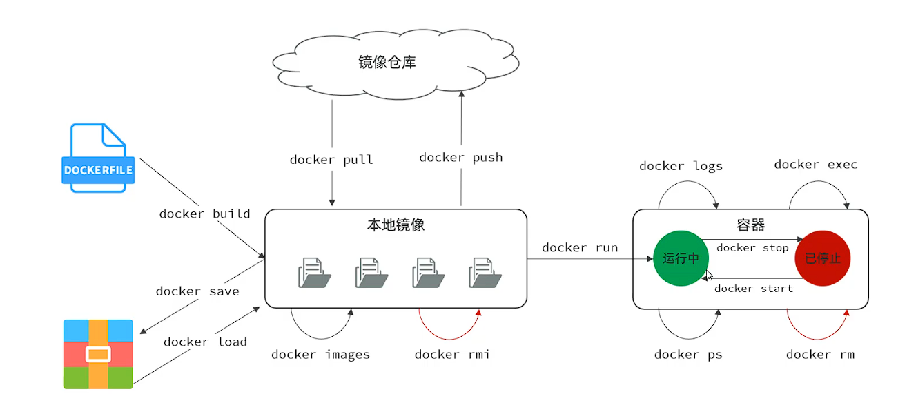
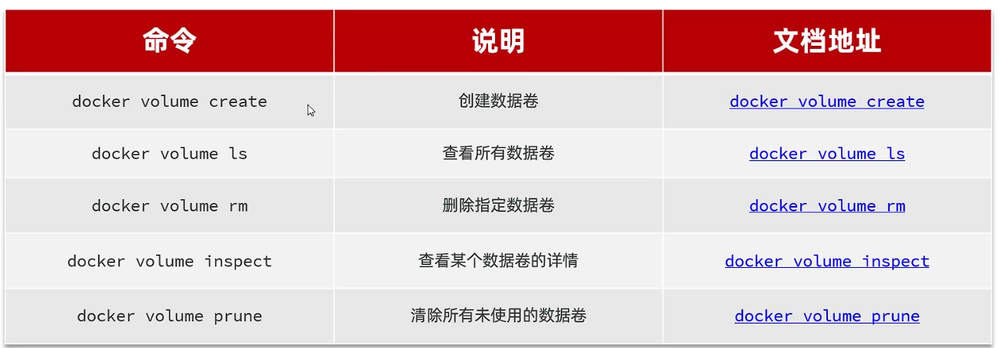
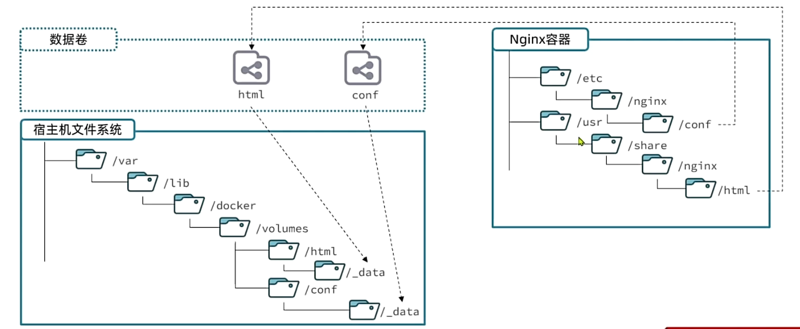
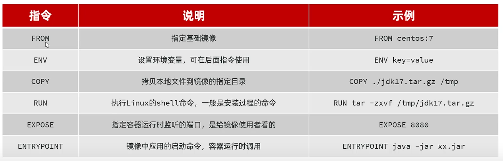
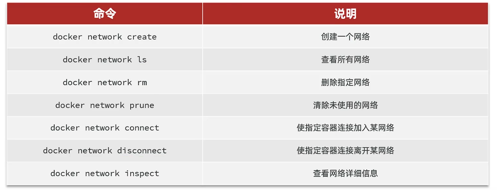
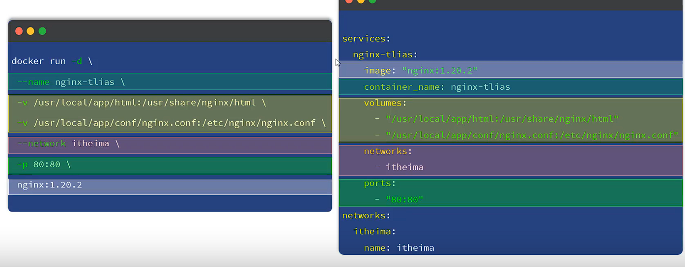
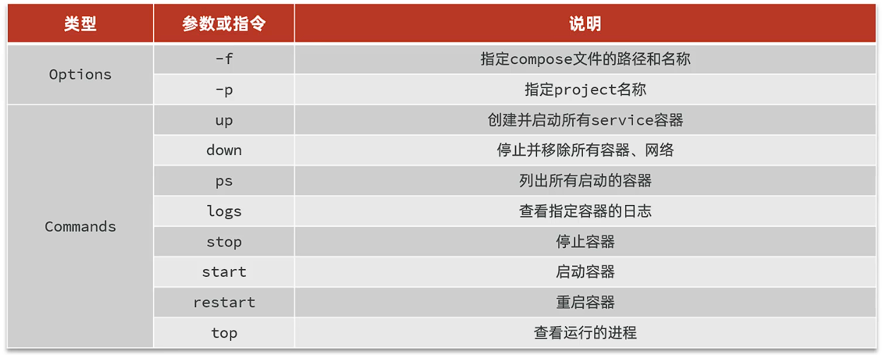

### 一、Docker卸载重装步骤
**一键安装:** **https://github.com/tech-shrimp/docker_installer**

### 二、部署MySQL 8.0.32

```bash
# 创建MySQL容器
docker run -d \                         # docker run: 启动容器; -d: 后台运行容器;
  --name mysql8 \       # --name: 指定容器名称; mysql8: 容器名称,容器名称必须唯一,不能重复;
  -p 3306:3306 \        # -p: 端口映射; 3306(左): 宿主机端口; 3306(右): 容器端口;
  -e TZ=Asia/Shanghai \  # -e: 设置环境变量; 设置时区为上海时区;
  -e MYSQL_ROOT_PASSWORD=your_strong_password \  # -e: 设置环境变量;  设置root密码
  mysql:8.0.32                 # 镜像名称:版本, 若不指定tag，默认最新版
```

### 三、镜像和容器

* 当我们利用Docker安装应用时，Docker会自动下载镜像(image)。镜像不仅包含应用本身，还包含应用需要的环境、配置、系统函数库。
  Docker会在运行时创建一个隔离环境，叫容器(container)。
* **镜像仓库：** Docker Hub，存储和管理镜像的平台。

### 四、Docker常用命令

#### 1. 验证Docker安装

```bash
# 检查Docker版本
docker --version
# 成功输出示例：Docker version 24.0.7, build afdd53b

# 验证镜像加速器
docker info | grep -i mirror
# 成功输出应显示配置的镜像地址

# 测试容器运行
docker run hello-world
# 成功输出"Hello from Docker!"消息
```

#### 2. 验证MySQL安装

```bash
# 检查容器状态
docker ps -a --filter "name=mysql8"
# 状态应为Up

# 进入MySQL命令行
docker exec -it mysql8 mysql -uroot -p
# 输入密码后应进入mysql>提示符

# 验证版本
SELECT VERSION();
# 应输出：8.0.32

# 验证字符集
SHOW VARIABLES LIKE 'character_set_server';
# 应输出：utf8mb4
```
#### 3. 验证MySQL安装

| **命令**                                 | **说明**           |
| ---------------------------------------------- | ------------------------ |
| `docker ps`                                  | 查看运行中的容器         |
| `docker ps -a`                               | 查看所有容器（含停止的） |
| `docker images`                              | 列出本地镜像             |
| `docker pull <image>`                        | 拉取镜像                 |
| `docker run [options] <image>`               | 创建并启动容器           |
| `docker start/stop/restart <container>`      | 启动/停止/重启容器       |
| `docker rm <container>`                      | 删除容器                 |
| `docker rmi <image>`                         | 删除镜像                 |
| `docker exec -it <container> bash`           | 进入容器终端             |
| `docker logs <container>`                    | 查看容器日志             |
| `docker build -t <tag> .`                    | 构建Docker镜像           |
| `docker volume ls`                           | 列出数据卷               |
| `docker network ls`                          | 列出网络                 |
| `docker system prune -a`                     | 清理所有未使用资源       |
|  |                          |

> **重要提示** ：
>
> 1. 所有命令需在管理员权限下运行（使用 `sudo`或加入docker用户组）
> 2. MySQL密码需符合安全策略（大小写字母+数字+特殊字符，至少8位）
> 3. 生产环境建议添加 `--restart=always`参数确保MySQL自启动


### 五、数据卷挂载

* 数据卷(volume)，Docker提供的一种数据共享方式，是一个虚拟目录，是容器内目录和宿主机目录间映射的桥梁。
  
* **执行docker run命令时，使用 `-v 数据卷 : 容器内目录`形式可以完成数据卷挂载。(若数据卷不存在，则自动创建数据卷)**
* **关于宿主机和容器的映射关系如图:**
  

### 六、基于本地目录挂载

* **`docker run -d --name 容器名 -p 宿主机端口:容器端口 -v 本地目录:容器目录 镜像名`**
  * **其中:**
    * 本地目录必须以 `/`或 `./`开头，如果直接以名称开头，会被识别成数据卷。
    * 例如：`-v mysql:/var/lib/mysql` 就是一个数据卷挂载，数据卷的名字为mysql。
    * 例如：`-v ./mysql:/var/lib/mysql` 会被识别成当前目录下的mysql目录。

### 七、自定义镜像

* **镜像：** 镜像就是包含了应用程序、程序运行的系统函数库、运行配置等文件的文件包。构建镜像的过程就是把上述文件打包的过程。
* **Dockerfile：** Dockerfile是文本文件，其中包含一个个的指令(Instruction)，用指令来说明要执行什么操作来构建镜像。将来Docker可以根据Dockerfile来构建镜像。
  

#### 1. 基于Ubuntu镜像创建Java运行环境自定义镜像
**在 Dockerfile 中添加以下内容**

```bash
# 使用官方 Ubuntu 24.04 LTS 基础镜像
FROM ubuntu:24.04

# 设置环境变量, JDK安装目录，容器内时区
ENV JAVA_DIR=/usr/local 

# 拷贝jak和java项目包
COPY ./jdk8.tar.gz $JAVA_DIR/
COPY ./docker-demo.jar /tem/app.jar

# 安装JDK
RUN cd $JAVA_DIR \ && tar -xf ./jdk8.tar.gz \ && mv ./jdk1.8.0_144 ./java8

# 设置 Java 环境变量
ENV JAVA_HOME=$JAVA_DIR/java8
ENV PATH=$PATH:$JAVA_HOME/bin

# 入口，java项目启动命令
ENTRYPOINT ["java", "-jar", "/app.jar"]
```
#### 2. 以JDK为基础镜像创建自定义镜像
```bash
# 使用openjdk镜像
FROM openjdk:11.0-jre-buster
# 拷贝jar包
COPY docker-demo.jar /tem/app.jar
# 入口
ENTRYPOINT ["java", "-jar", "/app.jar"]
```
#### 3. 保存并退出编辑器

* 在 nano 中：按 `Ctrl+X`，然后按 `Y` 确认保存，最后按 `Enter`

#### 4. 构建 Docker 镜像

```bash
# 构建镜像（注意最后的点表示当前目录）格式为repository:tag
docker build -t myImage:1.0 .

# 查看构建的镜像
docker images | grep jdk17-ubuntu
```

#### 5. 验证镜像功能

```bash
# 运行容器并检查 Java 版本
docker run --rm jdk17-ubuntu:24.04 java -version

# 预期输出：
# openjdk version "17.0.11" 2024-04-16
# OpenJDK Runtime Environment (build 17.0.11+9-Ubuntu-122.04)
# OpenJDK 64-Bit Server VM (build 17.0.11+9-Ubuntu-122.04, mixed mode, sharing)
```

### 六、网络

* **默认情况下，所有容器都是以bridge方式连接到Docker的一个虚拟网桥上。**
  

### 七、项目后端部署

* **后端项目：**
  * **步骤：**
    * **1.准备MySQL容器，创建项目数据库及其结构。**
    * **2.准备java应用镜像，部署Docker容器。**

      **项目中需要修改日志的路径，修改为 `/tlias/tlias-%d{yyyy-MM-dd}-%i.log`**

      **项目中需要修改MySQL的连接地址，修改为 `jdbc:mysql://mysql容器名:3306/`；以及Linux中的用户密码**
* **构建镜像**
**1.将以下Dockerfile文件移动至镜像目录下**
```bash
# 使用官方 Eclipse Temurin JDK 17 基础镜像
FROM eclipse-temurin:17-jdk-jammy

# 设置环境变量
ENV TZ=Asia/Shanghai \
    LANG=en_US.UTF-8 \
    LANGUAGE=en_US:en \
    LC_ALL=en_US.UTF-8 \
    JAVA_HOME=/opt/java/openjdk \
    APP_PORT=8080 \
    OSS_ACCESS_KEY_ID= \
    OSS_ACCESS_KEY_SECRET=

# 设置时区和编码
RUN ln -snf /usr/share/zoneinfo/$TZ /etc/localtime && \
    echo $TZ > /etc/timezone && \
    apt-get update && \
    apt-get install -y locales && \
    locale-gen en_US.UTF-8 && \
    rm -rf /var/lib/apt/lists/*

# 创建非root用户和专用目录
RUN groupadd -r appuser && useradd -r -g appuser appuser && \
    mkdir -p /app && chown appuser:appuser /app

# 设置工作目录
WORKDIR /app

# 复制应用JAR文件
COPY --chown=appuser:appuser tlias.jar /app/

# 暴露应用端口
EXPOSE 8080

# 容器启动命令
ENTRYPOINT ["java", "-jar", "tlias.jar"]

# 默认启动参数
CMD ["--spring.profiles.active=prod"]
```
**2.构建Docker镜像**：运行以下命令，构建Docker镜像：
```bash
 docker build -t tlias:1.0 .
```
**3.部署Docker容器：**
```bash
 docker run -d --name tlias-server -p 8080:8080 --network tlias tlias:1.0
```
**4.启动后端项目：**
```bash
docker logs -f  tlias-server
```
### 八、项目前端部署
**1.部署nginx容器(目录映射)：**
```bash
docker run -d --name nginx-tlias \
-v /home/tuanzi/tlias-nginx/html:/usr/share/nginx/html \
-v /home/tuanzi/tlias-nginx/conf/nginx.conf:/etc/nginx/nginx.conf \
--network tlias -p 80:80 \
nginx:1.27.3
```
**2.将部署的前端资源文件及配置文件上传至服务器，执行命令创建nginx容器**

### 九、DockerCompose
* **1.DockerCompose:** 通过一个单独的docker-compose.yml文件，定义多个相关联的容器，帮助我们实现多个相关联的Docker容器的部署。 

* **2.基于DockerCompose部署项目：**
该项目涉及到MySQL、服务端、前端nginx。
* **3.步骤：**
**1.准备资源(tlias.sql、服务端jdk17、jar包、Dockerfile、前端项目打包文件、nginx.conf)**
**2.准备docker-compose.yml文件：**
```yml
Service:
  mysql:
    image: mysql:8.0.32
    container_name: mysql
    post:
     - "3306:3306"
    environment:
        MYSQL_ROOT_PASSWORD: lvbohan2003
        TZ: Asia/Shanghai
    volumes:
      - "/home/tuanzi/DockerCompose/mysql/conf:/etc/mysql/conf.d"
      - "/home/tuanzi/DockerCompose/mysql/data:/var/lib/mysql"
      - "/home/tuanzi/DockerCompose/mysql/init:/docker-entrypoint-initdb.d"
    networks:
      - talias-network
  tlias:
    build:
      context: .
      dockerfile: Dockerfile
    container_name: tlias-server
    ports:
      - "8080:8080"
    networks:
      - talias-network
    depends_on:
      - mysql
  nginx:
    image: nginx:1.27.3
    container_name: nginx-tlias
    posts:
      - "80:80"
    volumes:
        - "/home/tuanzi/DockerCompose/tlias-nginx/conf:/etc/nginx/nginx.conf"
        - "/home/tuanzi/DockerCompose/tlias-nginx/html:/usr/share/nginx/html"
    depends_on:
      - tlias
    networks:
      - talias-network
networks:
  talias-network:
    name:talias
```
**3.基于DockerCompose部署项目**
* **DockerCompose命令:** docker compose [options] [command]
* **参数说明：**
  
   


