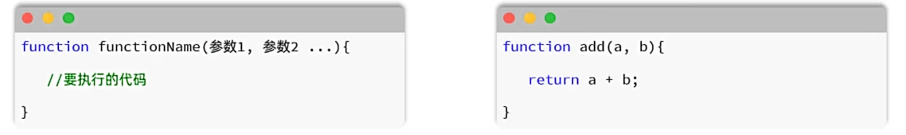
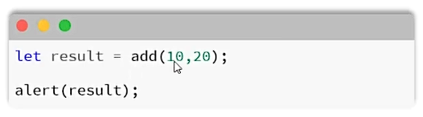
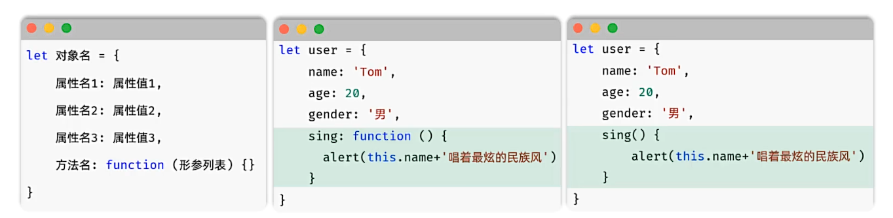
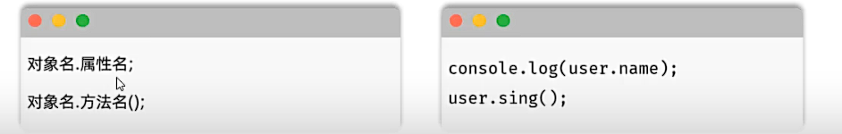
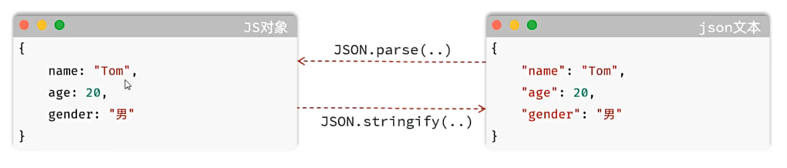
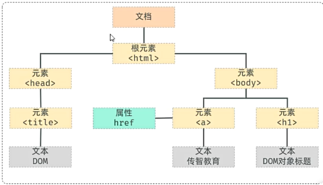
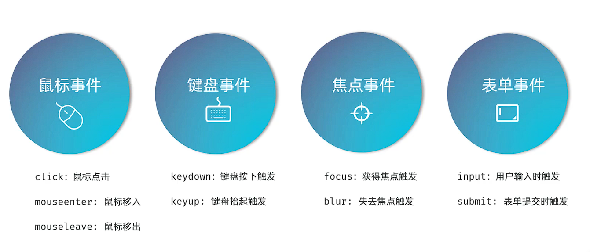
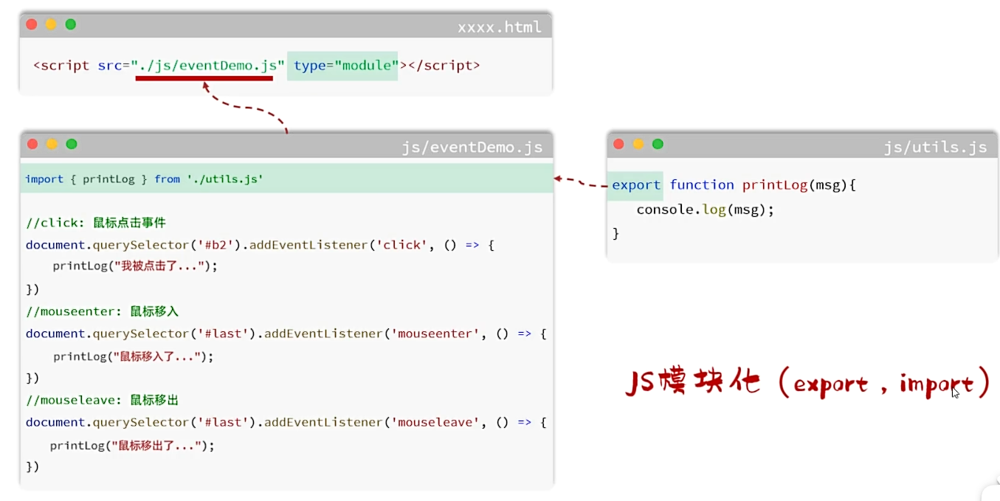

## 一、JavaScript基础
* **JavaScript是跨平台面向对象的脚本语言，控制网络行为。**
* **组成：**
  * ECMAScript: 规定了JS基础语法的核心，包括变量、流程控制、函数、对象等。
  * BOM：浏览器对象模型，用于操作浏览器本身，如页面弹窗、地址栏、等。
  * DOM：文档对象模型，用于操作HTML文档，如改变标签内的内容、改变字体样式等。
## 二、JS引入方式
* **内部脚本：** 将JS代码定义在HTML页面中。
  * JavaScript代码位于<script></script>标签之间。
  * 一般置于<body></body>标签底部。
* **外部脚本：** 将JS代码定义在单独的JS文件中，通过<script src = "..."></script>标签引入。
## 三、JS变量、常量
* **JS中使用let声明变量（变量可以存放不同类型的值）。弱类型语言可不声明类型**
* **变量规则：** 1. 变量名必须以字母、下划线或美元符开头。 2. 变量名不能以数字开头。 3. 变量名不能包含空格。 4. 变量名不能与JS关键字冲突。 5. 变量名区分大小写。
* **JS中使用const声明常量（常量存放的值不能改变）。**
## 四、JS输出语句： 
* **console.log()：** 输出到控制台。 
* **alert()：** 弹出对话框。
## 五、数据类型：
* **Number：** 数值。(整数、小数、NaN (Not a Number))
* **Boolean：** 布尔值。(true、false)
* **Null：** 空值。JavaScript中大小写敏感，null、Null、NULL完全不同
* **String：** 字符串。单引号、双引号、反引号皆可表示字符串，但一般使用单引号。
* **undefined：** 声明的变量未初始化时，其值为undefined。
* **使用typeof()判断数据类型**
* **模板字符串：** 
  * 使用``包裹的字符串
  * 内容拼接变量时，可以使用${}来引用变量 
例子：
```javascript
let name = 'Tom';
console.log(`Hello, ${name}`);
```
## 六、函数
* **介绍：** 函数(function), 是被设计用来执行特定任务的代码块，方便程序封装复用。
* **定义：** 通过关键字function定义，语法：
 
*  **调用：** 函数名（实际参数列表）

* **注意：** 由于JS为弱类型语言，形参、返回值都不需要指定类型，实参个数和形参个数可以不一致，但建议一致。
* **匿名函数：** 通过function关键字定义，函数表达式和箭头函数。
例子：
```javascript
//具名函数
function add(a,b){
  return a+b;
}
let c = add(1,2);
console.log(c);
//匿名函数
//函数表达式
let add = function(a,b){
  return a+b;
}
let a = add(1,2);
console.log(a);
//箭头函数
let add = (a,b) => {
  return a+b;
}
let b = add(1,2);
console.log(b);
```
## 七、自定义对象：
* 定义格式：

* 调用格式：
 
 例子：
 ```javascript
 let person = {
  name: '张三',
  age: 18,
  show: function(){//注意：若要使用箭头函数，此时this指向的是当前对象的父级
    console.log(this.name + ',' + this.age);
  }
 }
 //调用
 person.show();
 ```
 ## 八、json
 * **概念：** JSON（JavaScript Object Notation）是JavaScript对象标记法(JS对象标记法书写的文本)，由于其语法简单，层次结构鲜明，所有多用于数据载体，在网络中传输数据。本质是字符串

* 使用JSON.stringify()将JS对象转换为JSON字符串。
* 使用JSON.parse()将JSON字符串转换为JS对象。
## 九、DOM
* **概念：** 文档对象模型，用于操作HTML文档。
* **将标记语言的各个组成部分封装为对应的对象：**
  * Document：整个文档对象
  * Element：元素对象
  * Attribute：属性对象
  * Text：文本对象
  * Comment：注释对象
  
* **JavaScript操作DOM：**
 * 改变HTML元素内容。
 * 改变HTML元素样式（CSS）。
 * 对HTML DOM 事件做出反应。
 * 添加、删除HTML元素。
* **DOM操作核心思想：** 将网页中所有的元素当作对象处理。（标签的所有属性在该对象上都可以找得到）
* **DOM操作步骤：**
  * 获取要操作的DOM元素对象。
  * 操作DOM元素对象的属性或方法。
* **获取DOM对象：**
  * 根据CSS选择器获取DOM元素，获取匹配到的第一个元素：document.querySelector('css选择器')
  * 根据CSS选择器获取DOM元素，获取匹配到的所有元素：document.querySelectorAll('css选择器')
  * **注意：得到的是一个NodeList结点集合，是一个伪数组(有长度，有索引的数组，没有数组的方法)**
例子：
```html
<body>
  <div class="box">1234</div>
  <div class="box2">1234</div>
  <script>
    let divs = document.querySelectorAll('div');//得到所有div元素
    divs[0].innerHTML = 'hello';//修改第一个div的文本内容
    let divs2 = document.querySelector('#box2');//根据id获取元素
    divs2.innerHTML = 'hello';//修改id为box2的div的文本内容
  </script>
</body>
```
## 十、事件监听
* **事件：** 用户操作浏览器所触发的某种行为。例如：点击、鼠标移动、键盘按下等。
* **监听：** JavaScript可以在事件触发时，立即调用一个函数做出响应，也称之为事件绑定或注册事件。
* **语法：** 事件源.addEventListener('事件类型', 事件触发时执行的函数);
* **事件监听三要素：**
  * 事件源：触发事件的DOM元素，要获取DOM元素。
  * 事件类型：触发的事件类型，如click(鼠标点击)、mouseleave(鼠标移出)、keydown(按下键盘)等。
  * 事件触发时执行的函数：应该做什么事情。
* 另一种写法：事件源.on事件 = function(){...};(只能绑定一次事件，后面新增的事件会覆盖前面的事件)
例子：
```html
<body>
  <input type="button" value="点我" id="btn" />
  <script>
    //事件监听(多次绑定同一事件)
    document.querySelector("btn").addEventListener("click", () => {
      alert("点击了按钮");
    });
    document.querySelector("btn").addEventListener("click", () => {
      alert("又点击了按钮");//支持多次绑定事件
    });
  </script>
</body>
```
* **常见事件：**
 
 ## 十一、JS代码优化

* **JS模块化：** 使用一个单独的JS文件将重复的代码抽离出来统一管理，使用export导出，需要使用时，使用`improt {函数名} from '文件路径'`导入。在HTML中使用`<script src="文件路径" type="module"></script>`引入模块化JS。

 
 
