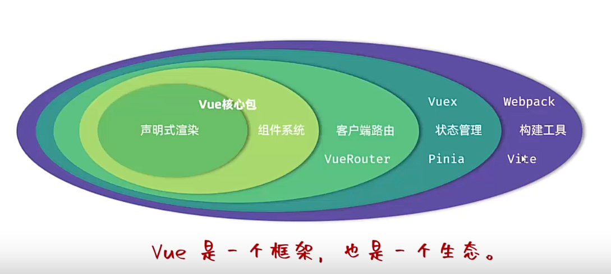
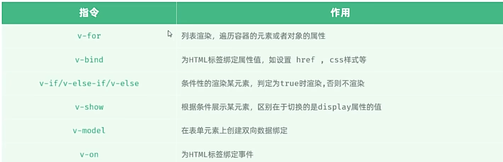
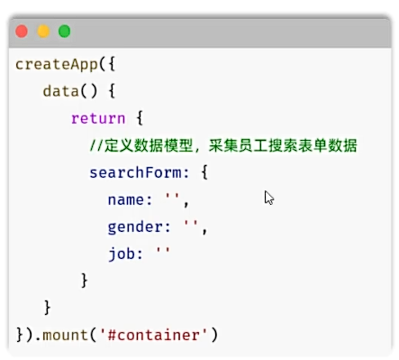
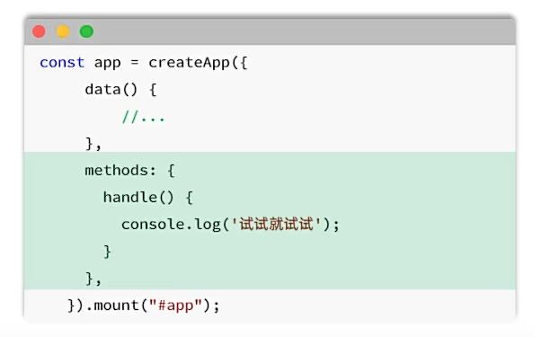
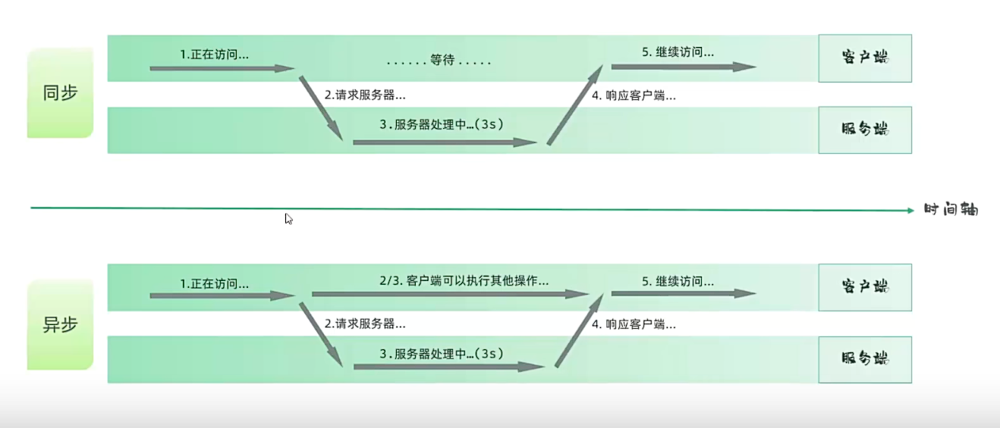
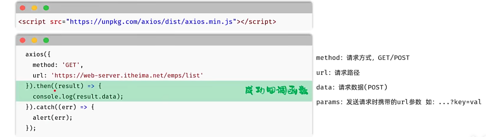
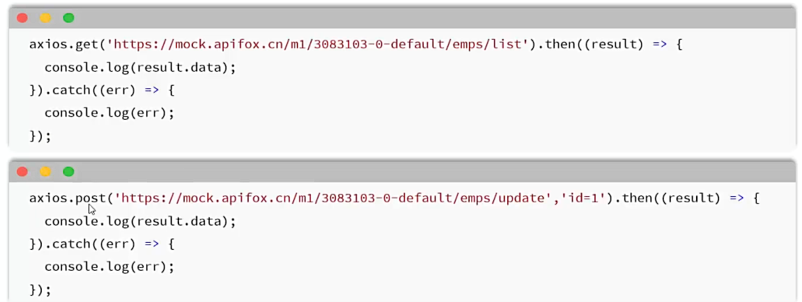
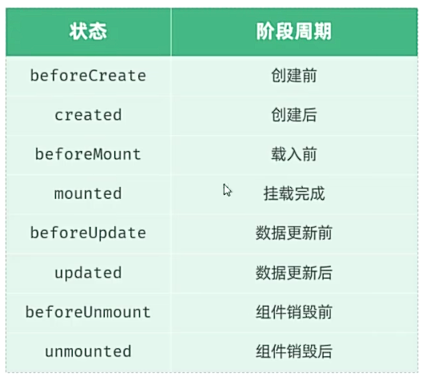

## 一、Vue
* **概念：** Vue.js是一个渐进式JavaScript框架，用于构建用户界面。

* **模块化引入Vue3：**
例子：
```html
<div id="app">{{ message }}</div>
<script type="module">
  import { createApp, ref } from 'https://unpkg.com/vue@3/dist/vue.esm-browser.js'
  createApp({
    data() {
      return {
        message: 'Hello Vue!'
      }
    }
  }).mount('#app')
</script>
```
## 二、常用指令：
* **指令：** HTML标签中带有v- 前缀的特殊属性，不同的指令不同的含义，可实现不同功能。
* **常用指令：**
  
* **v-for:**
  * **语法：** `<tr tr v-for="(item, index) in items" :key="item.id">{{item}}</tr>`
  * **参数：**
    * `items`：为遍历的数组
    * `item`：为遍历出来的元素
    * `index`：为索引，从零开始；可省略，写为：`v-for="item in items"`
  * **key:**
    * **作用：** 给元素添加唯一标识，便于对vue进行列表项的正确排序复用，提升渲染性能
    * 建议使用id作为key，因为id不会重复
  * **注意：遍历的数组，必须在data中定义; 想让哪个标签循环多次，就在哪个标签使用v-for**
* **v-bind:**
  * **作用：** 动态给HTML标签添加属性，如src、href、style等 
  * **语法：** `v-bind:属性名="属性值"` 或 `:属性名="属性值"`
  * **注意：动态为标签属性绑定值，不可使用插值表达式，只能使用v-bind, 且绑定的数据，必须在data中定义。**
* **v-if&v-show:**
  * **作用：** 条件渲染，如果条件为真，则显示标签，否则不显示标签。
  * **v-if：**
    * **语法：** `v-if="表达式"，若表达式为真，则显示标签，否则不显示标签。`
    * **原理：** v-if是条件渲染，来控制创建或移除元素结点。
    * **应用场景：** 适用于切换不频繁的场景，要么显示，要么隐藏。
    * 可以配合v-else-if、v-else使用，实现链式条件判断。
    * **注意：v-else-if必须在v-if之后，可以有多个；v-else必须紧跟在v-if、v-else-if之后。**
  * **v-show：**
    * **语法：** `v-show="表达式"，若表达式为真，则显示标签，否则隐藏标签。` 
    * **原理：** v-show是基于CSS样式的display属性，来控制标签的显示或隐藏。
    * **应用场景：** 适用于切换频繁的场景，比如切换显示和隐藏。
* **v-model：**
  * **语法：** `v-model="变量名"`
  * **作用：** 表单元素上使用，用于数据的双向绑定、可以方便的获取或设置表单项数据。
  * **注意：** v-model中绑定的变量，必须在data中定义。
  
* **v-on：**
  * **作用：** 绑定事件处理函数，用于监听用户操作。
  * **语法：** `v-on:事件名="事件处理函数"` 或 `@事件名="事件处理函数"`
  * **注意：在与data()平级的methods中定义事件处理函数。要在事件处理函数中，使用this.变量名，获取data中的变量值。**
  
* **Ajax请求：**
  * **介绍：** 异步的JavaScript和XML，用于从服务器获取数据。
    * **XML:** 其中XML，可扩展标记语言，本质是一种数据格式，用于存储复杂的数据结构。 
  * **作用：** 
    * **数据交换：** 通过ajax可以给服务器发送请求，并获取服务器响应的数据。
    * **异步交互：** 可以在不重新加载整个页面的情况下，与服务器交换数据并更新部分网页的技术，如: 搜索联想、用户名是否可用校验等。 
    * **同步与异步：** 同步：浏览器会等待服务器响应，再执行后续代码。异步：浏览器不等待服务器响应，直接执行后续代码。
  
  * **Axios：** Axios对原生的Ajax进行了封装，提供了更方便的使用方式。
   
  * **Axios中还为所有的请求方法提供了别名：** `axios.请求方式(url [, data [, config]])`
   
  * **async&await：** 通过async&await，可以让异步操作变为同步操作。async用来声明一个异步函数，await用来等待一个异步操作完成。
  * **注意：** await只能用在async函数中，不能单独使用。await关键字可以取代then方法，等待获取到请求成功的结果值。
* **Vue生命周期：** 指一个对象从创建到销毁的过程。
  * **八个阶段：** 每触发一个生命周期事件，会自动执行一个生命周期方法（钩子）。
    
  例子：
```javascript
//常规获取数据
// getUser() {
//   axios.get('http://...').then(res => {
//   console.log(res.data)})
// }
//上述异步操作变同步操作
async getUser() {
  const res = await axios.get('http://...')
  console.log(res.data)//获取数据成功
}
//页面加载完成后使用钩子函数调用方法
mounted() {
  this.getUser()
}
```