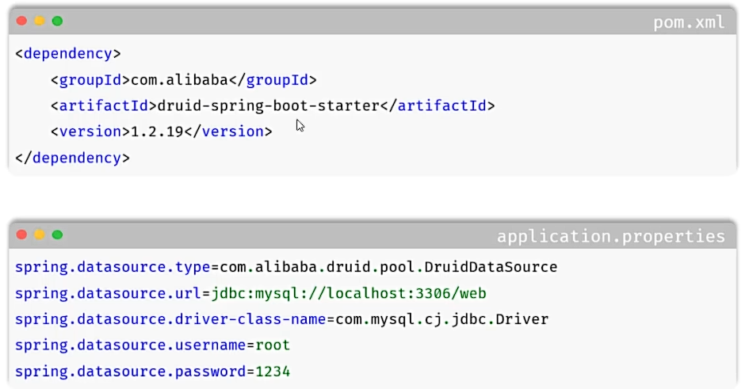
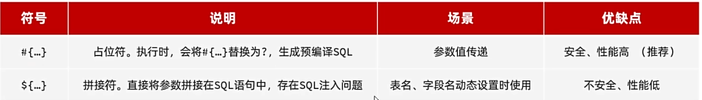
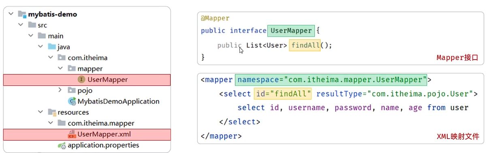

## 一、Mybatis：
* **Mybatis：** 是一个持久层的框架，用于简化JDBC开发。
* **Mybatis的持久层接口命名规范为XXXMapper.java，也叫Mapper接口。**
## 二、数据库连接池
* **数据库连接池是一个容器，负责分配、管理数据库连接(Connection)。**
* **它允许应用程序重复使用一个现有的数据库连接，而不是重新创建它。**
* **释放空闲时间超过最大空闲时间的连接，避免因为没有释放连接而引起数据库连接遗漏。**
* **SpringBoot默认使用Hikari数据库连接池，另外还有一个常用的数据库连接池是Druid。**
* **切换数据库连接池：**
 
## 三、Mybatis删除操作
```java
@Mapper
public interface UserMapper {
    @Delete("delete from user where id = #{id}")
    void deleteByPrimaryKey(Integer id);
}
```
* **关于Mybatis中的#和$的区别：**
  
## 四、Mybatis修改操作
```java
@Mapper
public interface UserMapper {
    @Update("update user set name = #{name}, age = #{age} where id = #{id}")
    void updateByPrimaryKey(User record);
}
 ```
## 五、Mybatis增加操作
```java
@Mapper
public interface UserMapper {
    @Insert("insert into user(name, age) values(#{name}, #{age})")
     void insert(User record);
}
```
 ## 六、Mybatis查询操作
```java
 @Mapper
  public interface UserMapper {
     @Select("select * from user where id = #{id}")
     List<User> selectByPrimaryKey(Integer id);
  }
  ```
## 七、XML映射配置文件
* **XML映射配置文件：** Mybatis中不仅可以通过注解配置SQL语句，还可以通过XML配置文件来配置SQL语句。
* **规则：**
  * 1.XML映射文件要与Mapper接口名称一致，并且将XML映射文件和Mapper接口放置在相同包下(同包同名)。
  * 2.XML映射文件中的namespace属性值必须与Mapper接口的全限定名一致。
  * 3.XML映射文件的sql语句id与Mapper接口中的方法名一致，并保持返回类型一致。
  
* **关于注解和xml的选择：** 1.如果是简单的增删改查，使用注解配置即可。 2.如果SQL语句复杂，使用xml配置文件来配置SQL语句。
* **辅助配置：** 
```yml
 mybatis:
  configuration:
    log-impl: org.apache.ibatis.logging.stdout.StdOutImpl  # SQL日志输出到控制台
    map-underscore-to-camel-case: true  # 开启数据库字段_转驼峰命名映射
  mapper-locations: classpath:mapper/*.xml  # MyBatis映射文件路径
```
