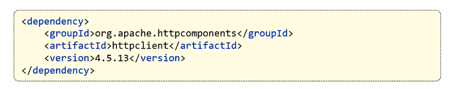

### 一、HttpClient介绍
* **HttpClient用于在Java应用程序中发送HTTP请求。**
 
* 核心API：
  * HttpClient：用于创建HTTP请求，发送HTTP请求，接收HTTP响应。
  * HttpClients：用于创建HttpClient实例。 
  * CloseableHttpClient：继承HttpClient，用于关闭HttpClient实例。
  * HttpGet：用于创建GET请求。
  * HttpPost：用于创建POST请求。
* 请求发送步骤：
  * 创建HttpClient对象。
  * 创建Http请求对象
  * 调用HttpClient对象的execute方法发送请求，并接收响应。 