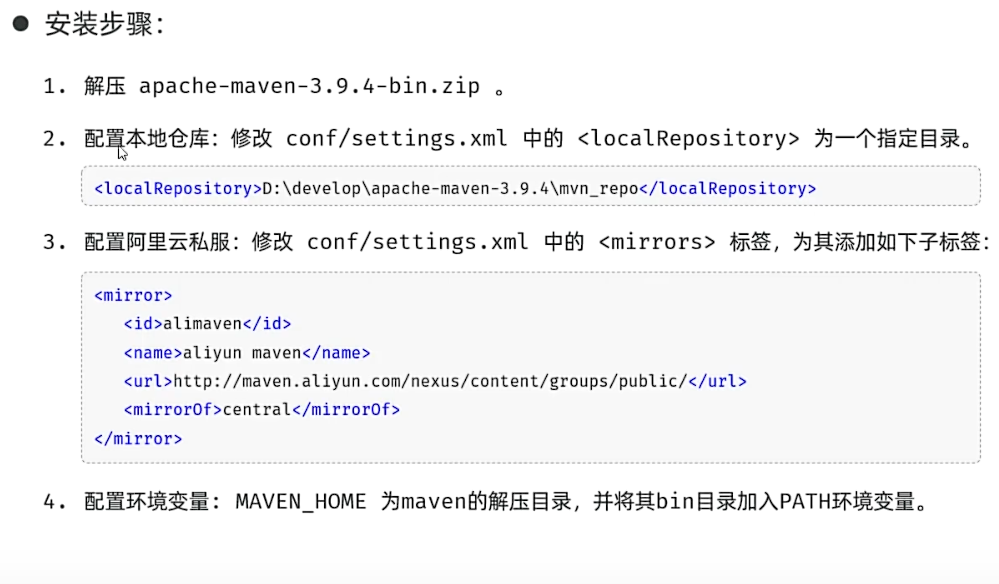
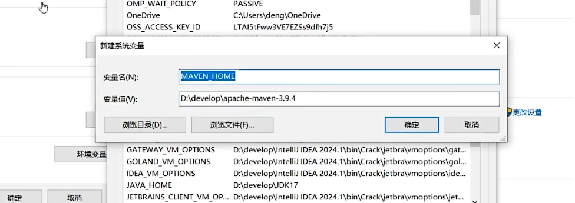
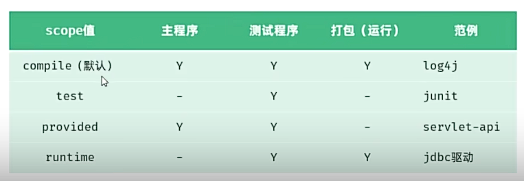

## 一、Maven
* **概念：** Maven是一个开源项目管理工具，用于管理和构建Java项目。
* **作用：**
  * **项目构建：** 标准化的跨平台(Linux、Windows、Mac)的自动化项目构建方式：编译(compile)、测试(test)、打包(package)、安装(install)、部署(deploy)。
  * **依赖管理：** Maven可以自动管理项目所依赖的jar包，并自动下载所需jar包。 
  * **统一项目结构：** Maven可以提供标准统一的项目结构。
* **安装：**
 
 
## 二、Maven坐标：
* **概念：** Maven坐标是资源(jar)的唯一标识，通过该坐标可以唯一定位资源位置。使用坐标可以自定义项目或引入项目中需要的依赖。
* **坐标的主要组成：**
  * **groupId：** 定义Maven项目属于谁。
  * **artifactId：** 定义Maven项目名称。
  * **version：** 定义Maven项目版本。
    * **Snapshot：** 快照版本，每次更新都会递增版本号，功能不稳定。 
    * **Release：** 正式版本，每次更新不会递增版本号，功能趋于稳定。 
## 三、依赖配置：
* **依赖：** Maven依赖是项目运行所需要的jar包，一个项目中可以有多个依赖。
*  **依赖配置：**
  * 1.在pom.xml文件中添加`<dependencies>`标签。
  * 2.在`<dependencies>`标签下使用`<dependency>`引入坐标。
  * 3.定义坐标的groupId、artifactId、version。
  * 4.点击刷新，引入最新加入的坐标。
  * 5.可以在https://mvnrepository.com/ 中搜索需要的坐标。
* **排除依赖：** 指主动断开依赖，被排除的依赖不需要指定版本
  * 在`<dependency>`标签下添加`<exclusions>`标签，在`<exclusions>`标签下添加`<exclusion>`标签，在`<exclusion>`标签下添加`<artifactId>`和`<groupId>`标签。 
  * 一旦依赖配置变更，就需要刷新。
##  四、生命周期：
* **maven的生命周期就是为了对所有的maven项目构建过程进行抽象和统一。**
* **Maven有三套相互独立的生命周期：**
  * **clean**：清理.
  * **default**：核心工作，如编译(compile)、测试(test)、打包(package)、安装(install)、部署(deploy)等。
  * **site**：生成报告，发布站点。
  * **同一套生命周期中，运行后面的阶段，前面会跟着运行。**
## 五、Maven依赖范围：
* **默认情况下，依赖的jar包可以在任何地方使用。可以通过scope属性来控制依赖的范围。**
*  **scope属性：**
  
## 六、Maven的常见问题：
* 若引入jar包时网络原因，依赖未下载完成，则会在maven仓库中生成一个.lastUpdated文件，若该文件不删除，则maven会认为该依赖已下载完成，不会重新下载，但因为该依赖并未下载，所以运行maven项目会报错。
* **解决方案：** 
  * 1.根据maven的坐标找出仓库中对应的.lastUpdated文件，删除该文件，重新运行项目。
  * 2.通过命令(del /s .lastUpdated)批量递归删除仓库中所有.lastUpdated文件。重新加载项目。
  可将第二个方案制作成脚本：
```bash
@echo off
cd /d "D:\idea\maven"
del /s /q *.lastUpdated
echo Maven仓库.lastUpdated文件已清理完成
pause
```
 
   