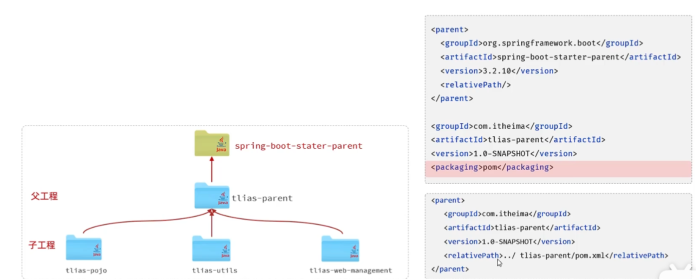
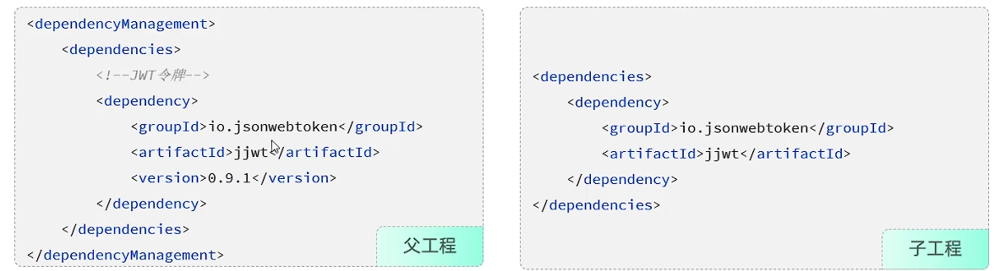
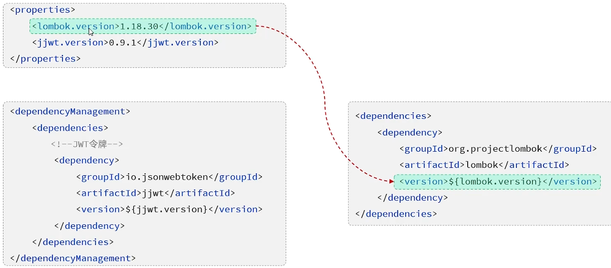
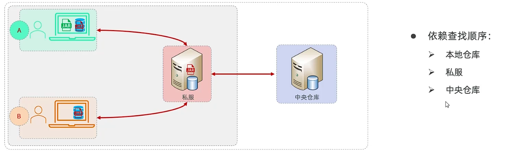
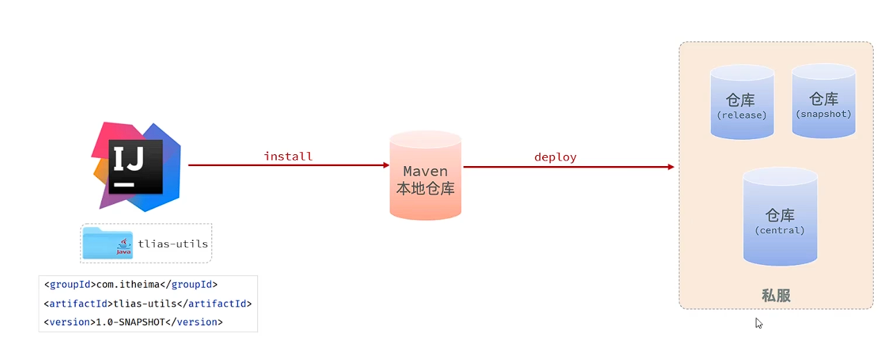
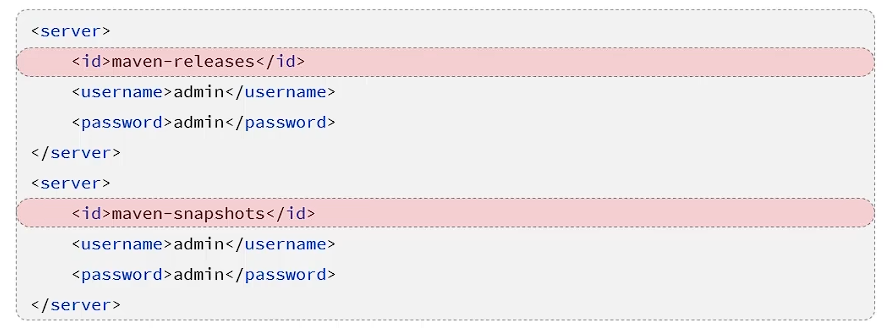
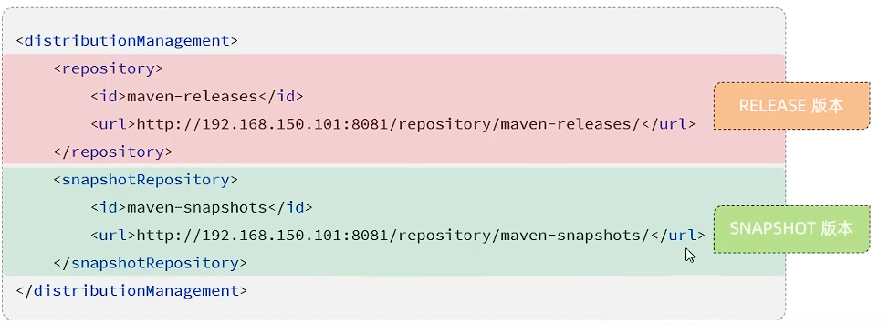
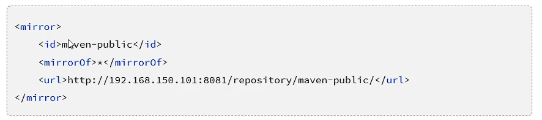
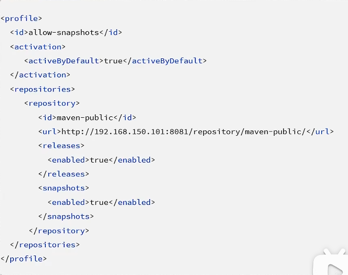

## 一、分模块设计
* **策略一：** 按照功能模块划分，如：公共组件、商品模块、搜索模块等。
* **策略二：** 按照层划分，如：公共组件、实体层、业务层、数据访问层、工具类等。
* **策略三：** 按照功能+层划分。

* **实际项目开发中，是先对模块进行设计，再进行编码。不会将工程开发完毕，再拆分。
## 二、继承
* **继承：** 继承是描述两个工程之间的关系，与Java继承类似，子工程可以继承父工程的配置信息，常见于依赖关系的继承。
* **作用：** 减少重复配置，提高开发效率。
* **继承的实现方式：** 配置继承，pom.xml中添加`<parent>`标签。
  * 1.创建maven模块tlias-parent，作为父工程，设置打包方式为pom(默认为jar)。
    * jar：普通模块打包，springboot项目基本都是jar包。(内嵌tomcat)
    * war：web模块打包，需要部署再外部的tomcat服务器中运行。
    * pom：父工程和聚合工程，该模块不写代码，仅进行依赖管理。
  * 2.在子工程的pom.xml中，配置继承关系。
  
  * 3.在父工程中配置各工程的共有依赖(子工程自动继承父工程的依赖)。
  * **在子工程中配置了继承关系后，坐标中的groupId可以省略，因为会自动继承父工程。**
  * **relativePath指定父工程的pom文件相对位置(若不指定，就会从本地仓库和远程仓库中查找)**
  * 在Maven中，可以在父工程的pom文件中通过`<dependencyManagement>`标签来统一管理依赖版本。
  
* **自定义属性：**
   
## 三、聚合
* **聚合：** 将多个模块组织成一个整体，同时进行项目构建。
* **聚合工程：** 一个不具有业务功能的“空”工程，只有一个pom文件。
* **实现：** 通过`<modules>`标签，指定子工程。  
* **聚合工程中包含的模块，在构建时，会自动根据模块间的依赖关系设置构建顺序，与书写位置无关。** 
* **聚合与继承的区别：** 
  * 1.继承用于简化项目，统一管理依赖版本，在子工程中配置继承关系。
  * 2.聚合用于快速构建项目，是在父工程(聚合工程)中配置聚合的模块。
## 四、私服
* **私服：** 一种特殊的远程仓库，架设在局域网内的仓库，用来代理位于外部的中央仓库，用于解决团队内部的资源共享与同步问题。
  
* **资源上传与下载：**
  
* **项目版本：**
  * RELEASE：稳定版本，发布版本，存在私服的RELEASE仓库中。 
  * SNAPSHOT：快照版本，开发版本，存在私服的SNAPSHOT仓库中。
* **连接私服：**
  * 1.设置私服的访问用户名/密码。(Settings.xml中的servers中配置)
   
  * 2.在pom.xml中配置上传(发布)的地址。
  
  * 3.设置私服依赖下载的仓库组地址(Settings.xml中的mirrors、profiles中配置)。
   
   访问快照版本的配置：
   