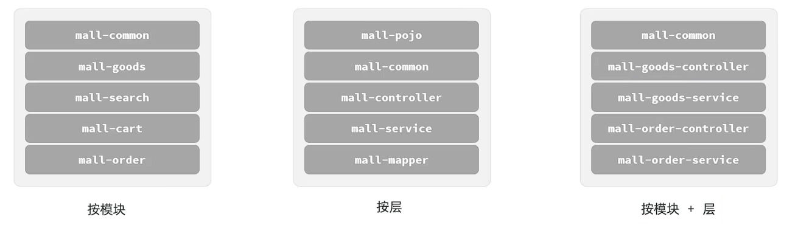
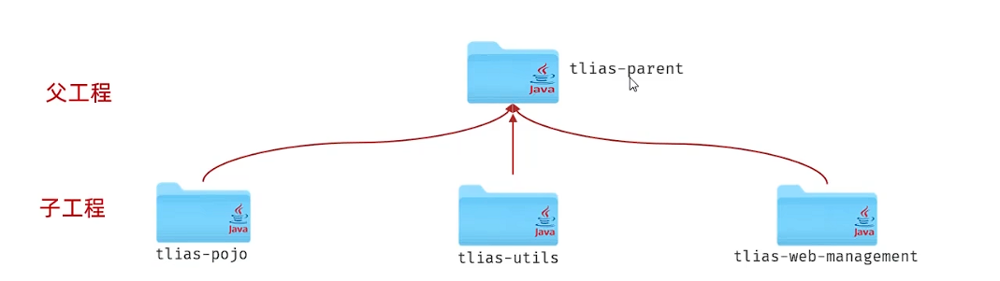

## 一、分模块设计
* **策略一：** 按照功能模块划分，如：公共组件、商品模块、搜索模块等。
* **策略二：** 按照层划分，如：公共组件、实体层、业务层、数据访问层、工具类等。
* **策略三：** 按照功能+层划分。

* **实际项目开发中，是先对模块进行设计，再进行编码。不会将工程开发完毕，再拆分。
## 二、继承
* **继承：** 继承是描述两个工程之间的关系，与Java继承类似，子工程可以继承父工程的配置信息，常见于依赖关系的继承。
* **作用：** 减少重复配置，提高开发效率。
* **继承的实现方式：** 配置继承，pom.xml中添加`<parent>`标签。
 
  * 1.创建maven模块tlias-parent，作为父工程，设置打包方式为pom(默认为jar)。
    * jar：普通模块打包，springboot项目基本都是jar包。(内嵌tomcat)
    * war：web模块打包，需要部署再外部的tomcat服务器中运行。
    * pom：父工程和聚合工程，该模块不写代码，仅进行依赖管理。