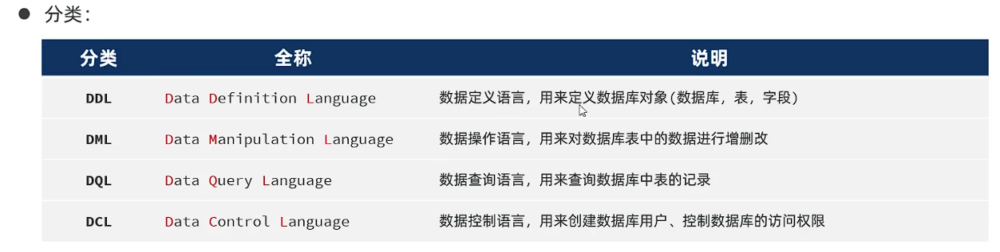
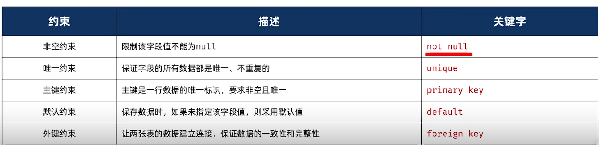
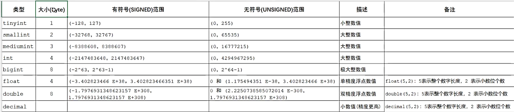
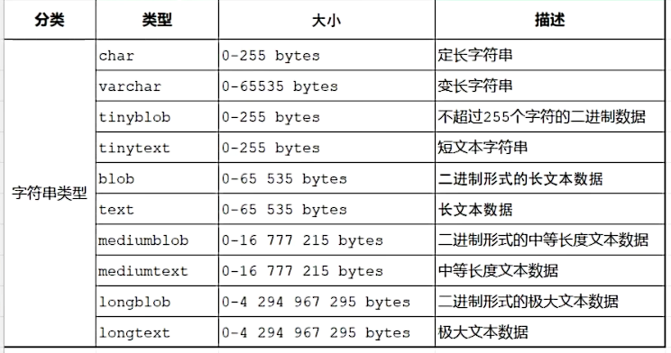
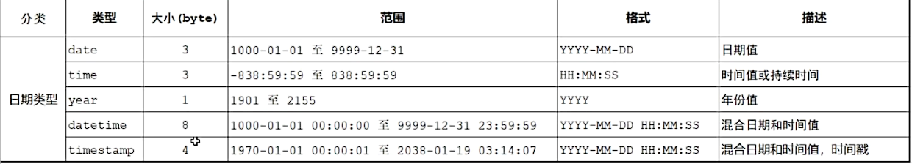
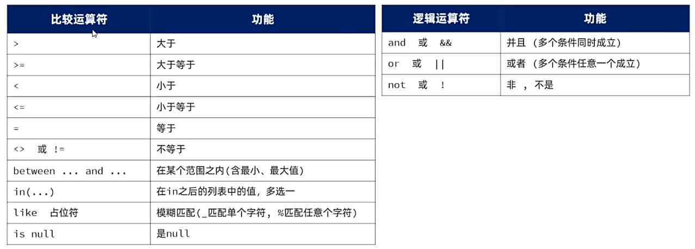
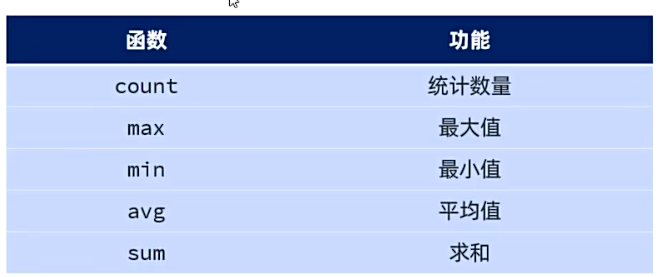

## 一、数据库
* **数据库**：Database，数据库是存储和管理数据的容器。
* **数据库管理系统**：Database Management System，数据库管理系统是数据库的运行环境。
* **SQL：** Structured Query Language，操作关系型数据库的编程语言，定义了一套操作关系型数据库的统一标准。
## 二、MySQL
* **连接：** mysql -u root -p
* **关系型数据库：** 建立在关系模型基础上，由多张相互连接的二维表组成的数据库。
* **特点：** 
  * 使用表存储数据，格式统一，便于维护。
  * 使用SQL语言操作，标准统一，使用方便，可用于复杂查询。 
## 三、SQL语句

### 1.DDL语句：
* **数据库操作：** 
```SQL
-- 涉及到database的部分，可以换成schema
-- 查询所有数据库
show databases;
-- 查询当前数据库
select database();
-- 使用/切换数据库
use 数据库名称;
-- 创建数据库
-- if not exists 指若数据库不存在，则创建数据库
-- default charset utf8mb4 设置数据库编码格式为utf8mb4，在sql8及以后版本中，默认编码格式为utf8mb4
create database [if not exists] 数据库名称 [default charset utf8mb4];
-- 删除数据库
-- if exists 指若数据库存在，则删除数据库
drop database [if exists] 数据库名称;
```
* **表操作：**
  * **约束：** 约束是作用于表中字段上的规则，用于限制表中数据，保证数据的完整性和正确性。
  
* **创建表：**
```SQL
-- 创建表
create table 表名称(
  字段1 数据类型 [约束] [comment 字段1注释],
  ......
  字段n 数据类型 [约束] [comment 字段n注释]
)[comment 表注释]
-- 创建表例子：
create table admin(
    id       int auto_increment comment '主键' primary key,
    username varchar(255) null comment '账号',
    password varchar(255) null comment '密码',
    name     varchar(255) null comment '姓名',
    avatar   varchar(255) null comment '头像',
    role     varchar(255) null comment '角色',
    phone    varchar(255) null comment '电话',
    email    varchar(255) null comment '邮箱'
)comment '管理员表';
```
* **数据类型：** MySQL中的数据类型有很多，数值类型、字符串类型、日期时间类型。
  * 数值类型：在满足需求的情况下，尽可能选择占用小的数据类型。
   
  * 字符串类型：
  
  * 日期时间类型：
  
* **表的查询、修改、删除：**
```SQL
show tables; -- 查询当前数据库中的所有表
desc 表名; -- 查询表结构
show create table 表名; -- 查询创建表的SQL语句
alter table 表名 add 字段名 类型(长度) [comment 字段注释] [约束]; -- 添加字段
alter table 表名 modify 字段名 新数据类型(长度); -- 修改字段
alter table 表名 change 旧字段名 新字段名 新数据类型(长度) [comment 字段注释] [约束]; -- 修改字段名与数据类型
alter table 表名 drop 字段名; -- 删除字段
alter table 表名 rename 新表名; -- 重命名表
drop table [if exists] 表名; -- 删除表，表中数据也会被删除
```
### 2.DML语句：
* **数据增加：** 
```SQL
-- 指定字段添加数据
insert into 表名(字段1,字段2,字段3) values(值1,值2,值3);
-- 全部字段添加数据
insert into 表名 values(值1,值2,值3);
-- 批量添加数据(指定字段)
insert into 表名(字段1,字段2,字段3) values (值1,值2) , (值1,值2);
-- 批量添加数据(全部字段)
insert into 表名 values (值1,值2, ...) , (值1,值2, ...);
```
* **数据修改：**
```SQL
-- 修改数据, 条件要加上, 否则会对所有数据进行修改
update 表名 set 字段1 = 值1, 字段2 = 值2, ... [where 条件];
```
* **数据删除：**
```sql 
-- 删除数据, 条件要加上, 否则会删除所有数据
delete from 表名 [where 删除条件];
```
###  3.DQL语句：
```sql
select 字段列表
 from 表名列表        -- 基本查询
 where 条件列表       -- 条件查询
 group by 分组列表 
 having 分组条件列表  -- 分组查询
 order by 排序列表    -- 排序查询
 limit 分页参数;      -- 分页查询
```
* **(1)基本查询：**
```SQL
-- 查询所有字段
select * from 表名;
-- 查询指定字段
select 字段1,字段2,字段3 from 表名;
-- 为字段设置别名查询
select 字段1 as 别名1,字段2 as 别名2,字段3 as 别名3 from 表名;
-- 去除重复数据
select distinct 字段列表 from 表名;
```
* **(2)条件查询：**
```sql
select 字段列表 from 表名 where 条件列表;
```
* **条件查询运算符：**

* **(3)分组查询：**
  * **聚合函数：** 将一列数据作为整体，进行纵向计算。
  * **使用方式：** `select 聚合函数(字段) from 表名; `
  
```sql
-- 分组查询
select 字段列表 from 表名 [where 条件列表] group by 分组字段名 [having 分组过滤后条件];
-- 分组查询例子：
select count(*) as 总数, sex from student group by sex having count(*) > 1; -- 查询性别为男、女分别有多少人
```
* **where和having的区别：** 
  * where：在分组前过滤数据，不参与分组；having：在对分组后的结果进行过滤。
  * 判断条件：where不能对聚合函数进行判断，having可以。
* **关于SQL语句的执行时机：** where => group by => having 
* **(4)排序查询：**
```sql
select 字段列表 from 表名 [where 条件列表] [group by 分组字段名 having 分组过滤后条件] order by 排序字段，排序方式;
```
* **排序方式：** 升序：asc；降序：desc; 默认升序，asc可以省略。
* **若多字段排序，当第一个字段相同时，才会根据第二个字段排序。**
* **(5)分页查询：**
```sql
select 字段列表 from 表名 [where 条件列表] [group by 分组字段名 having 分组过滤后条件] order by 排序字段，排序方式 limit 开始位置，查询数量;
```
* **关于分页查询说明：**
  * 1.起始索引从0开始。
  * 2.分页查询是数据库的方言，不同数据库语法不同，MySQL是limit。
  * 3.若起始索引是0，起始索引可以省略，简写为`limit 10`。
  * 4.通过页码计算起始索引：起始索引 = ( 页码-1 ) * 每页显示的记录数。
 
 
