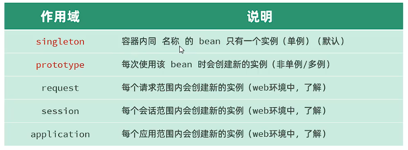
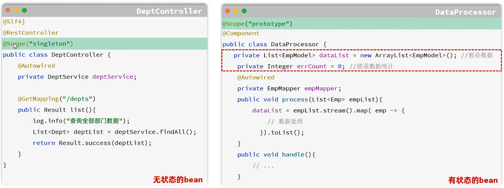
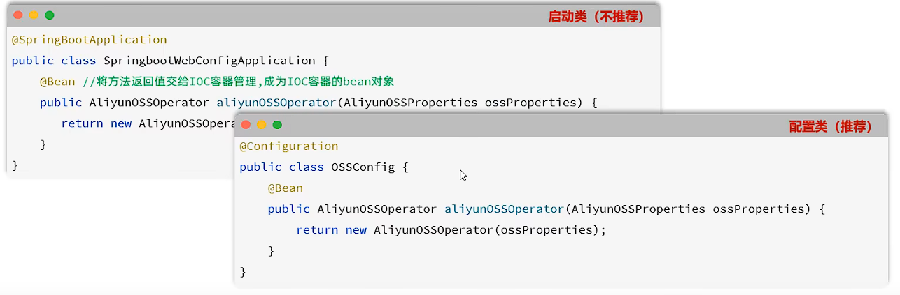
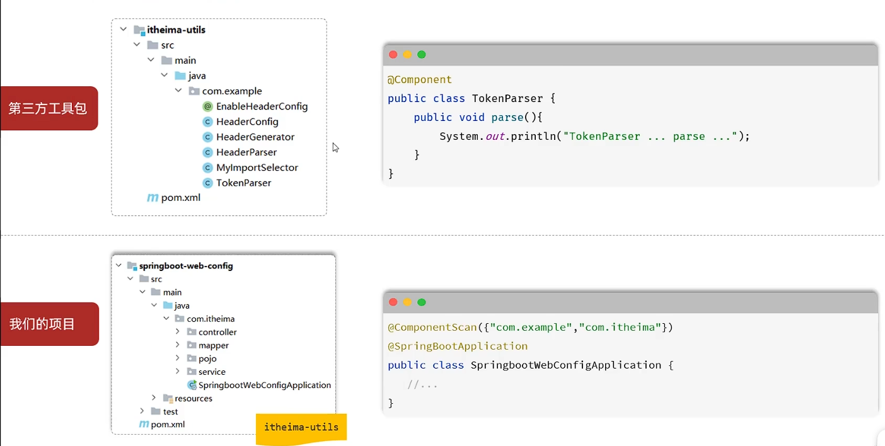
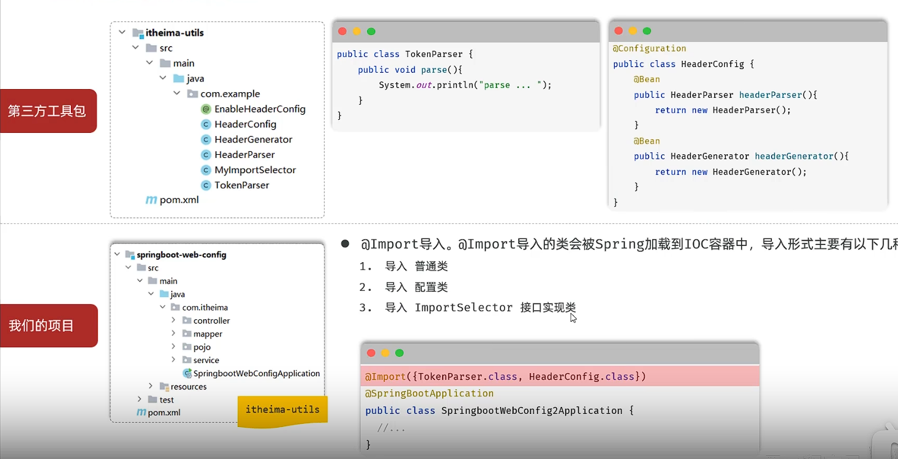
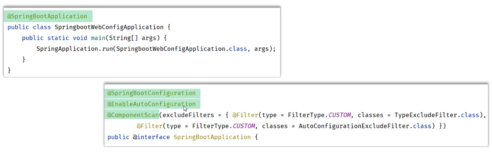
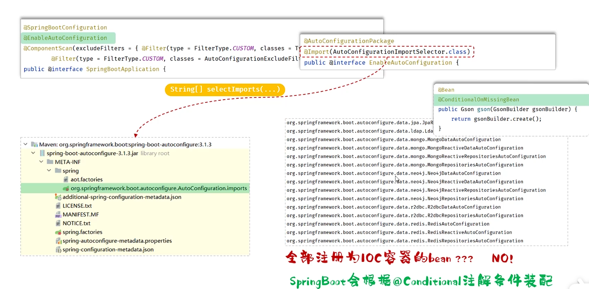
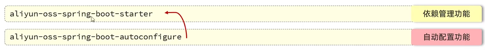

## 一、SpringBoot配置优先级
* **SpringBoot配置优先级：** 命令行 > java系统属性 > `.properties` > `.yml` > `.yaml` 
* **项目开发时一般统一使用一种文件格式(`.yml`)。**
* **SpringBoot除了支持配置文件配置属性，还支持Java系统属性和命令行参数配置**
  * **Java系统属性：** 通过-D指定，如：`-Dserver.port=8080`。
  * **命令行参数：** 通过命令行指定，如：`--server.port=8080`。
   
  * 在执行maven命令package将程序打包成jar包后，执行jar包时，可以通过命令行参数指定属性值，如：
   `java -Dserver.port=9000 -jar xxx.jar --server.port=8080`。
## 二、Bean的作用域
* Spring支持五种作用域，后三种在Web环境下才生效：

* 默认singleton的bean，在容器启动时创建，可以使用@Lazy注解来延迟初始化(延迟到第一次使用时)。
* 单例的Bean用于无状态的bean，多例的bean用于有状态的bean。实际开发中多数都为单例。
* 对于单例bean，如果是无状态的bean，内部不保存任何状态信息，则是线程安全的。如果是有状态的bean，内部会保存状态信息，多个线程同时操作该bean时，可能会出现数据不一致问题，这样的bean时线程不安全的。
 
## 三、第三方Bean
* 如果要管理的bean是来自于第三方的，不是自定义的，无法使用@Component注解或者衍生注解声明bean，此时可以使用@Bean注解。
* 如果第三方bean需要依赖其他的bean对象，直接在bean定义的方法中设置形参即可，容器会根据类型自动装配。
* 通过@Bean注解的name或value属性指定bean的名称，如果不指定，默认为方法名。
* 若要管理第三方bean，则可以队这些bean进行集中分类配置，可以通过@Configuration注解声明配置类。
 
## 四、起步依赖
* Spring Boot starters是Spring Boot提供的一组依赖，用于简化Spring Boot应用程序的配置。它们提供了一组默认的配置，简化了应用程序的创建和配置。
* 其原理是依赖传递
## 五、自动配置
* Spring Boot自动配置就是当Spring项目启动后，一些配置类、bean对象就自动存入了IOC容器中，不需要我们手动去声明，从而简化了开发，省去繁琐的配置操作。
* **自动配置实现：**
  * **方案一：** 在第三方工具类中使用@Component注解声明bean对象，在我们的项目的启动类中添加`@ComponentScan({"xxx","xxx"})`注解，手动扫描配置类，并添加到IOC容器中。一旦声明@ComponentScan注解，@SpringBootApplication注解中的默认扫描启动类所在包及其子包依赖的功能就会失效，需要在@ComponentScan注解将所有需要扫描的包都添加进去。
  
  * **方案二：** `@Import`导入，@Import导入的类会被Spring加载到容器中，导入形式有以下几种：
    * 导入普通类
    * 导入配置类
    * 导入ImportSelector 接口实现类
    * 一般第三方包都会声明@EnableXXX注解，这个注解会导入一个ImportSelector接口实现类封装@Import注解
     
## 六、自动配置-源码跟踪
* `@SpringBootApplication`: 该注解标识在SpringBoot工程引导类上，是SpringBoot最核心的注解。该注解由三个部分组成：
  * 1.`@SpringBootConfiguration`: 该注解与@Configuration注解功能一致，表示当前类是一个配置类。 
  * 2.`@ComponentScan`: 组件扫描，默认扫描当前引导类所在包及其子包。
  * 3.`@EnableAutoConfiguration`: SpringBoot实现自动化配置的核心注解。
   
  * **低版本的(2.7.0以下)的SpringBoot中，自动配置类(XxxAutoConfiguration)是定义在spring.factories文件中的。**
  
* `@Conditional`: 
  * 作用：按照一定条件进行判断，在满足条件后，才会注册对应的bean对象到SpringIOC容器中。
  * 位置：方法、类。
  * `@Conditional`本身是一个父注解，派生出大量子注解：
    * `@ConditionalOnClass`: 判断环境中是否有对应的字节码文件，有才注册bean到IOC容器中。
    * `@ConditionalOnMissingBean`: 判断环境中是否有对应的bean(类型或名称)，没有才注册bean到IOC容器中。
    * `@ConditionalOnProperty`: 判断配置文件中是否有对应的属性和值，有才注册bean到IOC容器中。
## 七、案例：自定义Start
* **自定义aliyun-oss-spring-boot-starter, 完成阿里云操作工具类AliyunOSSOperator的自动配置**
* 引入起步依赖后，想使用阿里云OSS, 注入AliyunOSSOperator即可。
* **步骤：**
  * 1.创建aliyun-oss-spring-boot-starter模块
  * 2.创建aliyun-oss-spring-boot-autoconfigure模块，在start模块中引用
  * 3.在aliyun-oss-spring-boot-autoconfigure模块中定义自动配置功能，并定义自动配置文件META-INF/spring/xxxx.imports
  
