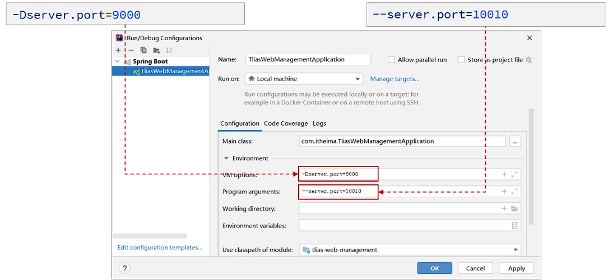

## 一、SpringBoot配置优先级
* **SpringBoot配置优先级：** 命令行 > java系统属性 > `.properties` > `.yml` > `.yaml` 
* **项目开发时一般统一使用一种文件格式(`.yml`)。**
* **SpringBoot除了支持配置文件配置属性，还支持Java系统属性和命令行参数配置**
  * **Java系统属性：** 通过-D指定，如：`-Dserver.port=8080`。
  * **命令行参数：** 通过命令行指定，如：`--server.port=8080`。
   
  * 在执行maven命令package将程序打包成jar包后，执行jar包时，可以通过命令行参数指定属性值，如：
   `java -Dserver.port=9000 -jar xxx.jar --server.port=8080`。
 