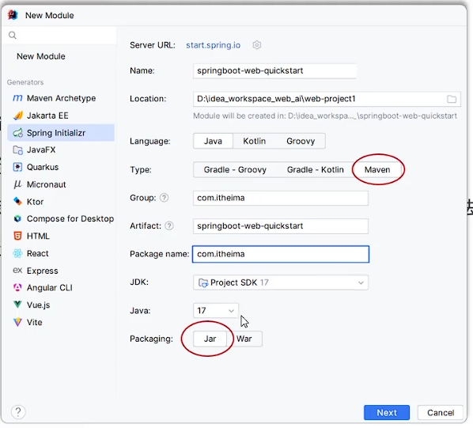
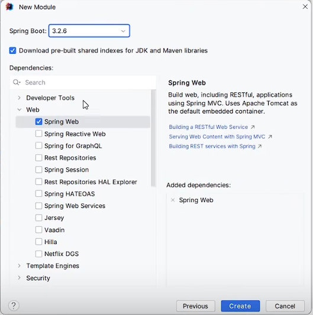
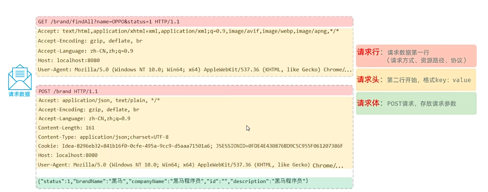
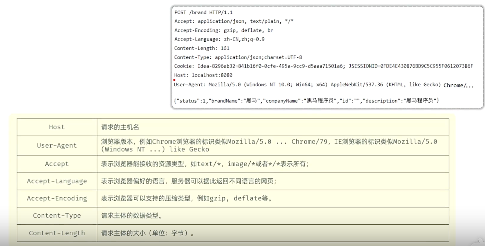
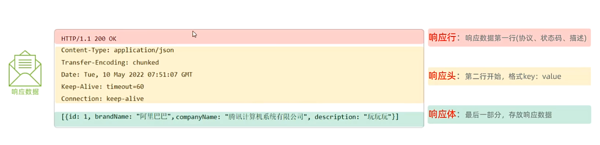
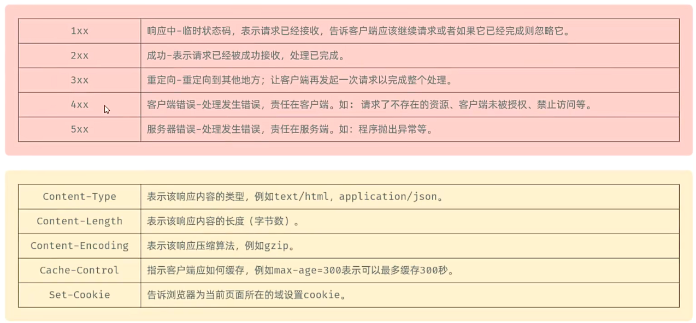

## 一、Web开发
* **静态资源：** 服务器上存放的资源，如HTML、CSS、JS、图片、视频、音频、字体文件等。不会因为用户的访问而改变。(负责页面展示)
* **动态资源：** 服务器端根据用户的请求和其他数据生成的，如Servlet、JSP、Spring框架等，会因为用户的访问而改变。
## 二、SpringWeb：
* **官网：** https://spring.io/
* **使用SpringBoot步骤：**
  * 1.创建一个SpringBoot项目。
   
  * 2.选择依赖：
   
初识SpringBoot例子：
```java
@RestController
public class HelloController {
    @RequestMapping("/hello")
    public String index() {
        return "HelloWorld";
    }
}
```
## 三、Http协议：
* **概念：** HTTP(HyperText Transfer Protocol)，超文本传输协议，规定了浏览器和服务器之间的数据传输规则。
* **特点：**
  * 1.基于TCP协议：面向连接，安全。
  * 2.基于请求-响应模型：一次请求对应一次响应。
  * 3.无状态：对于事务处理没有记忆能力，每次请求-响应过程都是独立的。
    * 缺点：多次请求不能共享数据。
    * 优点：速度快。
* **http请求数据格式：**


  * **GET请求：** 请求参数在请求行中，没有请求体。GET请求大小在浏览器中是有限制的。
  * **POST请求：** 请求参数在请求体中。POST请求大小无限制。 
  * **请求数据获取：** Web服务器(Tomcat)对HTTP协议的请求数据进行解析，并封装成了HttpServletRequest对象，在调用Controller方法时传递给了该方法。这样就不必对协议进行操作，让开发更便捷。
例子：
```java
@RestController
public class RequestController {
    //获取请求参数
    @RequestMapping("/getParam")
    public String getParam(HttpServletRequest request) {
        //1.获取请求方式
        String method = request.getMethod();
        System.out.println("请求方式：" + method);
        //2.获取请求url
        String url = request.getRequestURL().toString();
        System.out.println("请求url：" + url);
        //3.获取请求协议
        String protocol = request.getProtocol();
        System.out.println("请求协议：" + protocol);
        //4.获取请求头
        String header = request.getHeader("User-Agent");
        System.out.println("请求头：" + header);
        //5.获取请求参数
        String param = request.getParameter("username");
        String value = request.getParameter("age");
        System.out.println("请求参数：" + "\t\n" + "用户名：" + param + "\t\n" + "年龄：" + value);
        return "请求参数获取成功！";
    }
}
```
* **http响应数据格式：** 
  
  
  * * **响应数据设置：** Web服务器(Tomcat)对HTTP协议的响应数据进行封装，并封装成了HttpServletResponse对象，在调用Controller方法时传递给了该方法。这样就不必对协议进行操作，让开发更便捷。
例子：
```java
/**
 * 响应数据:HttpServletResponse设置响应数据
 */
@RestController
public class ResponseController {
    //设定响应数据
    //方式一：使用HttpServletResponse
    @RequestMapping("/getResponse")
    public void getResponse(HttpServletResponse response) throws IOException {
        //1.设置响应状态码
        response.setStatus(HttpServletResponse.SC_UNAUTHORIZED);//一般不指定状态码，由浏览器自动设定
        //2.设置响应头
        response.setHeader("name", "tuanzi");
        //3.设置响应体
        //手动调用 response.getWriter().write() 写入响应体。
        //方法返回 String 类型（return "success"），此时 Spring 会通过 @RestController 自动调用 getWriter() 再次写入返回值。
        //两者冲突导致 IllegalStateException。
        //将返回值类型改为void，不返回任何值，课解决上述异常
        response.getWriter().write("<h1>hello world</h1>");
        //return "success";
    }
    //方式二：使用ResponseEntity<T>
    @RequestMapping("/getResponse2")
    public ResponseEntity<String> getResponse2() {
        return ResponseEntity
                .status(HttpServletResponse.SC_UNAUTHORIZED)
                .header("name", "tuanzi")
                .body("<h1>hello world2</h1>");
    }
}
```
  * **注意：** 响应状态码和响应头一般不会手动设定。浏览器会根据请求逻辑自动设定。

 

