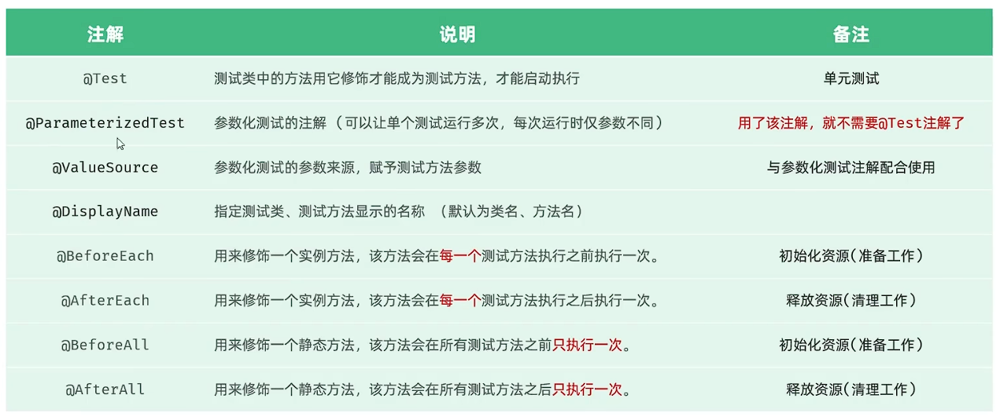

## 一、测试
* **测试：** 是一种用来促进鉴定软件正确性、完整性、安全性和质量的过程。
* **阶段：** 
  * **单元测试：** 对软件的最小单位进行测试，由开发人员进行。  
  * **集成测试：** 检查模块之间协作是否正确，由开发人员进行。  
  * **系统测试：** 由测试人员进行的，对软件系统进行测试。测试软件正确性和性能。 
  * **验收测试：** 由客户进行的，对软件业务流程进行测试。测试软件是否满足客户需求。
* **测试方法：**
  * **白盒测试：** 清楚其中代码结构逻辑，验证代码和逻辑的正确性。
  * **黑盒测试：** 不清楚代码结构逻辑，验证软件功能、兼容性。
  * **灰盒测试：** 既清楚代码结构逻辑，又关注外部表现。
 
* **JUnit：** 用于对Java程序进行单元测试。
* **断言：** 断言是测试方法中用来判断实际结果是否与预期结果是否一致的。
  
  * 该断言中的msg参数可以不指定，有对应重载方法。
  * **JUnit常见注解：**
  
* **企业级规范：** 在写测试方法时，要尽可能覆盖所有可能的情况（尤其是边界值）。
  * 可用通义灵码右键一键生成单元测试。 