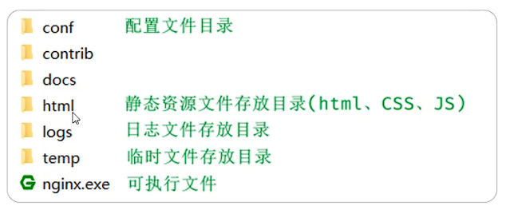
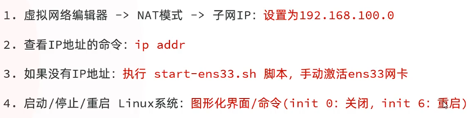
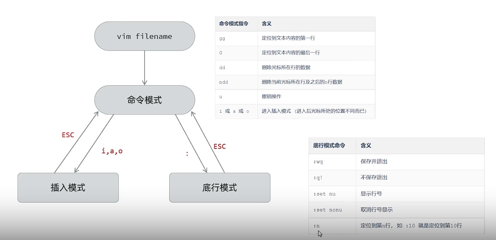

## 一、部署(Nginx)



* **反向代理：**

```
location ^~ /api/ { 
  rewrite ^/api/(.*)$ /$1 break;
  proxy_pass http://localhost:8080;
}
```

* **部署：** 将dist静态资源复制粘贴在nginx的的html目录下，并修改nginx.conf文件，将location路径指向dist目录即可。
* **nginx常用命令：**

```bash
nginx -s reload # 重新加载配置文件
nginx -s stop # 停止nginx
nginx -s quit # 优雅的停止nginx
nginx -s reopen # 重新打开日志文件
start nginx.exe # 启动nginx
```

## 二、部署(Linux)

* **linux:**
  
* **远程连接步骤：**
  **1.确认 Linux SSH 服务已启用**

```bash
# 检查 SSH 服务状态
sudo systemctl status ssh
# 若未安装（Ubuntu/Debian）
sudo apt update && sudo apt install openssh-server
# 启动 SSH 服务
sudo systemctl start ssh && sudo systemctl enable ssh
```

**2.配置防火墙允许 SSH**

```bash
# Ubuntu/Debian (UFW)
sudo ufw allow 22
# CentOS/RHEL (firewalld)
sudo firewall-cmd --permanent --add-service=ssh
sudo firewall-cmd --reload
```

**3.验证网络连通性**
 在 FinalShell 所在电脑执行：

```bash
ping 192.168.65.128
```

**预期结果** :
**text**

```
来自 192.168.65.128 的回复: 字节=32 时间<1ms TTL=64
```

* **Linux中目录的特点：**
  1.`/`是所有目录的顶点
  2.目录像一棵倒挂的树
* **linux中的文件目录树结构：(粗体要求重点关注)**
  * `bin`: 存放二进制可执行文件
  * `boot`: 存放设备文件
  * **`etc`: 存放系统配置文件**
  * `home`: 存放系统用户文件
  * `lib`: 存放程序运行所需的共享库和内核模块
  * `opt`: 额外安装的可选应用程序包所放置的位置
  * **`root`: 存放超级用户目录**
  * `sbin`: 存放二进制可执行文件，只有root用户才能访问
  * `tmp`: 存放临时文件
  * `usr`: 存放系统应用程序
  * `var`: 存放需要改变数据的文件，如日志文件

## 三、Linux常用命令

* **Linux命令格式：** `command [-options] [parameters]`
  * `command`: 命令名称
  * `[-options]`: 命令选项，用于对命令进行控制，也可以省略
  * `[parameters]`: 命令参数，用于指定命令的输入和输出，可以一个，也可多个
* **技巧：**
  * Tab键自动补全命令
  * 连续两次Tab键给出提示
  * 使用上下键键选择历史命令
  * 使用Ctrl+l或clear清屏
* **ls命令：**
  * `ls`: 显示当前目录下的文件和目录
  * `ls [-a|-l] [dir]`
  * `ls -a`: 显示所有文件，包括隐藏文件(.开头的文件)
  * `ls -l`: 显示文件详细信息，文件类型，权限，拥有者，大小等详细信息。别名为ll。
    * 权限：
      `r`: 读; `w`: 写; `x`: 执行; `-`: 没有; 若是目录，权限符前会显示 `d`，若是文件，权限符前会显示 `-`，后缀不能表示目录或文件
* **cd命令：**
  * `cd [dir]`: 切换到指定目录
  * `cd ..`: 返回上一级目录
  * `.`: 当前目录
  * `cd -`: 返回上一次所在目录
  * `cd ~`: 切换到用户home目录
  * `cd /usr`: 切换到usr目录
* **mkdir命令：**
  * `mkdir [-p] dir`: 创建目录
  * `-p`: 确保目录存在，不存在则创建，通过此选项，可以实现多层目录同时创建。
* **rm命令：**
  * `rm [-rf] fileName`: 删除文件或目录
  * `-r`: 将目录及目录中的所有文件/目录逐一删除
  * `-f`: 无需确认，直接删除
* **cat命令：**
  * `cat [-n] fileName`: 显示文件内容
  * `-n`: 由1开始对输出行编号
  * 只适合用于查询小文件
* **more命令：**
  * `more fileName`: 以分页形式显示文件内容
  * 操作说明：
    `q`或ctrl+c: 退出；回车键: 向下滚动一行；空格键: 向下滚动一屏；`b`: 向上滚动一行；
* **head命令：**
  * `head [-n] fileName`: 显示文件开头几行内容
  * `-n`: 显示指定行数(不加行数，默认显示10行)
* **tail命令：**
  * `tail [-nf] fileName`: 显示文件结尾几行内容
  * `-n`: 显示指定行数(不加行数，默认显示10行)
  * `-f`: 动态读取文件末尾内容并显示，用于日志文件的内容输出。
* **cp命令：**
  * `cp [-r] sourceFile targetFile`: 复制文件或目录
  * `-r`: 复制目录及目录中的所有文件/目录
* **mv命令：**
  * 为文件/目录改名，或移动文件/目录(第二个参数若是已经存在的目录，则将文件移动到该目录下)
  * `mv sourceFile targetFile`: 移动文件或目录
* **tar命令：**
  * `tar [-zcxvf] fileName [files]`: 压缩和解压缩文件
  * **说明：**
    * 包文件后缀为.tar表示只是完成了打包，并没有压缩
    * 包文件后缀为.tar.gz表示打包的同时完成压缩
  * **选项：**
    * `-z`: 使用gzip进行压缩，gzip可以对文件进行压缩或者解压
    * `-c`: create，创建一个包文件
    * `-x`: extract，从包文件中还原文件
    * `-v`: verbose，详细显示命令的执行过程
    * `-f`: file，指定包文件的名称
    * **例子：**
      * `tar -cvf hello.tar hello`: 创建一个hello.tar包，并把hello打包进去
      * `tar -zcvf hello.tar.gz hello`: 将hello进行打包并压缩，文件名为hello.tar.gz
      * `tar -xvf hello.tar`: 解压hello.tar包，并将解压的文件放在当前目录下
      * `tar -zxvf hello.tar.gz`: 解压hello.tar.gz包，并将解压的文件放在当前目录下
      * `tar -zxvf hello.tar.gz -C /usr/local`: 解压hello.tar.gz包，并将解压的文件放在/usr/local目录下
* **vi/vim**
  * **作用：** vi是linux的文本编辑工具
  * **命令：** `vi filename`: 打开文件filename
  * **关于Vim的安装**：日常使用选 `sudo apt install vim`；开发/插件选 `vim-nox`；需要 GUI 选 `vim-gtk3`.
    
* **find命令：**
  * `find dir -options fileName`: 在指定目录下查找文件
* **grep命令：**
  * `grep [-inAB] word fileName`: 在指定文件中查找指定的文本内容
  * **选项：**
    * `-i`: 忽略大小写
    * `-n`: 输出关键字所在的行号
    * `-A`: 输出关键字所在行及后面几行(例如：-A5表示输出关键字所在行及后面5行)
    * `-B`: 输出关键字所在行及前面几行(例如：-B5表示输出关键字所在行及前面5行)
## 四、前端项目部署在Nginx上
* **1.前端项目打包：** 将打包好的dist文件夹放在nginx的html目录下，并修改nginx的配置文件，将html目录下的dist文件夹映射到nginx的html目录下。
* **2.nginx配置文件：** 在`/etc/nginx/sites-enabled/default`文件中修改配置（若项目在 /var/www/html/dist）：
```conf
server {
    listen 80 default_server;
    listen [::]:80 default_server;
    
    # 修改根目录到您的 dist 文件夹
    root /var/www/html/dist;
    
    # 添加 index 文件支持（Vue/React/Angular 等框架通常使用 index.html）
    index index.html;
    
    location / {
        # 单页面应用（SPA）需要此配置支持前端路由
        try_files $uri $uri/ /index.html;
    }
    
    # 可选：静态资源缓存配置
    location ~* \.(js|css|png|jpg|jpeg|gif|ico|svg)$ {
        expires 30d;
        add_header Cache-Control "public, no-transform";
    }
}
```
* **3.当使用 vim 编辑时提示只读，需用 sudo 提权：**
```bash
# 使用管理员权限编辑配置文件
sudo vim /etc/nginx/sites-enabled/default
```
* **4.应用配置的完整流程：**
```bash
# 1. 检查配置语法是否正确
sudo nginx -t

# 应看到提示：
# nginx: configuration file /etc/nginx/nginx.conf test is successful

# 2. 重启 Nginx 使配置生效
sudo systemctl restart nginx

# 3. 检查服务状态
sudo systemctl status nginx

# 4. 验证目录权限（确保 Nginx 可读取）
sudo chown -R www-data:www-data /var/www/html/dist
sudo chmod -R 755 /var/www/html/dist
```

## 五、后端项目部署在Nginx上
* 在`/etc/nginx/sites-enabled/default`文件中修改配置，随后启动打包好的jar包：
```
 location ^~ /api/ {
          rewrite ^/api/(.*)$ /$1 break;
          proxy_pass http://localhost:8080;
        }
```
* **项目中需要修改日志的路径，修改为`/var/log/nginx/`**
* **项目中需要修改MySQL的连接地址，修改为`jdbc:mysql://LinuxIP:3306/`；以及Linux中的用户密码**
* **Linux中需要添加阿里云的AccessKey和SecretKey的环境变量:**
* **具体步骤：**
**编辑用户配置文件：**

```bash
sudo vim ~/.bashrc
```
添加以下内容到文件末尾：

```bash
# 阿里云 OSS 配置
export OSS_ACCESS_KEY_ID="LTAI5t6kT4dqexvqVs6toAwp"  # 替换为您的实际AccessKey
export OSS_ACCESS_KEY_SECRET="your_secret_key_here"  # 替换为您的实际Secret
```
保存并退出：`:wq`
立即生效配置：
```bash
source ~/.bashrc
```
**验证环境变量生效**
终端直接检查：

```bash
# 检查变量是否存在
echo $OSS_ACCESS_KEY_ID
echo $OSS_ACCESS_KEY_SECRET

# 安全显示（避免泄露完整密钥）
echo "OSS_ACCESS_KEY_ID: ${OSS_ACCESS_KEY_ID:0:4}****${OSS_ACCESS_KEY_ID: -4}"
```
* **若不希望关闭窗口，进程停止，可使用`nohup`命令：**
  * `nohup java -jar xxx.jar > tlian.log &` 
  * 查看进程：`ps -ef | grep java`
  * 停止进程：`kill -9 进程号`