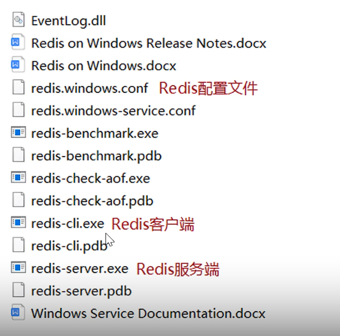
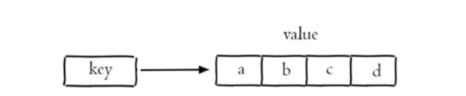

### 一、Redis简介
* **Redis：** Redis是一个开源的基于内存的键值对（key-value）数据库。
  * 基于内存存储，读写性能高
  * 适合存储热点数据，需要大量访问的数据(热点商品、资讯、新闻)
* **启动redis：** redis-server.exe redis.windows.conf
* **redis的目录结构：**

* **修改密码：** 在redis.windows.conf文件中添加：requirepass 123456
### 二、Redis的常用数据类型
* **value的数据类型：** 
  * `String`：字符串, Redis中最简单的数据类型
  * `Hash`：哈希, 散列, 类似于Java的HashMap结构
  * `List`：列表, 按照数据的插入顺序排序，允许重复数据，类似于Java的LinkedList结构
  * `Set`：集合, 无序集合，不允许重复数据，类似于Java的HashSet结构
  * `ZSet/sorted set`：有序集合, 集合中每个元素关联一个分数(score)，分数决定元素的顺序，分局分数进行升序排序，没有重复元素。
### 三、Redis字符串类型常用命令：
* **`set key value`**：设置指定key的值
* **`get key`**：获取指定key的值
* **`setex key seconds value`**：设置指定key的值，并设置过期时间为seconds秒
* **`setnx key value`**：key不存在时设置key的值
### 四、Redis哈希类型常用命令：
* **`hset key field value`**：设置指定key的field的值
* **`hget key field`**：获取存储在哈希表中指定字段的值
* **`hdel key field`**：删除存储在哈希表中的指定字段
* **`hkeys key`**：获取存储在哈希表中的所有字段
* **`hvals key`**：获取存储在哈希表中的所有值
  
### 五、Redis列表类型常用命令：
* **`lpush key value1 value2 ...`**：将一个或多个值插入到列表头部
* **`lrange key start stop`**：获取列表中指定范围内的元素。
* **`rpop key`**：移除并返回列表中的最后一个元素
* **`llen key`**：返回列表的长度
 
### 六、Redis集合类型常用命令：
* **`sadd key member1 member2 ...`**：将一个或多个成员添加到集合
* **`smembers key`**：返回集合中的所有成员
* **`scard key`**：返回集合的成员数
* **`sinter key1 key2 ...`**：返回多个集合的交集
* **`sunion key1 key2 ...`**：返回多个集合的并集
* **`srem key member1 member2 ...`**：从集合中移除一个或多个成员
 
### 七、Redis有序集合常用命令：
* **`zadd key score member score2 member2 ...`**：添加一个或多个成员到有序集合中
* **`zrange key start stop [WITHSCORES]`**：返回有序集合中指定区间内的成员，若使用`WITHSCORES`参数，则返回成员和分数值。
* **`zincrby key increment member`**：为有序集合中的成员增加一个指定的分数值(increment)
* **`zrem key member1 member2 ...`**：移除有序集合中一个或多个成员

### 八、Redis通用命令：
* **`keys *`**：返回数据库中所有`key`的名称
* **`keys pattern`**：返回数据库中匹配指定模式的`key`名称
* **`exists key`**：判断`key`是否存在
* **`type key`**：返回`key`所存储的值的类型
* **`del key`**：在`key`存在时删除它
### 九、Java操作Redis：
* **Redis的java客户端：** Jedis、Lettuce、**Spring Data Redis**
* **Spring Data Redis 使用步骤：**
  * 1.引入依赖。
  * 2.配置Redis数据源。
  * 3.编写配置类，创建RedisTemplate对象。
   
  * 4.使用RedisTemplate对象操作Redis。 
   
