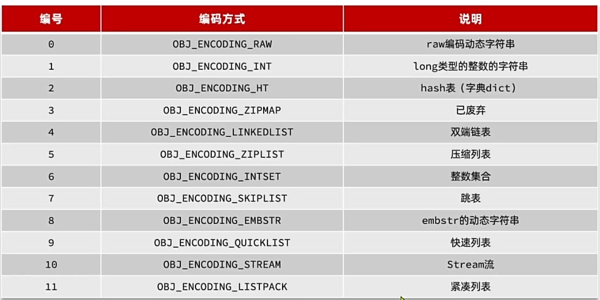

### 一、主从集群
单节点Redis的并发能力有上限，要进一步提高Redis的并发，需要搭建主从集群，实现读写分离。

####  **1. 建立主从集群**:
1. 利用docker创建3个redis实例
```yaml
version: "3.2"

services:
  r1:
    image: redis
    container_name: r1
    network_mode: "host"
    entrypoint: ["redis-server", "--port", "7001"]
  r2:
    image: redis
    container_name: r2
    network_mode: "host"
    entrypoint: ["redis-server", "--port", "7002"]
  r3:
    image: redis
    container_name: r3
    network_mode: "host"
    entrypoint: ["redis-server", "--port", "7003"]
```
2. 将上述配置文件保存为docker-compose.yml，存入/root/redis目录下，并运行`docker-compose up -d`
3. 可使用`ps -ef | grep redis`查看运行中的redis实例
4. 配置主从关系
```bash
# 进入r1实例
docker exec -it r1 redis-cli -p 7001
# 可通过命令查看当前实例
info replication # 若没有配置过主从关系，默认都是主
# 退出
exit
# 配置r2实例为r1的从实例
docker exec -it r2 redis-cli -p 7002
# Redis5.0以前
slaveof <r1的ip地址> <r1的端口号>
# Redis5.0以后还可以使用:
replicaof <r1的ip地址> <r1的端口号>
# r3配置过程和r2一样
```
#### **2. 主从同步原理**
当主从第一次同步连接或断开重连时，从节点都会发送psync请求，尝试同步数据。
master判断slave是否第一次同步，靠`replicationID`: 每个master节点都有自己唯一的id，简称`replid`
`offset`: repl_backlog中写入过的数据长度，写操作越多，offset值越大，主从的offset一致，表示数据一致。


#### **3. 主从同步优化**
**全量同步**: master将完整的内存数据生成RDB文件，并保存在磁盘中，发送RDB文件给从节点。
**增量同步**: slave提交offset到master，master获取repl_backlog中slave的offset之后的命令给slave。
当slave结点断开又恢复，并且在repl_backlog中能找到offset后，则会触发增量同步。
若从节点长时间宕机，repl_baklog中的offset已经被覆盖时，此时就会触发全量同步。
为了避免使用全量同步，做出如下优化:
- 在master结点中配置`repl-diskless-sync`为`yes`，启用无磁盘复制，避免全量同步时的磁盘IO。
- Redis单节点上的内存占用不能太大，减少RDB导致的过多磁盘IO
- 提高`repl_baklog`的大小, 发现slave宕机时尽快修复，避免触发全量同步
- 限制一个master结点上的slave结点数量，如果有太多slave，可以采用主-从-从的链式结构，减少master压力。
  
  但当使用主-从-从结构时，会产生时效性的问题，即从结点与主结点之间的数据延迟。需要对实际情况做出取舍。
#### **4. 哨兵原理**
Redis 提供了哨兵(Sentinel)机制来实现主从集群的自动故障恢复。具体作用如下:
- **监控**: Sentinel会不断检查master和slave
- **自动故障切换**: 当master结点出现故障时，Sentinel会自动将slave结点提升为master结点，并重新配置slave结点。当故障实例恢复后，也以新的master为主。
- **通知**: 当集群发生故障转移时，Sentinel会将最新的节点角色信息推送给Redis的客户端。
 
Sentinel是基于心跳机制检测服务状态，每隔1秒向集群的每个实例发送ping命令:
- **主观下线:** 若某Sentinel的节点发现某实例未在规定时间响应，则认为该实例主观下线。
- **客观下线:** 若超过指定数量(quorum)的Sentinel认为某实例主观下线，则认为该实例客观下线。quorum的值最好超过Sentinel数量的一半。
Sentinel选举新master:
- 首先会判断slave节点于master节点断开时间长短，若超过指定值(down-after-milliseconds * 10)则会排除该slave节点。
- 然后判断slave节点的slave-prority值，越小优先级越高，若等于0则永不参与选举。
- 若slave-prority一样，则判断slave节点的offset值，越大则数据越新，优先级越高。
- 最后判断slave节点的运行id大小，越小则优先级越高。
实现故障转移:
当选中了一个slave为新的master后，故障转移步骤如下:
- sentinel给备选的slave节点发送`slaveof no one`命令，将slave节点变为master节点。
- sentinel给所有其他slave发送`slaveof <新master的ip> <新master的端口号>`命令，将所有slave节点的master信息改为新的master, 从新的master节点开始接受数据。
- sentinel将故障节点标记为slave，当故障节点恢复后会自动成为新的master的slave节点。
 
#### **5. 搭建哨兵集群**
1. 停止已经启动的redis实例：
```bash
# 老版本DockerCompose
docker-compose down

# 新版本Docker
docker compose down
```
2. 准备配置文件sentinel.conf:
```bash
sentinel announce-ip "192.168.150.101"
sentinel monitor hmaster 192.168.150.101 7001 2
sentinel down-after-milliseconds hmaster 5000
sentinel failover-timeout hmaster 60000
```
参数说明:
- `sentinel announce-ip "192.168.3.54"`：声明当前sentinel的ip
- `sentinel monitor hmaster 192.168.3.54 7001 2`：指定集群的主节点信息 
  - `hmaster`：主节点名称，自定义，任意写
  - `192.168.3.54 7001`：主节点的ip和端口
  - `2`：认定master下线时的quorum值
- `sentinel down-after-milliseconds hmaster 5000`：声明master节点超时多久后被标记下线
- `sentinel failover-timeout hmaster 60000`：在第一次故障转移失败后多久再次重试
3. 在虚拟机的/root/redis目录下新建3个文件夹：s1、s2、s3: `mkdir s1 s2 s3`
   将sentinel.conf文件分别拷贝一份到3个文件夹中。
4. 修改docker-compose.yaml文件，内容如下：
```yaml
version: "3.2"

services:
  r1:
    image: redis
    container_name: r1
    network_mode: "host"
    entrypoint: ["redis-server", "--port", "7001"]
  r2:
    image: redis
    container_name: r2
    network_mode: "host"
    entrypoint: ["redis-server", "--port", "7002", "--slaveof", "192.168.150.101", "7001"]
  r3:
    image: redis
    container_name: r3
    network_mode: "host"
    entrypoint: ["redis-server", "--port", "7003", "--slaveof", "192.168.150.101", "7001"]
  s1:
    image: redis
    container_name: s1
    volumes:
      - /root/redis/s1:/etc/redis
    network_mode: "host"
    entrypoint: ["redis-sentinel", "/etc/redis/sentinel.conf", "--port", "27001"]
  s2:
    image: redis
    container_name: s2
    volumes:
      - /root/redis/s2:/etc/redis
    network_mode: "host"
    entrypoint: ["redis-sentinel", "/etc/redis/sentinel.conf", "--port", "27002"]
  s3:
    image: redis
    container_name: s3
    volumes:
      - /root/redis/s3:/etc/redis
    network_mode: "host"
    entrypoint: ["redis-sentinel", "/etc/redis/sentinel.conf", "--port", "27003"]
```
5. 启动集群：`docker-compose up -d`
#### **6. 分片集群**
主从和哨兵可以解决高可用、高并发读写问题，但仍有两个问题没有解决:
- 海量数据存储问题
- 高并发写的问题
使用分片集群可解决上述问题，分片集群特征:
- 集群有多个master节点, 每个master节点存储一部分数据
- 每个master节点有若干个slave节点
- master之间通过ping监测彼此健康状态

1. 分片集群搭建
新建一个docker-compose.yaml文件，内容如下：
```yaml
version: "3.2"

services:
  r1:
    image: redis
    container_name: r1
    network_mode: "host"
    entrypoint: ["redis-server", "--port", "7001", "--cluster-enabled", "yes", "--cluster-config-file", "node.conf"]
  r2:
    image: redis
    container_name: r2
    network_mode: "host"
    entrypoint: ["redis-server", "--port", "7002", "--cluster-enabled", "yes", "--cluster-config-file", "node.conf"]
  r3:
    image: redis
    container_name: r3
    network_mode: "host"
    entrypoint: ["redis-server", "--port", "7003", "--cluster-enabled", "yes", "--cluster-config-file", "node.conf"]
  r4:
    image: redis
    container_name: r4
    network_mode: "host"
    entrypoint: ["redis-server", "--port", "7004", "--cluster-enabled", "yes", "--cluster-config-file", "node.conf"]
  r5:
    image: redis
    container_name: r5
    network_mode: "host"
    entrypoint: ["redis-server", "--port", "7005", "--cluster-enabled", "yes", "--cluster-config-file", "node.conf"]
  r6:
    image: redis
    container_name: r6
    network_mode: "host"
    entrypoint: ["redis-server", "--port", "7006", "--cluster-enabled", "yes", "--cluster-config-file", "node.conf"]
```
**注意:** 使用Docker部署Redis集群，network模式必须采用host
2. 进入/root/redis-cluster目录，使用命令启动redis：`docker-compose up -d`
3. 创建集群:
```bash
# 进入任意节点容器
docker exec -it r1 bash
# 然后，执行命令
redis-cli --cluster create --cluster-replicas 1 \
192.168.150.101:7001 192.168.150.101:7002 192.168.150.101:7003 \
192.168.150.101:7004 192.168.150.101:7005 192.168.150.101:7006
```
命令说明：
- redis-cli --cluster：代表集群操作命令
- create：代表是创建集群
- --cluster-replicas 1 ：指定集群中每个master的副本个数为1
  - 此时节点总数 ÷ (replicas + 1) 得到的就是master的数量n。因此节点列表中的前n个节点就是master，其它节点都是slave节点，随机分配到不同master
4. 查看集群状态: `redis-cli -p 7001 cluster nodes`
#### **7. 散列插槽**
redis的集群中，共有16384个插槽(hash slot), 集群中的每一个master节点都会分配一定数量的hash slots。
redis数据不是与节点绑定，而是与插槽slots绑定。当读写数据时，redis会基于CRC16算法对key做hash运算，得到的结果与16384取余，就计算出了key的slot值，然后到slot所在的Redis节点执行读写操作。
redis在计算key的hash值是不一定根据整个key计算，分两种情况:
- 当key中包含`{}`时，根据`{}`之间的字符串计算hash slot
- 当key中不包含`{}`时，根据key的整个字符串计算hash slot
###  二、数据结构
#### **1. RedisObject**
Redis中任意数据类型的键和值都会呗封装为一个RedisObject，也叫Redis对象。
RedisObject结构如下：
```c
typedef struct redisObject { 
  unsigned type:4;  // 对象类型，分别是String、Hash、list、set和zset, 占4个bit位
  unsigned encoding:4; // 底层编码方式，共12种，占4个bit位
  unsigned lru:LRU_BITS; // LRU: 以秒为单位记录最近一次被访问的时间，占用24个bit位。
                        // LFU: 高16位以分钟为单位记录最近一次访问时间，低8位记录逻辑访问次数
  int refcount; // 对象计数器，计数器为0则说明对象无人引用，可以回收
  void *ptr; // 指针，指向存放实际数据的空间
} robj;
```
redis会根据存储数据的不同，选择不同的编码方式，共包含12种编码方式：

五种数据结构:

#### **2. skipList**
SkipList跳表，是一种链表，但与链表相比有差异:
- 元素按照升序排列存储
- 节点可能包含多个指针，指针跨度不同
  
最多可以允许32个指针
#### **3. SortedSet**
SortedSet有序集合，特点是:
- 每组数据都包含score和member
- member是唯一的
- 可根据score进行排序
- 要快捷的根据member查score，因此底层有一个哈希表，以member为key，score为value
- 其次为了能够根据score进行排序，底层还维护了一个跳表
- 需要根据member查score，则去哈希表种查询；要根据score查询顺序，则基于跳表查询
### 三、内存回收
#### **1. 过期Key处理**
redis本身史键值型数据库，其所有的数据都存在一个redisDB的结构体中，其中包含两个哈希表:
- dict: 保存Redis中所有的键值对
- expires: 保存Redis中所有设置了过期时间的键以及到期时间(写入时间 + TTL)
 
Redis并不会实时监测key的过期时间，而是采用两种延迟删除的策略:
- 惰性删除：当有命令需要操作一个Key时，检查该Key的存活时间，如果已经过期则删除该Key
- 周期删除: 通过一个定时任务，周期性抽样部分有TTL的key，若已经过期则删除该Key
周期删除还有两种策略:
- SLOW模式: 默认执行频率每秒十次，但每次执行时长不超过25ms，受到server.hz参数的影响
- FAST模式: 频率不固定，跟随Redis内部的IO事件循环执行，两次任务之间的间隔不低于2ms，执行时长不超过1ms
#### **2. 内存淘汰**
当Redis的内存使用到达设置的阈值时，Redis会主动挑选部分Key删除，释放更多内存的流程。
redis会在每次处理客户端命令时都会对内存使用情况做出判断，如果必要则执行内存淘汰。内存淘汰的策略有:
- noeviction: 不淘汰任何Key，但是内存满时不允许写入新数据，默认策略。
- volatile-ttl: 对设置了TTL的key，比较key的TTL值，选择TTL值最小的key进行淘汰
- allkeys-random: 对全体key，进行随机淘汰，也就是直接从db->dict中随机挑选。
- volatile-random: 对设置了TTL的key，随机选择一个进行淘汰，也就是从db->expires中随机挑选。
- allkeys-lru: 对全体key，基于LRU算法进行淘汰
- volatile-lru: 对设置了TTL的key，基于LRU算法进行淘汰
- volatile-lfu: 对设置了TTL的key，基于LFU算法进行淘汰
- allkeys-lfu: 对全体key，基于LFU算法进行淘汰

关于LRU: 最近最少使用，用当前时间减去最后一次访问的时间，值越大则淘汰优先级越高。
LFU: 最少频率使用，统计每个key的访问频率，值越小则淘汰优先级越高。
LFU叫做逻辑访问次数，因为并不是每次key被访问都计数，而是通过运算:
1. 生成[0, 1)之间的随机数R
2. 计算1/(旧次数 * lfu_log_factor + 1), 记录为P，lfu_log_factor默认为10
3. 如果R < P，则计数器 + 1，且最大不超过255
4. 访问次数会随着时间衰减，距离上一次访问时间每隔lfu_decay_time(默认为1)，计数器 - 1
### 四、Redis缓存
#### 1. 缓存一致性

低一致性时使用Redis的Key清理过期方案
高一致性时，主动更新，并以超时剔除作为兜底方案
- 读操作
  缓存命中则直接返回
  缓存未命中则从数据库中获取数据，并写入缓存，设定超时时间
- 写操作
  先写数据库，再删除缓存
  确保数据库与缓存操作的原子性
#### 2. 缓存穿透
缓存穿透是指客户端请求的数据在数据库中根本不存在，从而导师制请求穿透缓存，直接到达数据库的问题。
解决方案:
- 缓存空数据
  - 优点: 实现简单，维护方便
  - 缺点: 额外的内存消耗
- 布隆过滤
  - 优点: 内存占用少，没有多余key
  - 缺点: 实现复杂，存在误判可能
  
  布隆过滤器是一种数据统计的算法，用于判断一个元素是否属于一个集合。
  但是布隆过滤无需存储元素到集合，而是将元素映射到一个很长的二进制数位上。
  - 首先需要一个很长的二进制数，默认每一位都是0
  - 然后需要N个不同算法的哈希函数
  - 将集合中的元素根据N个哈希函数做运算，得到N个数字，然后将每个数字对应的bit标记为1
  - 判断某元素是否存在只需要把元素按照上述方式运算，判断对应bit位是否是1即可
#### 3. 缓存雪崩
缓存雪崩: 是指在同一时段大量缓存key同时失效或者redis服务宕机，导致大量请求到达数据库，带来巨大压力。
解决方案：
- 给不同的key的TTL添加随机值
- 利用Redis集群提高服务的可用性
- 给缓存业务添加降级限流策略
- 给业务添加多级缓存
#### 4. 缓存击穿
缓存击穿问题也叫热点key问题，一个被高并发访问且缓存重建业务较复杂的key突然失效了，无数的请求访问会在瞬间给数据库带来巨大冲击
常见解决方案:
- 互斥锁
- 逻辑过期
执行过程:

二者区别:

