### 一、微服务初识
1. 单体架构: 将所有业务功能集中在一个项目中，打包成一个包部署。
2. 微服务架构: 将所有业务功能拆分成多个项目，每个项目对应一个服务，通过API进行调用。
3. 微服务工程结构: (1)独立project; (2)maven聚合
### 二、远程调用
Spring提供了一个RestTemplate类，用于进行http请求的发送:
1. 注入RestTemplate到Spring容器中:
```java
@Bean
public RestTemplate getRestTemplate(){
return new RestTemplate();
}
```
2. 使用RestTemplate发送http请求:
```java
public <T> ResponseEntity<T> exchange(
  String url, //请求路径
  HttpMethod method, //请求方式
  @Nullable HttpEntity<?> requestEntity, //请求实体，可以为空
  Class<T> responseType, //返回值类型
  Map<String, ?> uriVariables //url参数
)
```
### 三、Nacos注册中心
1. **原理:**
   
   **服务提供者**: 暴露服务接口，给其他服务调用。
   **服务消费者**: 调用其他服务提供的接口
   **注册中心**: 记录并监控微服务的各实例状态，推送服务变更信息
   服务提供者会在启动时注册自己的信息到注册中心，消费者可以从注册中心订阅拉取服务信息
   服务提供者会通过心跳机制向注册中心报告健康状态，当心跳异常就会被注册中心剔除
   消费者可以通过负载均衡算法，从多个实例中选择一个
2. **搭建nacos**:
   (1)下载nacos的压缩包
   (2)在数据库中导入nacos的sql文件
   (3)使用`docker load -i nacos.tar`命令将nacos镜像导入docker
   (4)使用`docker run -d -p 8848:8848 --name nacos-8848 -e MODE=standalone -e NACOS_SERVER_IP=192.168.1.100 nacos/nacos-server:1.4.1`命令启动nacos
   (5)其中的nacos/custom.env文件中，有一个MYSQL_SERVICE_HOST也就是mysql地址，需要修改为你自己的虚拟机IP地址：
   ```
   PREFER_HOST_MODE=hostname
   MODE=standalone
   SPRING_DATASOURCE_PLATFORM=mysql
   MYSQL_SERVICE_HOST=192.168.150.101
   MYSQL_SERVICE_DB_NAME=nacos
   MYSQL_SERVICE_PORT=3306
   MYSQL_SERVICE_USER=root
   MYSQL_SERVICE_PASSWORD=123
   MYSQL_SERVICE_DB_PARAM=characterEncoding=utf8&connectTimeout=1000&socketTimeout=3000&autoReconnect=true&useSSL=false&allowPublicKeyRetrieval=true&serverTimezone=Asia/Shanghai
   ```
   (6)然后，将课前资料中的nacos目录上传至虚拟机的/root目录。进入root目录，然后执行下面的docker命令：
   ```bash
   docker run -d \
   --name nacos \
   --env-file ./nacos/custom.env \
   -p 8848:8848 \
   -p 9848:9848 \
   -p 9849:9849 \
   --restart=always \
   nacos/nacos-server:v2.1.0-slim
   ```
   (7)引入nacos依赖
   ```xml
   <dependency>
   <groupId>com.alibaba.cloud</groupId>
   <artifactId>spring-cloud-starter-alibaba-nacos-discovery</artifactId>
   </dependency>
   ```
   (8)配置nacos
   ```yaml
   spring:
    application:
     name: nacos-demo # 服务名
    cloud:
     nacos:
      server-addr: 虚拟机地址:8848 # nacos地址
   ```
3. **服务发现:**
   消费者需要连接nacos以拉取和订阅服务，因此服务发现的前两步和服务注册是一样的。
   服务调用:
   ```java
   private final DiscoveryClient discoveryClient;

   private final handlerCartItems(List<CartVo> vos){
    // 1.根据服务名称拉取服务实例列表
    List<ServiceInstance> instances = discoveryClient.getInstances("nacos-demo");
    // 2.负载均衡，挑选一个实例
    ServiceInstance instance = loadBalancer.choose(RandomUtil.randomInt(instances.size()));
    // 3.获取实例的ip和端口
    Url url = instance.getUri();
    // ......
   }
   ```
### 四、openFeign
openFeign是一个用于简化RESTful客户端访问的开源库, 使http请求的发送更简单。
1. **使用:**
   (1)引入依赖，OpenFeign和SpringCloudLoadBalancer:
   ```xml
   <!-- OpenFeign -->
   <dependency>
   <groupId>org.springframework.cloud</groupId>
   <artifactId>spring-cloud-starter-openfeign</artifactId>
   </dependency>
   <!-- 负载均衡 -->
   <dependency>
   <groupId>org.springframework.cloud</groupId>
   <artifactId>spring-cloud-starter-loadbalancer</artifactId>
   </dependency>
   ```
   (2)通过`@EnableFeignClients`开启openFeign功能
   ```java
   @EnableFeignClients
   @SpringBootApplication
   public class OrderApplication {...}
   ```
   (3)编写FeignClient接口
   ```java
   @FeignClient(value = "payment-service")
   public interface ItemClient {
    @GetMapping("/item/{id}")
    public Item findById(@RequestParam("ids") Collection<Long> ids);
   }
   ```
   (4)使用FeignClient接口，实现远程调用
   ```java
   List<ItemDTO> items = itemClient.findById(List.of(1, 2));
   ```
2. **连接池:**
   `OpenFeign`对http请求进行了封装，不过其底层发起http请求，依赖于其它的框架:
   **HttpUrlConnection**: 不支持连接池，使用起来比较简单，但是性能较低。
   **Apache HttpClient**: 支持连接池
   **OkHttp**: 支持连接池
   整合`OkHttp`，实现连接池步骤:
   (1)引入依赖
   ```xml
   <!-- OkHttp依赖 -->
   <dependency>
   <groupId>io.github.openfeign</groupId>
   <artifactId>feign-okhttp</artifactId>
   </dependency>
   ```
   (2)开启连接池功能
   ```yml
   feign: 
    okhttp: 
      enabled: true # 开启连接池功能
   ```
3. **日志输出:**
   `OpenFeign`只会在FeignClient所在包的日志级别为`DEBUG`时才输出日志, 输出日志的级别有4级:
   (1)`NONE`: 不输出日志
   (2)`BASIC`: 仅记录请求的方法，URL以及响应状态码和执行时间
   (3)`HEADERS`: 除了`BASIC`中定义的信息之外，还有请求和响应的头信息
   (4)`FULL`: 记录所有请求和响应的明细信息，包括请求头、请求体、元数据。
   Feign默认的日志级别为`NONE`
   要定义日志级别，需要声明一个类型为`Logger.Level`的Bean:
   ```java
   public class LoggerConfig {
    @Bean
    public Logger.Level feignLoggerLevel() {
      return Logger.Level.FULL;
    }
   }
   ```
   然后再某个`FeignClient`的`@FeignClient`注解中声明:
   ```java
   @FeignClient(name = "service-a", configuration = LoggerConfig.class)
   ```
   若要全局配置，则在`@EnableFeignClients`注解中声明:
   ```java
   @EnableFeignClients(defaultConfiguration = LoggerConfig.class)
   ```
### 五、网关
1. **网关就是网络的关口，负责请求的路由、转发、身份校验**
2. **使用:**
   (1)创建新模块
   (2)引入依赖
   ```xml
   <dependencies>
        <!--common-->
        <dependency>
            <groupId>com.heima</groupId>
            <artifactId>hm-common</artifactId>
            <version>1.0.0</version>
        </dependency>
        <!--网关-->
        <dependency>
            <groupId>org.springframework.cloud</groupId>
            <artifactId>spring-cloud-starter-gateway</artifactId>
        </dependency>
        <!--nacos discovery-->
        <dependency>
            <groupId>com.alibaba.cloud</groupId>
            <artifactId>spring-cloud-starter-alibaba-nacos-discovery</artifactId>
        </dependency>
        <!--负载均衡-->
        <dependency>
            <groupId>org.springframework.cloud</groupId>
            <artifactId>spring-cloud-starter-loadbalancer</artifactId>
        </dependency>
    </dependencies>
   ```
   (3)编写启动类
   (4)配置路由规则
   ```yml
   spring:
      cloud:
         gateway:
            routes:
               - id: item # 路由id, 自定义, 唯一
                 uri: lb://item-service # 路由的目标地址, lb:表示负载均衡
                 predicates: # 路由断言, 判断请求是否符合规则, 符合则路由到目标
                   - Path=/item/** # 路径匹配规则, 以/item开头的请求都会被路由到item-service
               - id: payment
               # ······ 其他路由规则
   ```
3. **常见属性:**
   (1)**`id`:** 路由id, 自定义, 唯一
   (2)**`uri`:** 路由的目标地址
   (3)**`predicates`:** 路由断言, 满足断言的请求才会被路由到目标
   spring提供了12种基本的RoutePredicateFactory实现:
   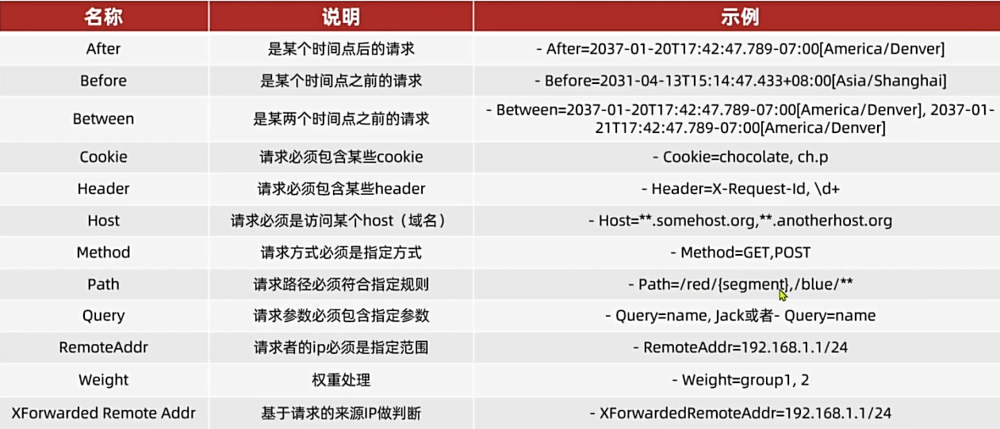
   (4)**`filters`:** 过滤器, 对请求或响应进行特殊处理
   spring提供了33种路由过滤器:
   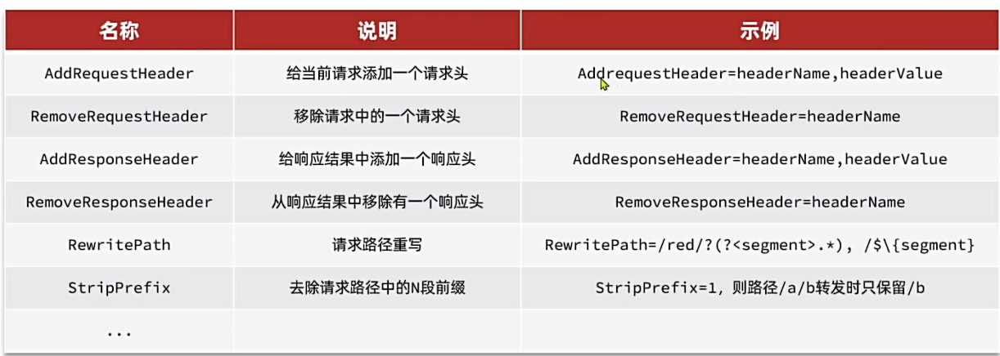
4. **网关请求处理流程:**
   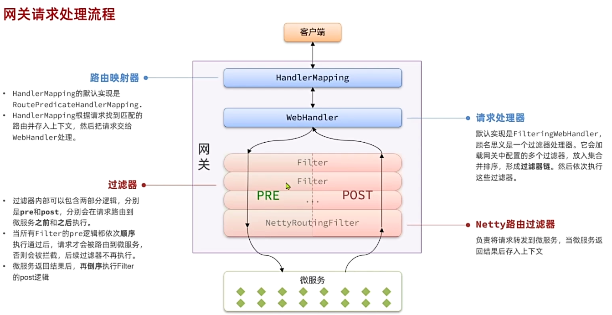
5. **自定义过滤器:**
   `GatewayFilter`: 路由过滤器，作用于任意指定的路由；默认不生效，要配置到路由后生效
   `GlobalFilter`: 全局过滤器，作用于所有路由；声明后自动生效
   ```java
   @Component
   public class MyGlobalFilter implements GlobalFilter, Ordered {
      @Override
      public Mono<Void> filter(ServerWebExchange exchange, GatewayFilterChain chain) {
         // 1.获取请求头
         ServerHttpRequest request = exchange.getRequest();
         // 2. 过滤器业务处理
         HttpHeaders headers = request.getHeaders();
         System.out.println("Headers的值为" + headers);
         // 3.放行
         return chain.filter(exchange);
      }
      @Override
      public int getOrder() {
         // 优先级, 数值越小优先级越高
         return 0;
      }
   }
   ```
6. **传递用户信息:**
   ```java
   ServerWebExchange swe = exchange.mutate()
                .request(builder -> builder.header("user-info", userId.toString()))
                .build();
   ```
7. **微服务数据传输的解决方案:**
   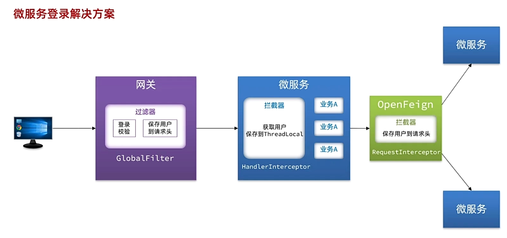
### 六、配置管理
1. **基于`NacosConfig`实现配置管理原理**
   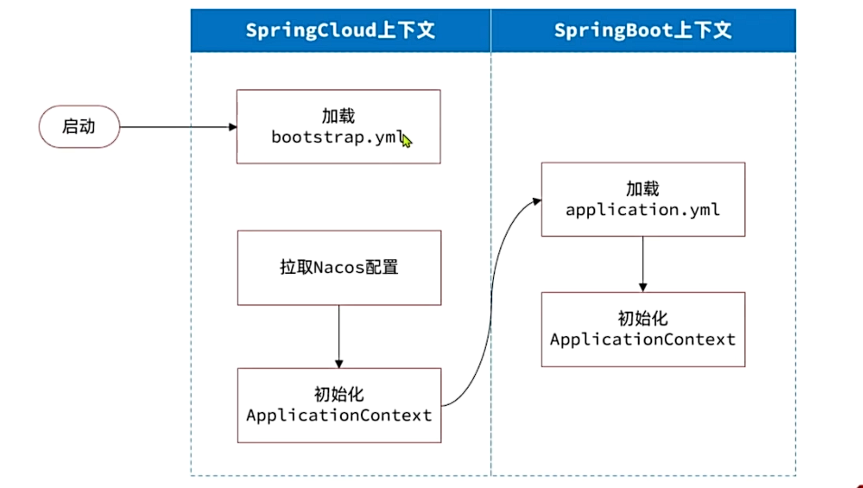
2. **使用步骤**
   (1)引入依赖
   ```xml
   <!-- nacos配置管理 -->
   <dependency>
   <groupId>com.alibaba.cloud</groupId>
   <artifactId>spring-cloud-starter-alibaba-nacos-config</artifactId>
   </dependency>
   <!-- 读取bootstrap.yaml中的配置信息 -->
   <dependency>
   <groupId>org.springframework.cloud</groupId>
   <artifactId>spring-cloud-starter-bootstrap</artifactId>
   </dependency>
   ```
   (2)新建`bootstrap.yaml`文件
   ```yaml
   spring:
      application:
         name: config-client # 服务名称
      profiles:
         active: dev
      cloud:
         nacos:
            server-addr: 192.168.56.10:8848 # nacos地址
            config:
               file-extension: yaml # 配置文件后缀名
               shared-configs: # 共享配置
                 - dataId: hm-common-dev # 配置文件ID
                 # 其他配置文件ID
   ```
3. **配置热更新**
   当修改配置文件时，配置文件会自动更新，不需要重启服务
   (1)nacos中创建一个配置文件
   微服务名称-项目profile(可选).配置文件后缀名
   `[Spring.application.name]-[spring.profiles.active].[file-extension]`
   (2)微服务中要以特定方式读取需要热更新的配置属性
   在需要热更新的类中加`@ConfigurationProperties(prefix = "hm-common")`注解
4. **动态路由**
   要实现动态路由，首先需要将路由配置到Nacos中，当Nacos中的路由配置变更时，推送到网关，实时更新网关的路由信息。
   (1)监听路由配置
   ```java
   @Autowired
   private NacosConfigManager nacosConfigManager;
   private final String dataId = "gateway-routes.json";
   private final String group = "DEFAULT_GROUP";

   @PostConstruct
   public void initRouteConfigListener() throws NacosException {
       // 1.项目启动时，先拉取一次配置，并添加配置监听器
       String configInfo = nacosConfigManager.getConfigService()
               .getConfigAndSignListener(dataId, group, 5000, new Listener() {
                   @Override
                   public Executor getExecutor() {
                       return null;
                   }
                   @Override
                   public void receiveConfigInfo(String configInfo) {
                       // 2.监听到配置信息变化，更新路由信息
                       updateConfigInfo(configInfo);
                   }
               });
       // 3.第一次读取配置，更新路由信息
       updateConfigInfo(configInfo);
   }
   ```
   (2)更新路由信息
   ```java
   public void updateConfigInfo(String configInfo) {
       log.info("更新路由信息：{}", configInfo);
       // 1.解析配置信息，转为RouteDefinition对象
       List<RouteDefinition> routeDefinitionList = JSONUtil.toList(configInfo, RouteDefinition.class);
       log.info("解析后的路由数量：{}", routeDefinitionList.size());

       // 2.删除旧路由
       routeIds.forEach(routeId -> {
           routeDefinitionWriter.delete(Mono.just(routeId)).subscribe();
       });
       routeIds.clear();

       // 3.更新路由表
       for (RouteDefinition routeDefinition : routeDefinitionList) {
           log.info("添加路由：{}", routeDefinition.getId());
           // 保存
           routeDefinitionWriter.save(Mono.just(routeDefinition)).subscribe();
           // 记录路由信息
           routeIds.add(routeDefinition.getId());
       }
   }
   ```
### 七、微服务保护
1. **雪崩问题**: 
   微服务相互调用，服务提供这出现故障或阻塞；
   服务调用者没有做好异常处理，导致自身故障；
   调用链中所有的服务级联失败，导致整个集群故障；
2. **服务保护方案**: 
   **线程隔离**: 舱壁模式，通过限定每一个业务能够使用的线程数量而将业务隔离，避免故障扩散。
   **服务熔断**: 由断路器统计请求的异常比例，如果超出阈值则会熔断该业务，拦截该接口的请求。
3. **Sentinel使用步骤:**
   (1)下载jar包
   [Sentinel下载地址](https://github.com/alibaba/Sentinel/releases)
   (2)放在无中文的目录下运行: `java -Dserver.port=8090 -Dcsp.sentinel.dashboard.server=localhost:8090 -Dproject.name=sentinel-dashboard -jar sentinel-dashboard.jar`
   (3)访问: `http://localhost:8090`, 默认用户密码为 `sentinel/sentinel`
   (4)微服务整合:
   引入依赖:
   ```xml
   <!-- sentinel -->
   <dependency>
         <groupId>com.alibaba.cloud</groupId>
         <artifactId>spring-cloud-starter-alibaba-sentinel</artifactId>
   </dependency>
   ```
   添加配置:
   ```yaml
   spring:
      cloud:
         sentinel:
            transport:
               dashboard: localhost:8090
   ```
4. **簇点链路**:
   单机调用链路，一次请求进入服务后经过的每一个被Sentinel监控的资源链，
   默认Sentinel会监控SpringMVC的每一个Http请求。
   限流、熔断等都是针对簇点链路中的资源设置的。
   资源名默认就是请求的URL。
   Restful风格的API请求路径一般相同，会导致簇点资源名重复，因此要修改配置，把请求方式+请求路径作为簇点资源名。
   ```yaml
   http-method-specify: true # 启用请求方式+请求路径作为簇点资源名，与transport齐平
   ```
5. **请求限流**:
   在Sentinel控制台流控规则中新增流控规则，设置阈值类型为`QPS`并设置阈值。
6. **线程隔离**:
   当商品服务出现阻塞或故障时，调用商品服务的购物车服务会因此被拖慢，所以需要限制购物车服务中查询商品的可用线程数，实现线程隔离。
   在Sentinel控制台线程池规则中新增线程池规则，设置阈值类型为线程数并设置阈值。
7. **Fallback**:
   当接口调用失败时，返回一个默认值
   **使用**:
   (1)将FeignClient作为Sentinel的簇点资源:
   ```yaml
   feign:
      sentinel:
         enabled: true
   ```
   (2)在FeignClient中添加Fallback:
   Fallback有两种配置方式:
   方式一: FallbackClass, 无法对远程调用的异常进行处理
   方式二: FallbackFactory, 可以对远程调用的异常进行处理, 通常使用这种
   例子:
   ```java
   @FeignClient(value = "user-service")
   public interface UserClient { 
      @GetMapping("/user/{id}")
      public User getUser(@PathVariable("id") Long id);
   }
   ```
   对上述FeignClient添加Fallback:
   (1)自定义类，实现FallbackFactory, 编写对某个FeignClient的Fallback逻辑
   ```java
   @Slf4j
   @Component
   public class UserClientFallbackFactory implements FallbackFactory<UserClient> {
      @Override
      public UserClient create(Throwable throwable) {
         return new UserClient() {
            @Override
            public User getUser(Long id) {
               // 记录异常信息，返回空或抛出异常
               log.error("查询用户失败", throwable);
               return null;
            }
         }
      }
   }
   ```
   (2)将定义的UserClientFallbackFactory注册为Bean
   ```java
   @Bean
   public UserClientFallbackFactory userClientFallbackFactory() {
      return new UserClientFallbackFactory();
   }
   ```
   (3)在UserClient中添加FallbackFactory
   在`@FeignClient`注解中添加`fallbackFactory`属性，值为`UserClientFallbackFactory.class`
8. **服务熔断**:
   断路器统计服务调用的异常比例、慢请求比例，若超过阈值，则会熔断该服务。即拦截访问该服务的所有请求，当服务恢复后，断路器会放行访问该服务的请求。
   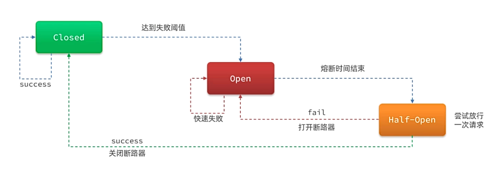
   **使用**: 在Sentinel控制台点击熔断按钮，即可配置熔断规则。
   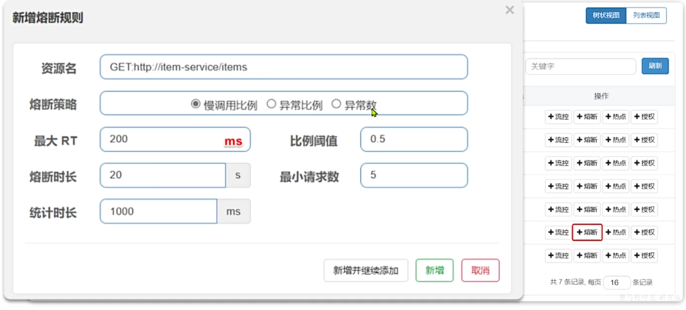 
### 八、分布式事务 
在分布式系统中，一个业务需要多个服务共同完成，且每个服务也都有事务，多个事务必须同时成功或失败，这样的事务就是分布式事务。其中每个服务的事务就是一个分支事务，整个业务就是全局业务。
1. **Seata架构**: 
   **`TC (Transaction Coordinator)`**: 事务协调者，维护全局和分支事务的状态，协调全局事务的提交或回滚。
   **`TM (Transaction Manager)`**: 事务管理器，定义全局事务的范围，开始全局事务，提交或回滚全局事务。
   **`RM (Resource Manager)`**: 资源管理器，与TC交谈，以注册分支事务和报告分支事务的状态。
   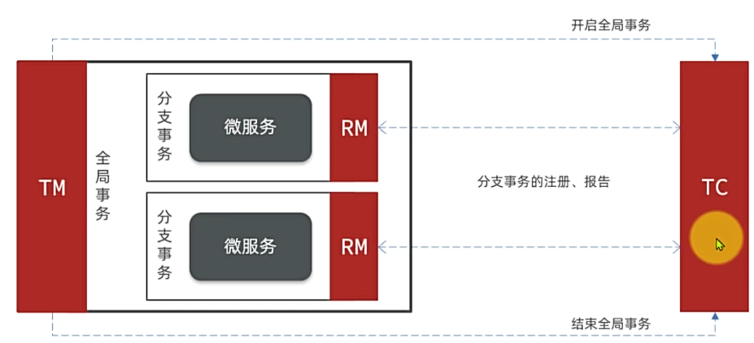
2. **Seata安装**:
   (1) 下载Seata: [Seata下载地址](https://github.com/seata/seata/releases)
   (2) 准备数据库
   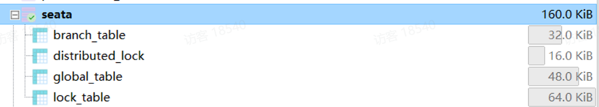
   (3) 准备配置文件
   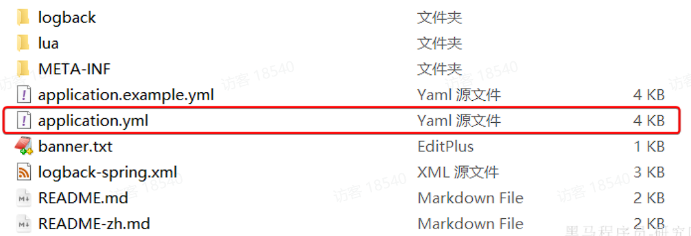
   (4) 将seata文件夹放到虚拟机/root目录下
   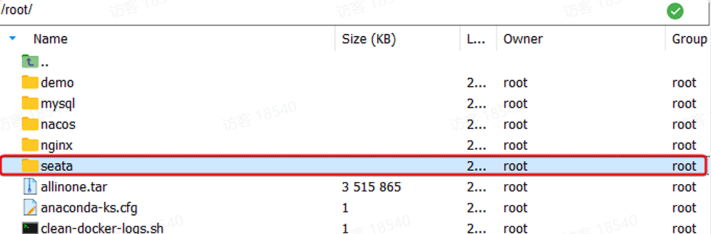
   (5) Docker部署
   部署前需要确保nacos、mysql在同一个网络下
   之后再/root目录下执行: 
   ```bash
   docker run --name seata \
   -p 8099:8099 \
   -p 7099:7099 \
   -e SEATA_IP=192.168.3.54 \
   -v ./seata:/seata-server/resources \
   --privileged=true \
   --network hm-net \
   -d \
   seataio/seata-server:1.5.2
   ```
   **此时访问`http://192.168.3.54:7099`即可查看Seata控制台**
   用户密码默认为`admin/admin`
3. **微服务集成seata**:
   (1) 添加依赖: 
   ```xml
   <!--统一配置管理-->
   <dependency>
       <groupId>com.alibaba.cloud</groupId>
       <artifactId>spring-cloud-starter-alibaba-nacos-config</artifactId>
   </dependency>
   <!--读取bootstrap文件-->
   <dependency>
       <groupId>org.springframework.cloud</groupId>
       <artifactId>spring-cloud-starter-bootstrap</artifactId>
   </dependency>
   <!--seata-->
   <dependency>
       <groupId>com.alibaba.cloud</groupId>
       <artifactId>spring-cloud-starter-alibaba-seata</artifactId>
   </dependency>
   ```
   (2) 添加配置: 
   ```yaml
   seata:
      registry: # 注册中心，微服务根据这些信息去注册中心获取TC服务地址
         type: nacos # 注册中心类型 nacos
         nacos:
            server-addr: 192.168.3.54:8848
            namespace: ""
            group: DEFAULT_GROUP
            application: seata-server # seata服务名称
            username: nacos
            password: nacos
      tx-service-group: hmall # 事务组名称
      service:
         vgroup-mapping: # 事务组和tc集群的映射关系
           hmall: "default"
   ```
4. **XA模式**:
   XA模式描述了全局的TM与局部的RM之间的接口。
   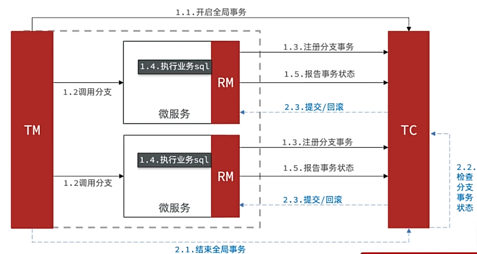
   **第一阶段工作**:
   (1) RM注册分支事务到TC
   (2) RM执行分支业务sql但不提交
   (3) RM报告执行状态到TC
   **第二阶段工作**:
   (1) TC检测各个分支事务的执行状态:
       若都执行成功，则通知所有RM提交事务;
       若有执行失败，则通知所有RM回滚事务;
   (2) RM接收TC的指令，提交或回滚事务
   **XA模式实现**: 
   (1) 修改每个参与事务的微服务的application.yml: 
   ```yaml
   spring:
      data-source-proxy-mode: XA # 开启数据源代理的XA模式
   ```
   (2) 发起全局事务的入口方法添加@GlobalTransactional注解
   (3) 重启服务测试
5. **AT模式**:
   Seata主推AT模式，弥补了XA模型中资源锁定周期长的问题。
   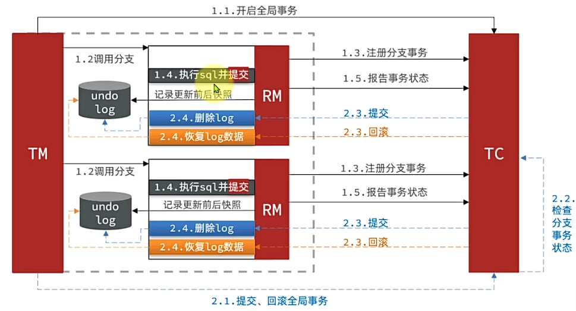
   **第一阶段RM工作**: 
   (1) 注册分支事务
   (2) 记录undo-log(数据快照)
   (3) 执行业务SQL提交
   (4) 报告事务状态
   **第二阶段工作**: 
   提交RM时，删除undo-log
   回滚RM时，根据undo-log恢复到更新前
   **AT模式实现**: 
   (1) 添加seata-at.sql到参与业务的对应数据库中，用于存储undo-log信息
   (2) 修改每个参与事务的application.yml:
   ```yaml
   spring:
      data-source-proxy-mode: XA # 开启数据源代理的XA模式
   ```

