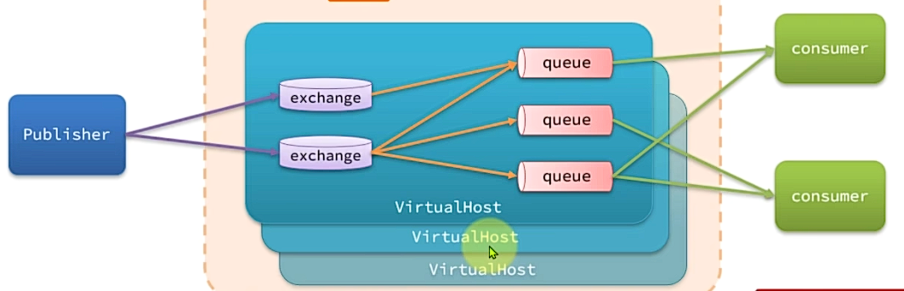
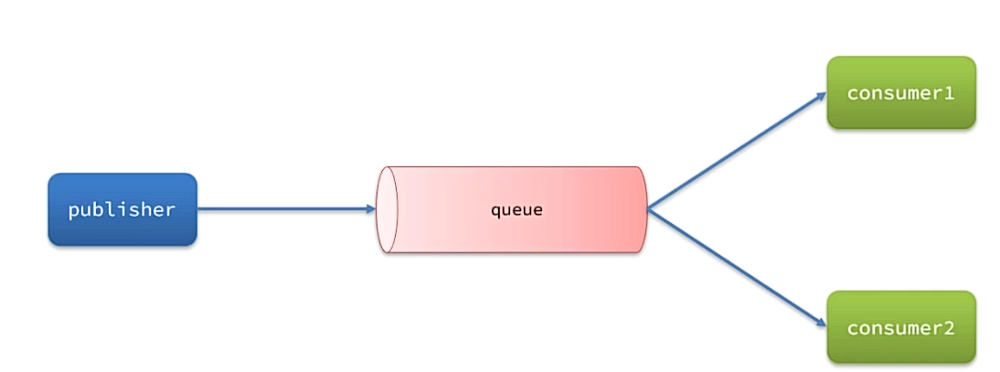
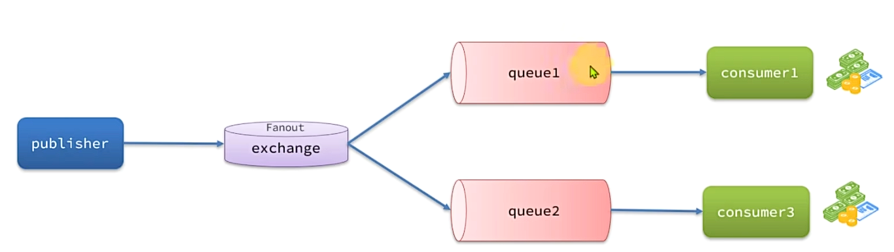
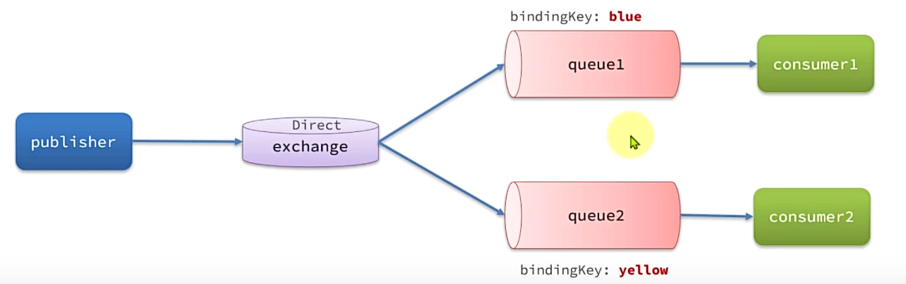
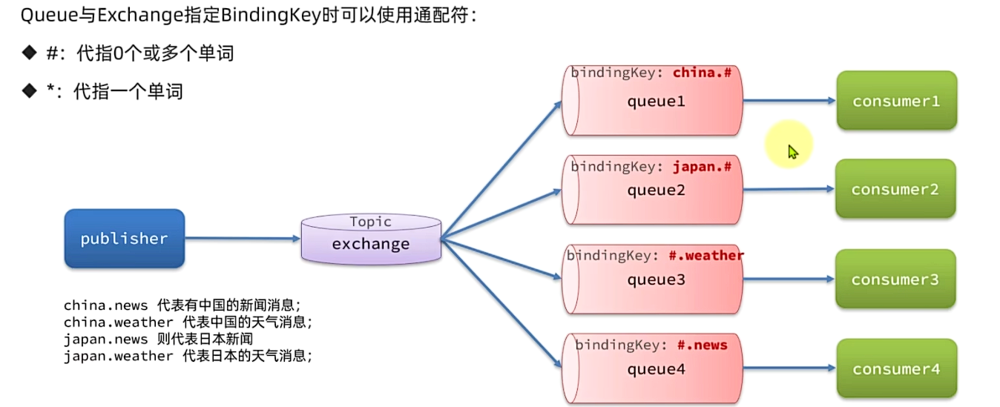
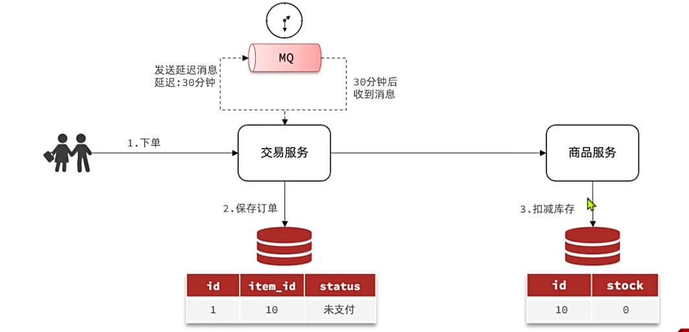
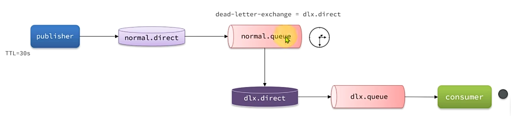

### 一、异步调用
   通常基于消息通知的方式，包含三个角色:
   - 消息发送者: 投递消息，原来的调用者
   - 消息接收者: 接收消息，原来的服务提供者
   - 消息代理: 管理、暂存、转发消息
### 二、RabbitMQ
#### **1. 基于Docker安装**
   ```bash
   docker run \
   -e RABBITMQ_DEFAULT_USER=root \
   -e RABBITMQ_DEFAULT_PASS=123456 \
   -v mq-plugins:/plugins \
   --name mq \
   --hostname mq \
   -p 15672:15672 \
   -p 5672:5672 \
   --network hm-net\
   -d \
   rabbitmq:3.8-management
   ```
#### **2. RabbitMQ架构**
- **publisher**: 消息发送者
- **consumer**: 消息接收者
- **queue**: 队列, 存储消息
- **exchange**: 交换机, 负责路由消息
- **virtual-host**: 虚拟主机, 虚拟的队列和交换机, 虚拟主机之间互不干扰
  
#### **3. 使用RabbitMQ**
1. 引入依赖:
   ```xml
   <!-- AMQP依赖，包含RabbitMQ依赖 -->
   <dependency>
   <groupId>org.springframework.boot</groupId>
   <artifactId>spring-boot-starter-amqp</artifactId>
   </dependency>
   ```
2. 在每个微服务中引入MQ服务端信息:
   ```yaml
   spring:
      rabbitmq:
         host: 192.168.3.54 # 服务器地址
         port: 5672 # 端口
         virtual-host: / # 虚拟主机
         username: root # 用户名
         password: 123456 # 密码
   ```
3. 发送消息:
   ```java
   @Autowired
   private RabbitTemplate rabbitTemplate;

   @Test
   public void sendMessage() {
      // 队列名称
      String queueName = "queue.test";
      // 消息
      String message = "hello world";
      // 发送消息
      rabbitTemplate.convertAndSend(queueName, message);
   }
   ```
4. 接收消息:
   ```java
   @Slf4j
   @Component
   public class ReceiveMessageListener {
      @RabbitListener(queues = "queue.test")
      public void listenSimpleQueueMessage(String message) throws InterruptedException {
         log.info("接收到消息: {}", message);
      }
   }
   ```
#### **4. work Queues**
任务模型，让多个消费者绑定到一个队列，共同消费对列的消息。

默认情况下，RabbitMQ会将消息依次轮流投递给绑定在队列上的每一个消费者，但并没考虑到消费者是否处理完消息，可能出现消息堆积的情况。
解决方案：在application.yml中设置preFetch值为1，确保同一时刻最多投递给消费者一条信息:
```yaml
spring:
   rabbitmq:
      listener:
         simple:
            prefetch: 1 # 每次只处理一条消息，处理完成才能获取下一个消息
```
#### **5. Fanout交换机**
Fanout交换机会将接收到的消息广播给所有绑定的队列，每个队列都会收到相同的消息。

#### **6. Direct交换机**
Direct交换机会将接收到的消息根据规则路由到指定的Queue中, 因此被称之为定向路由

- 每一个Queue都与Exchange设置一个BindingKey
- 发布者发送消息时，会指定消息的RoutingKey
- Exchange将消息路由到BindingKey与消息RoutingKey一致的队列
#### **7. Topic交换机**
Topic交换机也是基于RoutingKey做消息路由，不过RoutingKey可以由多个单词组成，多个单词之间使用`.`分隔

#### **8. 基于Bean声明队列和交换机**
SpringAMQP提供了几个类用来声明队列、交换机、绑定关系:
- **Queue**: 用于声明队列，使用工厂类`QueueBuilder`创建
- **Exchange**: 用于声明交换机，使用工厂类`ExchangeBuilder`创建
- **Binding**: 用于绑定队列和交换机，使用工厂类`BindingBuilder`创建
例子:
```java
@Configuration
public class RabbitMQConfig { 
   // 声明anoutExchange交换机
   @Bean
   public FanoutExchange fanoutExchange() {
      return new FanoutExchange("hmall.fanout");
    }
    // 声明第一个队列
    @Bean
    public Queue fanoutQueue1() {
      return new Queue("fanout.queue1");
    }
    // 绑定队列1到交换机
    @Bean
    public Binding bindingQueue1(FanoutExchange fanoutExchange, Queue fanoutQueue1) {
      return BindingBuilder.bind(fanoutQueue1).to(fanoutExchange);
    }
    // 其他队列......
}
```
#### **9. 基于注解声明队列和交换机**
SpringAMQP提供了基于@RabbitListener注解来声明队列和交换机的方式:
```java
@RabbitListener(bindings = @QueueBinding(
   value = @Queue(name = "direct.queue1"), 
   exchange = @Exchange(name = "itcast.direct", type = ExchangeTypes.DIRECT),
   key = { "red", "green" }
   ))
public void listenDirectQueue1(String message) {
   log.info("消费者1接收到消息: {}", message);
}
```
#### **10. 消息转换器**
Spring的对消息对象的处理是由org.springframework.amqp.support.converter.MessageConverter处理的。
默认实现使用的是SimpleMessageConverter，是基于JDK的ObjectOutputStream完成序列化。
存在下列问题:
- JDK的序列化有安全风险
- JDK序列化的消息太大
- JDK序列化的消息可读性差
为了解决上面问题，一般会采用JSON序列化代替默认的JDK序列化:
1. 引入依赖:
```xml
<dependency>
<groupId>com.fasterxml.jackson.core</groupId>
<artifactId>jackson-databind</artifactId>
</dependency>
```
2. 在pushlisher和consumer中配置消息转换器:
```java
@Bean
public MessageConverter messageConverter() { 
   return new Jackson2JsonMessageConverter();
}
```
### 三、MQ的可靠性
#### **1. 发送者重连**
由于网络波动，可能会出现发送者连接MQ失败的情况，通过配置可以开启失败后的重连机制：
```yaml
spring:
   rabbitmq:
      connection-timeout: 10000 # 连接超时时间为10秒
      template:
         retry:
            enabled: true # 开启失败重连机制
            initial-interval: 5000 # 失败重连初始等待时间间隔为5秒
            multiplier: 2 # 失败后下次的等待的时长倍数，下次等待时长= initial-interval * multiplier
            max-attempts: 5 # 最大失败重连次数
```
**注意**: SpringAMQP的重试机制是基于阻塞式的重试，多次重试等待的过程中，当线程是被阻塞的，就会影响业务性能。
#### **2. 发送者确认**
SpringAMQP提供了Publisher Confirm和Publisher Return两种确认机制，开启确认机制后，发送者发送消息给MQ后，MQ会返回确认结果给发送者。返回的结果会有以下几种情况:
- 消息投递到MQ，但路由失败，此时会通过Publisher Return返回路由异常原因，返回ACK，告知投递成功
- 临时消息投递到MQ，并且入队成功，返回ACK，告知投递成功
- 持久消息投递到MQ，并且入队成功完成持久化，返回ACK，告知投递成功
- 其他情况都会返回NACK，告知投递失败
**发送者确认机制在SpringAMQP中实现**:
1. 配置发送者确认机制:
```yaml
spring:
   rabbitmq:
      publisher-confirm-type: correlated # 开启publisher confirm机制，并设计confirm类型
      publisher-returns: true # 开启publisher return机制
```
其中关于`publisher-confirm-type`的类型:
- correlated: MQ异步回调方式返回回执消息
- none: 关闭confirm机制
- simple: 同步阻塞等待MQ的回执消息
2. 每个RabbitTemplate只能配置一个ReturnCallback，因此在项目启动时，需要配置:
```java
@Slf4j
@Configuration
public class MqConfig { 
   
   @Autowired
   private RabbitTemplate rabbitTemplate;

   @PostConstruct
   public void init() { 
      rabbitTemplate.setReturnCallback(new RabbitTemplate.ReturnCallback() { 
         @Override
         public void returnedMessage(ReturnedMessage returned) { 
            log.error("触发return callback");
            log.info("exchange: {}", returned.getExchange());
            log.info("routingKey: {}", returned.getRoutingKey());
            log.info("replyCode: {}", returned.getReplyCode());
            log.info("message: {}", returned.getMessage());
            log.info("replyCode: {}", returned.getReplyCode());
            log.info("replyText: {}", returned.getReplyText());
         }
      });
   }
}
```
3. 发送消息，指定消息ID、消息ConfirmCallback:
```java
@Test
void testSendMessageWithConfirm() throws InterruptedException { 
   // 1. 创建CorrelatedData
   CorrelatedData correlatedData = new CorrelatedData(UUID.randomUUID().toString());
   // 2. 给Future添加confirmCallback
   correlatedData.getFuture().addCallback(new ListenableFutureCallback<CorrelationData.Confirm>() {
      @Override
      public void onFailure(Throwable ex) { 
         // Future发生异常时的处理逻辑，基本不会发生
         log.error("Future发生异常: {}", ex.getMessage());
      }
      @Override
      public void onSuccess(CorrelationData.Confirm result) { 
         // Future接收到回执的处理逻辑，参数中的result为回执消息
         if (result.isAck()) {  // result.isAck()为boolean类型，true为ack回执，false为nack回执
            log.info("消息发送成功, 收到ack");
         } else {
            log.error("消息发送失败, 收到nack, 原因: {}", result.getReason());
         }
      }
   });
   // 3. 发送消息
   rabbitTemplate.convertAndSend("exchange.direct", "red", "hello, confirm", correlatedData);
}
```
#### **3. MQ的可靠性**
默认情况下，RabbitMQ会将消息保存在内存中降低消息收发的延迟，会导致两个问题，
- 消息丢失：当RabbitMQ服务挂掉时，内存中的消息就会丢失
- 内存空间有限：当消费者故障或处理过慢时，就会导致消息积压，引发MQ阻塞
RabbitMQ提供了持久化消息和消息确认机制，通过配置实现消息的持久化和可靠性。
包括三个方面:
- 交换机持久化
- 队列持久化
- 消息持久化(SpringAMQP默认是持久化的)
#### **4. Lazy Queue**
惰性队列，特征如下:
- 接收到消息后直接存入磁盘中，不进行内存缓存
- 消费者要消费消息时，才会从磁盘中读取并加载到内存(可以提前缓存部分消息到内存，最多2048条)
3.12版本后，所有的队列都是Lazy Queue，无法更改
在3.12版本以前，利用`@Bean`实现惰性队列:
```java
@Bean
public Queue lazyQueue() { 
   return QueueBuilder.durable("lazy.queue").lazy().build();
}
```
利用注解实现惰性队列:
```java
@Queue(value = "lazy.queue", durable = "true", arguments = @Argument(name = "x-queue-type", value = "lazy"))
public void lazyQueue(String message) {
   log.info("lazy queue Message: {}", message);
}
```
#### **5. 消费者确认机制**
消费者确认机制(Consumer Acknowledgement)是为了确认消费者是否成功处理消息。
当消费者处理消息结束后，应该向RabbitMQ发送一个回执，告知RabbitMQ消息处理状态
- ACK: 消息处理成功，RabbitMQ可以删除队列中的该消息
- nack: 消息处理失败，RabbitMQ将重新将消息发送给消费者
- reject: 消息处理失败并拒绝该消息，RabbitMQ将从队列中删除该消息
**SpringAMQP已经实现了消息确认功能。** 并允许我们通过配置文件选择ACK处理方式，有三种方式：
- none: 不处理，消息投递给消费者后立刻ack，消息会立刻从MQ删除。不安全，不建议使用
- manual: 手动处理，消费者处理完消息后，需要调用`channel.basicAck()`手动ack，消息会从MQ删除。
- auto: 自动处理，SpringAMQP利用AOP对消息处理逻辑做了环绕增强，当业务正常执行时自动返回ack。
  当业务异常时，根据异常判断返回不同的结果:
  如果是业务异常，则自动返回nack
  如果是消息处理或校验异常，自动返回reject
**配置**:
```yaml
spring:
   rabbitmq:
      listener:
         simple:
            prefetch: 1
            acknowledge-mode: manual # none, 关闭ack; manual, 手动ack; auto, 自动ack
```
#### **6. 失败重试机制**:
SpringAMQP提供了消费者失败重试机制，在消费者出现异常时利用本地重试，而不是无限requeue到mq。
具体配置如下:
```yaml
spring:
   rabbitmq:
      listener:
         simple:
            prefetch: 1
            retry:
               enabled: true # 开启消费者失败重试
               initial-interval: 1000 # 初始重试间隔为1秒
               multiplier: 2 # 重试间隔倍数
               max-attempts: 5 # 最大重试次数
               stateless: true # true: 无状态重试; false: 状态重试。若业务中包含事务，则改为false
```
**若重试次数耗尽，消息依然失败，需要有MessageReceiver来处理。**
它包含三种不同的实现:
- RejectAndDontRequeueRecoverer: 重试耗尽后，直接reject，丢弃消息。默认方式
- ImmediateRequeueMessageRecoverer: 重试耗尽后，直接nack，消息重新入队
- RepublishMessageRecoverer: 重试耗尽后，将失败消息投递到指定交换机
**失败消息处理策略**:
将失败处理策略改为RepublishMessageRecoverer:
1. 首先定义接收失败的交换机、队列、绑定关系
2. 定义RepublishMessageRecoverer
   ```java
   @Configuration
   @RequireArgsConstructor
   public class ErrorMessageConfiguration {
      private final RabbitTemplate rabbitTemplate;
      @Bean
      public DirectExchange errorExchange() { 
         return new DirectExchange("error.direct");
      }
      @Bean
      public Queue errorQueue() { 
         return new Queue("error.queue");
      }
      @Bean
      public Binding errorQueueBinding(Queue errorQueue, DirectExchange errorExchange) {
         return BindingBuilder.bind(errorQueue).to(errorExchange).with("error");
       }
      @Bean
      public MessageRecoverer republishMessageRecoverer(RabbitTemplate rabbitTemplate) { 
         return new RepublishMessageRecoverer(rabbitTemplate, "error.direct", "error");
      }
   }
   ```
#### **7. 业务幂等性**
**幂等:** 数学概念, f(x) = f(f(x)), 指同一个业务执行一次或多次对业务状态的影响是一致的。
**幂等性实现方式**:
方案一:
1. 给每个消息添加一个唯一id，利用id区分是否是重复消息。
2. 消费者接收到消息后处理自己的业务，业务处理成功后将消息id保存到数据库。
3. 如果下次又收到相同消息，去数据库查询判断是否存在，存在则为重复消息放弃处理。
   ```java
   @Bean
   public MessageConverter messageConverter() { 
      // 1.定义消息转换器
      Jackson2JsonMessageConverter converter = new Jackson2JsonMessageConverter();
      // 2.配置自动创建消息id，用于识别不同消息，也可以在业务中基于id判断是否是重复消息
      converter.setCreateMessageIds(true);
      return converter;
   }
   ```
方案二: 结合业务逻辑，基于业务本身做判断
#### **8. 延迟消息**
发送者发送消息时，指定一个时间，消费者不会立刻受到消息，而是在指定时间后才会接收到消息。

#### **9. 死信交换机**
当队列的消息满足下列情况之一时，就会成为死信：
- 消费者使用basic.reject或basic.nack声明消费失败，并且设置requeue为false。
- 消息时一个过期消息(达到了队列或消息本身设置的过期时间), 超时无人消费
- 投递的队列消息队积满了，最早的消息就可能称为死信
如果队列通过dead-letter-exchange属性指定一个交换机，那么该队列中的死信就会被投递到这个交换机中，这个交换机就会被称之为死信交换机(Dead Letter Exchange, 简称DLX)。

#### **10. 延迟消息插件**
延迟消息插件，可以将普通交换机改造为延迟消息功能的交换机，当消息投递到交换机后可以暂存一定时间，到期后在投递到队列。
**插件使用步骤**:
1. 查看RabbitMQ的插件目录: `docker volume inspect mq-plugins`, 上传插件到该目录下。
2. 执行命令，安装插件: `docker exec -it mq rabbitmq-plugins enable rabbitmq_delayed_message_exchange`
3. 或者在线安装:
4. 创建延迟交换机: 
   基于注解方式:
   ```java
   @RabbitListener(bindings = @QueueBinding(
       value = @Queue(value = "delay.queue", durable = "true"),
       exchange = @Exchange(value = "delay.exchange", delayed = "true"),
       key = "delay"
   ))
   public void delayMessage(String message) { 
      log.info("接收到延迟消息: {}", message);
   }
   ```
   基于Bean方式:
   ```java
   @Slf4j
   @Configuration
   public class DelayExchangeConfiguration { 
      @Bean
      public DirectExchange delayExchange() { 
         return ExchangeBuilder
         .directExchange("delay.direct")  // 创建延迟交换机类型和名称
         .delayed() // 设置delay属性为true
         .durable(true) // 持久化
         .build();
      }
      @Bean
      public Queue delayQueue() { 
         return new Queue("delay.queue");
      }
      @Bean
      public Binding delayQueueBinding(Queue delayQueue, DirectExchange delayExchange) { 
         return BindingBuilder.bind(delayQueue).to(delayExchange).with("delay");
      }
   }
   ```
   创建延迟消息:
   ```java
   @Test
   void testPublisherDelayMessage() { 
      // 1.创建消息
      String message = "Hello, delay message";
      // 2.发送消息，利用消息后置处理器添加消息头
      rabbitTemplate.convertAndSend("delay.direct", "delay", message, messagePostProcessor -> { 
         messagePostProcessor.getMessageProperties().setDelay(5000); // 设置延迟时间
         return messagePostProcessor;
      })
   }
   ```
