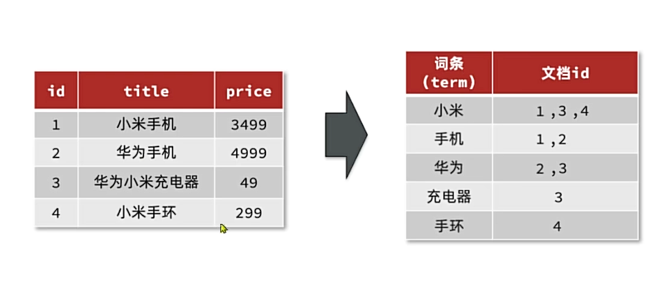
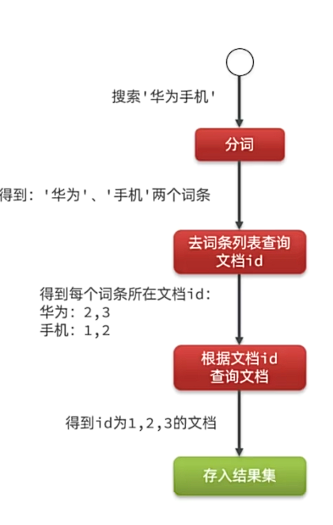
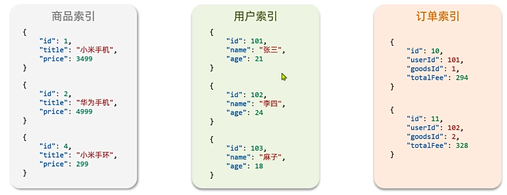
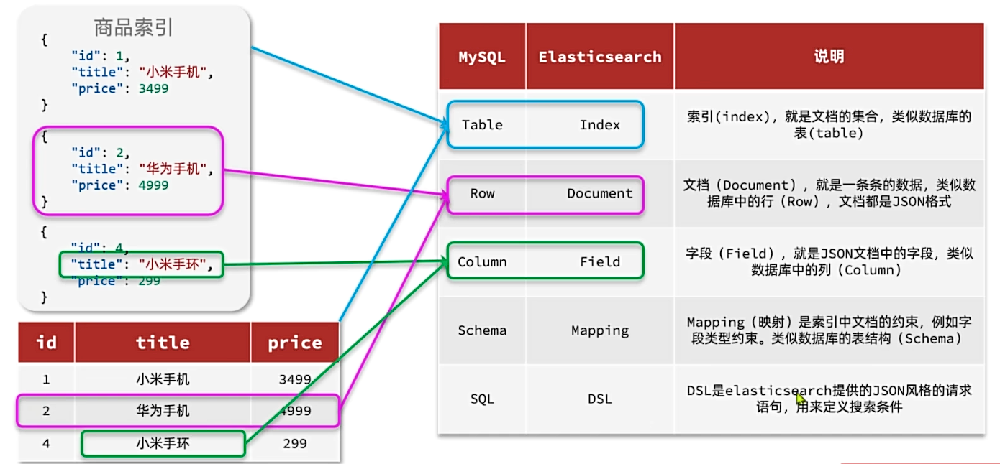
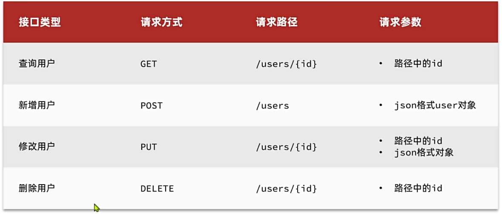

### 一、Elasticsearch安装
1. 下载Elasticsearch
```bash
docker run -d \
  --name es \
  -e "ES_JAVA_OPTS=-Xms512m -Xmx512m" \
  -e "discovery.type=single-node" \
  -v es-data:/usr/share/elasticsearch/data \
  -v es-plugins:/usr/share/elasticsearch/plugins \
  --privileged \
  --network hm-net \
  -p 9200:9200 \
  -p 9300:9300 \
  elasticsearch:7.12.1
```
2. 安装kibana
```bash
docker run -d \
--name kibana \
-e ELASTICSEARCH_HOSTS=http://es:9200 \
--network=hm-net \
-p 5601:5601  \
kibana:7.12.1
```
### 二、倒排索引
elasticsearch采用倒排索引:
- 文档: 每条数据就是一个文档
- 词条: 文档按照语义分成的词语


### 三、IK分词器
IK分词器是中文分词器
1. 下载ik分词器: ` docker exec -it es ./bin/elasticsearch-plugin  install https://github.com/medcl/elasticsearch-analysis-ik/releases/download/v7.12.1/elasticsearch-analysis-ik-7.12.1.zip`
2. Ik选择器允许我们配置拓展词典来增加自定义的词库:
```xml
<?xml version="1.0" encoding="UTF-8" ?>
<!DOCTYPE properties SYSTEM "http://java.sun.com/dtd/properties.dtd">
<properties>
<comment>IK Analyzer 扩展配置</comment>
<!-- 用户可以在这里配置自己的扩展字典 -->
<entry key="ext_dict">mydict.dic</entry>
<!-- 用户可以在这里配置远程扩展字典 -->
<entry key="remote_ext_dict">http://192.168.0.1:8080/ext_dict.dic</entry>
<!-- 用户可以在这里配置扩展停止词字典 -->
<entry key="ext_stopwords">stropwords.dic</entry>
<!-- 用户可以在这里配置远程扩展停止词字典 -->
<entry key="remote_ext_stopwords">http://192.168.0.1:8080/stropwords.dic</entry>
</properties>
```
### 四、基本概念
1. 索引: 相同类型的文档的集合
  
2. 映射: 索引中文档的字段约束信息，类似表的结构约束
3. 关于MySQL和Elasticsearch的对比
   
### 五、索引库操作
#### **1. Mapping映射属性**
mapping是对索引库中文档的约束，常见的mapping属性有:
1. type: 字段数据类型，常见的简单类型有:
   - 字符串: text(可分词的文本), keyword(精确值，如品牌、国家、IP地址)
   - 数值: long, integer, short, byte, double
   - 布尔: boolean
   - 时间: date
   - 对象: object
2. index: 是否索引: true, false(默认为true，若为false则不会参与搜索)
3. analyzer: 分词器，使用那种分词器
4. properties: 该字段的子字段
#### **2. 索引库的CRUD**
Elasticsearch提供的API都是Restful风格：

1. 创建索引库: 
```json
PUT /索引库名称
{  
  "mappings": {  
    "properties": {  
      "字段名称1": {  
        "type": "字段数据类型",
        "analyzer": "分词器名称",
        "index": "是否参与索引, true/false",
        "子字段": {  
          //......
        }
      },
      "字段名称2": {  
        //......
      }
    }
  }
}
```
2. 查询索引库:
   `GET /索引库名称`
3. 删除索引库:
   `DELETE /索引库名称`
4. 修改索引库:
索引库和mapping一旦创建无法修改，但可以添加新的字段:
```json
PUT /索引库名称/_mapping
{  
  "properties": {  
    "新字段名称": {
      "type": "字段数据类型",
    }
  }
}
```
#### **3. 文档CRUD**
1. 新增文档:
```json
POST /索引库名称/_doc/文档id
{ 
  "字段名称1": "字段值1",
  "字段名称2": "字段值2",
  "字段名称3": {
    "子字段名称1": "子字段值1",
    "子字段名称2": "子字段值2"
    //......
  }
}
```
1. 查询文档:
   `GET /索引库名称/_doc/文档id`
2. 删除文档:
   `DELETE /索引库名称/_doc/文档id`
3. 修改文档:
   方式1: 全量修改，删除旧文档，添加新文档
   ```json
   PUT /索引库名称/_doc/文档id
   { 
    "字段名称1": "字段值1",
    "字段名称2": "字段值2",
    // ......
   }
   ```
   方式2: 增量修改，只修改指定的字段
   ```json
   POST /索引库名称/_update/文档id
   {  
    "doc": {  
      "字段名称1": "字段值1",
    }
   }
   ```
4. 批量操作:
Elasticsearch提供了bulk接口，可以批量操作索引库和文档:
```json
POST /_bulk
{ "index": {"_index": "索引库名称", "_id": "文档id"} }
{ "字段名称1": "字段值1", "字段名称2": "字段值2"}
{ "index": {"_index": "索引库名称", "_id": "文档id"} }
{ "字段名称1": "字段值1", "字段名称2": "字段值2"}
{ "delete": {"_index": "索引库名称", "_id": "文档id"} }
{ "update": {"_id": "文档id", "_index": "索引库名称"} }
{ "doc": {"字段名称1": "字段值1"} }
```
#### **4. DSL查询**
1. 基于DSL的基本查询语法：
```json
GET /索引库名称/_search
{  
  "query": {  
    "查询类型": {  
      "查询条件": "条件值"  // 如match_all就是查询所有
    }
  }
}
```
2. 叶子查询
- 全文检索(full text): 利用分词器对用户的输入内容分词，然后去词条列表中匹配。
  例如: 
  `match_query`: 对用户输入的内容进行分词，然后去倒排索引库检索:
  ```json
  GET /索引库名称/_search
  {  
    "query": {  
      "match": {  
        "字段名称": "用户输入内容"
      }
    }
  }
  ```
  `multi_match_query`: 与`match`一样，但是可以同时匹配多个字段。
  ```json
  GET /索引库名称/_search
  {  
    "query": {  
      "multi_match": {  
        "fields": ["字段名称1", "字段名称2"],
      }
    }
  }
  ```
- 精确查询: 不对用户输入内容分词，直接精确匹配，一般是查找keyword、数值、日期、布尔等类型。
  例如：
  `ids`:
  ```json
  GET /索引库名称/_search
  {  
    "query": {  
      "ids": {  
        "values": ["文档id1", "文档id2"]
      }
    }
  }
  ```
  `range`:
  ```json
  GET /索引库名称/_search
  {  
    "query": {  
      "range": {  
        "字段名称": {
          "gte": "最小值", // 加上e是指包括最小值，若需要排除最小值，直接用gt，最大值同理
          "lte": "最大值"
        }
      }
    }
  }
  ```
  `term`:
  ```json
  GET /索引库名称/_search
  {  
    "query": {  
      "term": {  
        "字段名称": {
          "value": "字段值"
        }
      }
    }
  }
  ```
- 地理查询: 用于搜索地理位置。
  例如: `geo_distance` `geo_bounding_box`

### 六、JavaRestClient
#### **1. 初始化**
1. 在使用到Elasticsearch的模块中引入RestHighLevelClient依赖:
```xml
<dependency>
  <groupId>org.elasticsearch.client</groupId>
  <artifactId>elasticsearch-rest-high-level-client</artifactId>
</dependency>
```
因为SpringBoot默认的ES版本为7.17.10，所以需要覆盖版本:
```xml
<properties>
    <maven.compiler.source>11</maven.compiler.source>
    <maven.compiler.target>11</maven.compiler.target>
    <elasticsearch.version>7.12.1</elasticsearch.version>
</properties>
```
2. 初始化:
```java
public class ElasticsearchTest { 
  private RestHighLevelClient client;
  @BeforeEach
  void setUp() { 
    client = new RestHighLevelClient(RestClient.builder(
         HttpHost.create("http://192.168.0.1:9200") // ES地址
    ));
  }
}

@AfterEach
void tearDown() throws IOException { 
  if (client != null) {
    client.close();
  }
}
```
#### **2. 商品Mapping映射**
索引的属性需要和数据库的字段一致，不参与搜索的字段需要设置`index: false`
```json
# 商品索引
PUT /hmall
{
  "mappings": {
    "properties": {
      "id":{
        "type": "keyword"
      },
      "name":{
        "type": "text",
        "analyzer": "ik_smart"
      },
      "price":{
        "type": "integer"
      },
      "image":{
        "type": "keyword",
        "index": false
      },
      "category":{
        "type": "keyword"
      },
      "brand":{
        "type": "keyword"
      },
      "sold":{
        "type": "integer"
      },
      "commentCount":{
        "type": "integer",
        "index": false
      },
      "isAD":{
        "type": "boolean"
      },
      "updateTime":{
        "type": "date"
      }
    }
  }
}
```
#### **3. 索引库操作**
1. 创建索引库：
```java
@Test
void createIndex() throws IOException { 
  // 1.创建Request对象, 对应Put /索引库名称
  CreateIndexRequest request = new CreateIndexRequest("hmall");
  // 2.请求参数，MAPPING_TEMPLATE是静态常量字符串，内容是JSON格式请求体，对应创建索引库的RestAPI
  request.source(MAPPING_TEMPLATE, XContentType.JSON);
  // 3.发送请求
  client.indices().create(request, RequestOptions.DEFAULT);
}
```
2. 删除索引库：
```java
@Test
void deleteIndex() throws IOException { 
  // 创建request对象
  DeleteIndexRequest request = new DeleteIndexRequest("hmall");
  // 发送请求
  client.indices().delete(request, RequestOptions.DEFAULT);
}
```
3. 查询索引库：
```java
@Test
void getIndex() throws IOException { 
  // 创建request对象
  GetIndexRequest request = new GetIndexRequest("hmall");
  // 发送请求
  client.indices().get(request, RequestOptions.DEFAULT);
}
```
#### **4. 文档操作**
1. 新增文档：
```java
@Test
void addDoc() throws IOException { 
  // 创建request对象
  IndexRequest request = new IndexRequest("hmall").id("1");
  // 准备Json文档
  request.source("{\"name\": \"Jack\"}", XContentType.JSON);
  // 发送请求
  client.index(request, RequestOptions.DEFAULT);
}
``` 
2. 删除文档：
```java
@Test
void deleteDoc() throws IOException { 
  // 创建request对象
  DeleteRequest request = new DeleteRequest("hmall", "1");
  // 发送请求
  client.delete(request, RequestOptions.DEFAULT);
}
```
3. 查询文档:
```java
@Test
void getDoc() throws IOException { 
  // 创建request对象
  GetRequest request = new GetRequest("hmall", "1");
  // 获取文档信息
  GetResponse response = client.get(request, RequestOptions.DEFAULT);
  // 解析响应结果
  String json = response.getSourceAsString();
  System.out.println(json);
}
```
4. 修改文档：
- 全量修改：与新增文档完全一致
- 局部更新, 只更新部分指定字段:
```java
@Test
void updateDoc() throws IOException { 
  // 创建request对象
  UpdateRequest request = new UpdateRequest("hmall", "1");
  // 准备参数
  request.doc(
    "name", "Tom"
    "age", 18
  );
  // 3.发送请求
  client.update(request, RequestOptions.DEFAULT);
}
```
#### **5. 批量操作**
```java
@Test
void batch() throws IOException { 
  // 创建Bulk请求
  BulkRequest request = new BulkRequest();
  // 添加批量提交的请求
  request.add(new IndexRequest("hmall").id("1").source("{\"name\": \"Jack\"}", XContentType.JSON));
  request.add(new IndexRequest("hmall").id("2").source("{\"name\": \"Tom\"}", XContentType.JSON));
  // 批量提交
  client.bulk(request, RequestOptions.DEFAULT);
}
```
