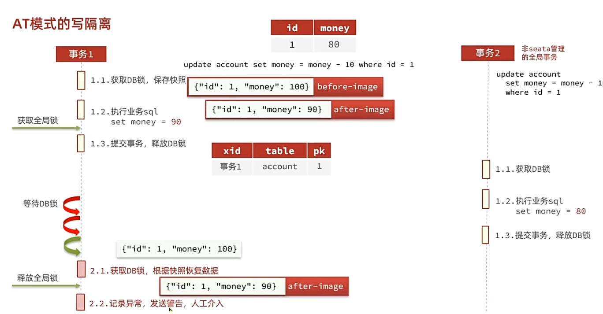
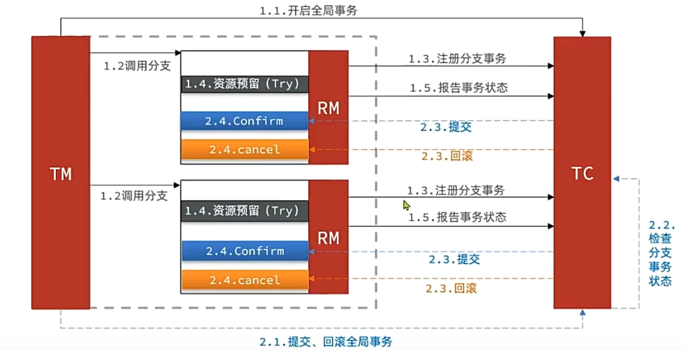
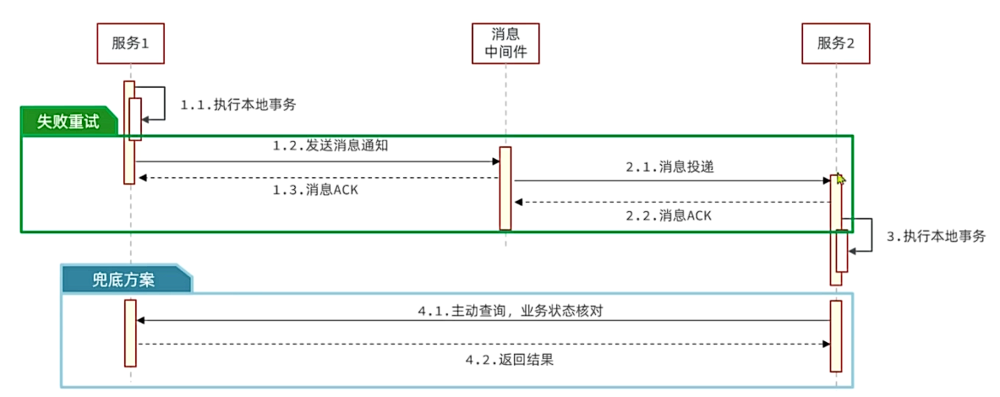
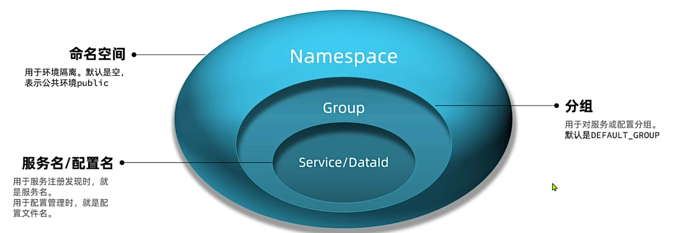
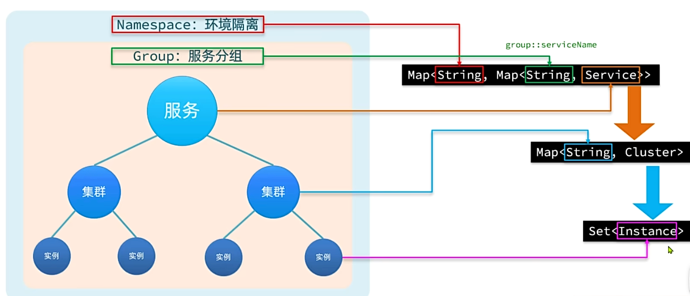
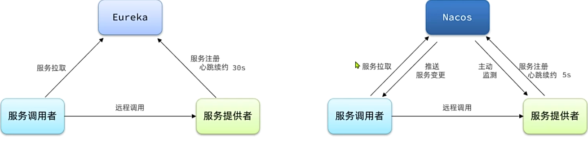
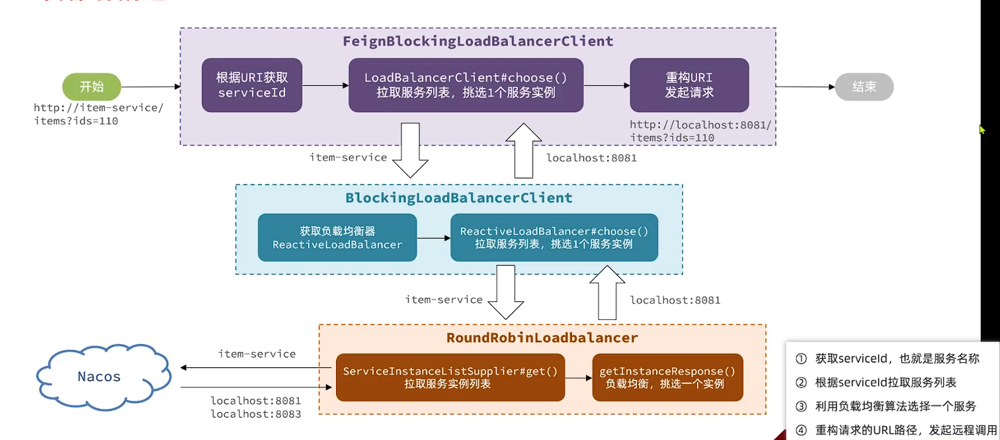
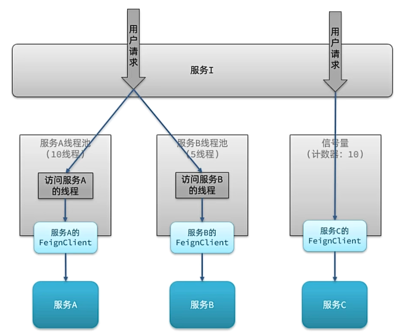
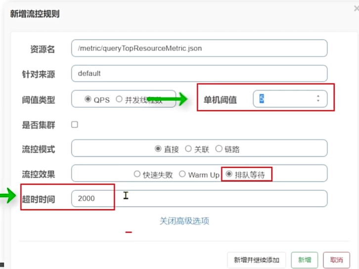

### 一、分布式事务
#### 1. CAP和BASE
1. CAP定理
   分布式系统有三个指标:
   -  Consistency 一致性: 用户访问分布式系统的任意节点，得到的数据必须一致
   -  Availability 可用性: 用户访问分布式系统时，读或写的操作总能成功，若其中一个不能满足或二者都不满足，则说明系统弱可用或不可用
   -  Partition tolerance 分区容错性:
      关于分区: 因为网络故障或其它原因导致分布式系统中的部分节点或其他节点失去连接，形成了独立分区
      容错: 系统要可以容忍网络分区现象，出现分区时，整个系统也要对外提供服务。
  分布式系统不能同时满足这三个指标，就是CAP定理。
#### 2. BASE
BASE理论是对CAP的一种解决思路，包含三个思想:
- Basically Available 基本可用: 分布式系统在出现故障时，允许损失一部分可用性，即保证核心可用。
- Soft state 软状态: 在同一时间内，允许出现中间状态，比如临时的不一致状态。
- Eventual consistency 最终一致性: 虽然无法保证强一致性，但在软状态结束后，最终达到数据一致。

分布式事务最大的问题是各子事务的一致性问题，因此可以借鉴CAP和BASE:
- CP模式: 各个子事务执行后相互等待，同时提交，同时回滚，达成强一致。但在事务等待过程中处于弱可用状态。
- AP模式: 各子事务分别执行和提交，允许出现结果不一致，然后采用弥补措施恢复数据，实现最终一致。
#### 3. AT模式脏写问题

#### 4. TCC模式
TCC模式与AT模式类似，每阶段有独立事务，不同的是TCC通过人工编码来实现数据恢复，需要实现三个方法:
- Try: 资源监测和预留；
- Confirm: 完成资源操作业务，要求Try成功Confirm成功
- Cancel: 预留资源释放，可以理解为Try的反向操作


优点:
- 一阶段完成直接事务提交，释放数据库资源，性能好。
- 相比AT模式，无需生成快照，无需使用全局锁
- 不依赖数据库事务，而是依赖补偿操作，可以用于非事务型数据库
  
缺点:
- 需要人工编码，实现复杂
- 软状态，事务时最终一致
- 需要考虑Confirm和Cancel失败的情况，做好幂等处理
#### 5. 最大努力通知
最大努力通知是一种最终一致性分布式事务解决方案。通过消息通知的方式来通知事务参与者完成业务执行，如果执行失败会多次通知，无需任何分布式事务组件介入。

### 二、注册中心
#### 1. 环境隔离
企业开发中，会有多个运行环境: 开发环境、测试环境、发布环境。不同环境间需要隔离，或者不同项目使用了一套nacos，不同项目之间要做环境隔离

在微服务中，我们可以通过配置文件指定当前服务所属的namespace：
```yaml
cloud:
  nacos:
    server-addr: 127.0.0.1:8848
      config:
        namespace: # 设置namespace，必须要用id
        file-extension: yaml
        share-configs:
         # ......共享配置
      discovery: # 服务发现配置
        namespace: # ......
```
#### 2. 分级模型
大厂服务可能部署在多个不同机房，物理上被隔离成多个集群。Nacos支持这种集群划分。

#### 3. Eureka和Nacos的对比
Eureka和Nacos都是服务注册中心，工作原理相似

共同点:
- 都支持服务注册和服务拉取
- 都支持服务提供者心跳方式做健康检测
区别:
- Nacos支持服务端主动监测提供者状态: 临时实例采用心跳模式，非临时实例采用主动监测模式
- 临时实例心跳不正常会被剔除，非临时实例则不会被剔除
- Nacos支持服务列表变更的消息推送模式，服务列表更新更及时
- Nacos集群默认采用AP方式，但支持CP；Eureka默认采用AP方式
### 三、远程调用
SpringCloud已经启用ribbon，改用SpringCloudLoadBalancer, 整合了OpenFeign、Gateway
OpenFeign在整合SpringCloudLoadBalancer时，与手动服务发现、负载均衡流程类似。
1. 获取serviceId，也就是服务名称
2. 根据serviceId获取服务列表
3. 利用负载均衡选择一个服务
4. 重构请求的URL路径，发起远程调用
   

分析源码时发现负载均衡算法是由ReactiveLoadBalancer定义的，它的实现类有三个:
- RandomLoadBalancer: 随机
- NacosLoadBalancer: 负载均衡
- RoundRobinLoadBalancer: 轮询
其中RoundRobinLoadBalancer和RandomLoadBalancer是由SpringCloudLoadBalancer模块提供的，而NacosLoadBalancer是由Nacos-Discovery模块提供的。
默认策略是RoundRobinLoadBalancer，即轮询负载均衡。

切换负载均衡(以NacosLoadBalancer为例):
```java
public class LoadBalancerConfiguration {
  @Bean
  public ReactiveLoadBalancer<ServiceInstance> reactiveServiceInstanceLoadBalancer(
      Environment environment,
      NacosDiscoveryProperties nacosDiscoveryProperties,
      LoadBalancerClientFactory loadBalancerClientFactory) { 
        String name = environment.getProperty(LoadBalancerClientFactory.PROPERTY_NAME);
        return new NacosReactiveLoadBalancer(
            loadBalancerClientFactory.getLazyProvider(name, ServiceInstanceListSupplier.class),
            name,
            nacosDiscoveryProperties
        )
      }
}
```
在启动类上通过`@LoadBalancerClients(defaultConfiguration = LoadBalancerConfiguration.class)`指定负载均衡策略
### 四、服务保护
#### 1. 线程隔离
有两种方式实现:
- 线程池(Hystrix默认采用)
- 信号量(Sentinel默认采用)
 

**Sentinel的线程隔离和Hystrix的线程池隔离差别:**
线程隔离可以采用线程池隔离或信号量隔离
Hystrix的线程池隔离: 默认基于线程池实现的线程隔离，每一个被隔离的业务都要创建一个独立的线程池，线程池过多会带来额外的CPU开销，性能一般，但隔离性强
Sentinel的信号量隔离: 基于信号量的实现，不用线程池创建，性能好，但隔离性一般。
#### 2. 滑动窗口计数器算法
1. 固定窗口算法
   - 将时间划分为多个窗口，窗口的时间跨度称之为Interval, 以1000ms为例；
   - 每个窗口分别计数统计，每有一次请求就将计数器加一，限流就是设计计数器阈值，以3为例；
   - 如果计数器超过了限流阈值，则超出阈值的请求都被丢弃
2. 滑动窗口计数器算法
   将一个窗口划分为n个更小的区间，
   - 窗口时间跨度Interval为1s，区间数量n = 2，则每个小区间的时间跨度为500ms，每个区间都有计数器
   - 限流阈值为3，时间窗口(1s)内请求超过阈值时，超出的请求被限流
   - 窗口会根据当前请求所在时间(currentTime)移动，窗口范围是从(currentTime - Interval)之后的第一个时区开始，到currentTime所在的时区结束。
#### 3. 漏桶算法
漏桶算法说明:
- 将每个请求视作"水滴"，放入一个"漏桶"进行存储;
- "漏桶"以固定的速度向外"漏"出请求执行，如果"漏桶"空了则停止"漏水";
- 如果"漏桶"已满，则新的请求被丢弃，即限流。
  
Sentinel内部基于漏桶算法实现了排队等待效果，桶的容量取决于限流的 **QPS阈值** 以及允许等待的 **最大超时时间**

例: 限流QPS = 5, 队列超时时间为2000ms, 则QPS为5就是每秒钟处理5个请求，即200ms执行一个请求，那么第N个请求的与其执行时间是第(N - 1) * 200ms。如果请求与其的执行时间超出最大时长2000ms，则"桶"满了，新的请求会被拒绝。
#### 4. 令牌桶算法
令牌桶算法说明:
- 以固定的速率生成令牌，存入令牌桶种，如果令牌桶满了后，停止生成
- 请求进入时，必须先尝试从桶中获取令牌，获取到令牌后才可以被处理
- 如果令牌桶中没有令牌，则请求等待或丢弃

**Sentinel的限流和Gateway限流差别:**
限流算法常见的有三种实现: 滑动事件窗口、令牌桶算法、漏桶算法。
Gateway则采用了基于Redis实现的令牌桶算法
Sentinel内部较为复杂:
- 默认限流模式是基于滑动事件窗口算法，另外Sentinel中断路器的计数也是基于滑动事件窗口算法；
- 限流后可以快速失败和排队等待，其中排队等待基于漏桶算法
- 热点参数限流则是基于令牌桶算法
