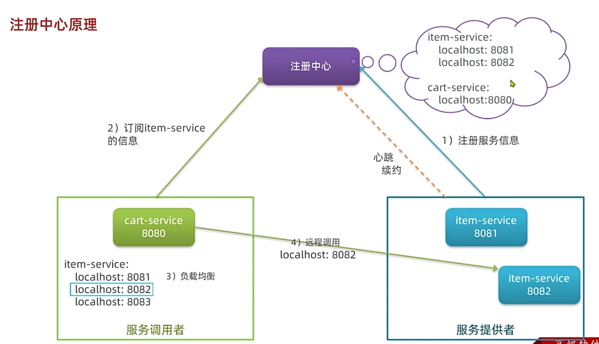

### 一、微服务初识
1. 单体架构: 将所有业务功能集中在一个项目中，打包成一个包部署。
2. 微服务架构: 将所有业务功能拆分成多个项目，每个项目对应一个服务，通过API进行调用。
3. 微服务工程结构: (1)独立project; (2)maven聚合
### 二、远程调用
Spring提供了一个RestTemplate类，用于进行http请求的发送:
1. 注入RestTemplate到Spring容器中:
```java
@Bean
public RestTemplate getRestTemplate(){
return new RestTemplate();
}
```
2. 使用RestTemplate发送http请求:
```java
public <T> ResponseEntity<T> exchange(
  String url, //请求路径
  HttpMethod method, //请求方式
  @Nullable HttpEntity<?> requestEntity, //请求实体，可以为空
  Class<T> responseType, //返回值类型
  Map<String, ?> uriVariables //url参数
)
```
### 三、Nacos注册中心
1. **原理:**
   
   **服务提供者**: 暴露服务接口，给其他服务调用。
   **服务消费者**: 调用其他服务提供的接口
   **注册中心**: 记录并监控微服务的各实例状态，推送服务变更信息
   服务提供者会在启动时注册自己的信息到注册中心，消费者可以从注册中心订阅拉取服务信息
   服务提供者会通过心跳机制向注册中心报告健康状态，当心跳异常就会被注册中心剔除
   消费者可以通过负载均衡算法，从多个实例中选择一个
2. **搭建nacos**:
   (1)下载nacos的压缩包
   (2)在数据库中导入nacos的sql文件
   (3)使用`docker load -i nacos.tar`命令将nacos镜像导入docker
   (4)使用`docker run -d -p 8848:8848 --name nacos-8848 -e MODE=standalone -e NACOS_SERVER_IP=192.168.1.100 nacos/nacos-server:1.4.1`命令启动nacos
   (5)其中的nacos/custom.env文件中，有一个MYSQL_SERVICE_HOST也就是mysql地址，需要修改为你自己的虚拟机IP地址：
   ```
   PREFER_HOST_MODE=hostname
   MODE=standalone
   SPRING_DATASOURCE_PLATFORM=mysql
   MYSQL_SERVICE_HOST=192.168.150.101
   MYSQL_SERVICE_DB_NAME=nacos
   MYSQL_SERVICE_PORT=3306
   MYSQL_SERVICE_USER=root
   MYSQL_SERVICE_PASSWORD=123
   MYSQL_SERVICE_DB_PARAM=characterEncoding=utf8&connectTimeout=1000&socketTimeout=3000&autoReconnect=true&useSSL=false&allowPublicKeyRetrieval=true&serverTimezone=Asia/Shanghai
   ```
   (6)然后，将课前资料中的nacos目录上传至虚拟机的/root目录。进入root目录，然后执行下面的docker命令：
   ```bash
   docker run -d \
   --name nacos \
   --env-file ./nacos/custom.env \
   -p 8848:8848 \
   -p 9848:9848 \
   -p 9849:9849 \
   --restart=always \
   nacos/nacos-server:v2.1.0-slim
   ```
   (7)引入nacos依赖
   ```xml
   <dependency>
   <groupId>com.alibaba.cloud</groupId>
   <artifactId>spring-cloud-starter-alibaba-nacos-discovery</artifactId>
   </dependency>
   ```
   (8)配置nacos
   ```yaml
   spring:
    application:
     name: nacos-demo # 服务名
    cloud:
     nacos:
      server-addr: 虚拟机地址:8848 # nacos地址
   ```
3. **服务发现:**
   消费者需要连接nacos以拉取和订阅服务，因此服务发现的前两步和服务注册是一样的。
   服务调用:
   ```java
   private final DiscoveryClient discoveryClient;

   private final handlerCartItems(List<CartVo> vos){
    // 1.根据服务名称拉取服务实例列表
    List<ServiceInstance> instances = discoveryClient.getInstances("nacos-demo");
    // 2.负载均衡，挑选一个实例
    ServiceInstance instance = loadBalancer.choose(RandomUtil.randomInt(instances.size()));
    // 3.获取实例的ip和端口
    Url url = instance.getUri();
    // ......
   }
   ```
### 四、openFeign
openFeign是一个用于简化RESTful客户端访问的开源库, 使http请求的发送更简单。
1. **使用:**
   (1)引入依赖，OpenFeign和SpringCloudLoadBalancer:
   ```xml
   <!-- OpenFeign -->
   <dependency>
   <groupId>org.springframework.cloud</groupId>
   <artifactId>spring-cloud-starter-openfeign</artifactId>
   </dependency>
   <!-- 负载均衡 -->
   <dependency>
   <groupId>org.springframework.cloud</groupId>
   <artifactId>spring-cloud-starter-loadbalancer</artifactId>
   </dependency>
   ```
   (2)通过`@EnableFeignClients`开启openFeign功能
   ```java
   @EnableFeignClients
   @SpringBootApplication
   public class OrderApplication {...}
   ```
   (3)编写FeignClient接口
   ```java
   @FeignClient(value = "payment-service")
   public interface ItemClient {
    @GetMapping("/item/{id}")
    public Item findById(@RequestParam("ids") Collection<Long> ids);
   }
   ```
   (4)使用FeignClient接口，实现远程调用
   ```java
   List<ItemDTO> items = itemClient.findById(List.of(1, 2));
   ```
2. **连接池:**
   `OpenFeign`对http请求进行了封装，不过其底层发起http请求，依赖于其它的框架:
   **HttpUrlConnection**: 不支持连接池，使用起来比较简单，但是性能较低。
   **Apache HttpClient**: 支持连接池
   **OkHttp**: 支持连接池
   整合`OkHttp`，实现连接池步骤:
   (1)引入依赖
   ```xml
   <!-- OkHttp依赖 -->
   <dependency>
   <groupId>io.github.openfeign</groupId>
   <artifactId>feign-okhttp</artifactId>
   </dependency>
   ```
   (2)开启连接池功能
   ```yml
   feign: 
    okhttp: 
      enabled: true # 开启连接池功能
   ```
3. **日志输出:**
   `OpenFeign`只会在FeignClient所在包的日志级别为`DEBUG`时才输出日志, 输出日志的级别有4级:
   (1)`NONE`: 不输出日志
   (2)`BASIC`: 仅记录请求的方法，URL以及响应状态码和执行时间
   (3)`HEADERS`: 除了`BASIC`中定义的信息之外，还有请求和响应的头信息
   (4)`FULL`: 记录所有请求和响应的明细信息，包括请求头、请求体、元数据。
   Feign默认的日志级别为`NONE`
   要定义日志级别，需要声明一个类型为`Logger.Level`的Bean:
   ```java
   public class LoggerConfig {
    @Bean
    public Logger.Level feignLoggerLevel() {
      return Logger.Level.FULL;
    }
   }
   ```
   然后再某个`FeignClient`的`@FeignClient`注解中声明:
   ```java
   @FeignClient(name = "service-a", configuration = LoggerConfig.class)
   ```
   若要全局配置，则在`@EnableFeignClients`注解中声明:
   ```java
   @EnableFeignClients(defaultConfiguration = LoggerConfig.class)
   ```
