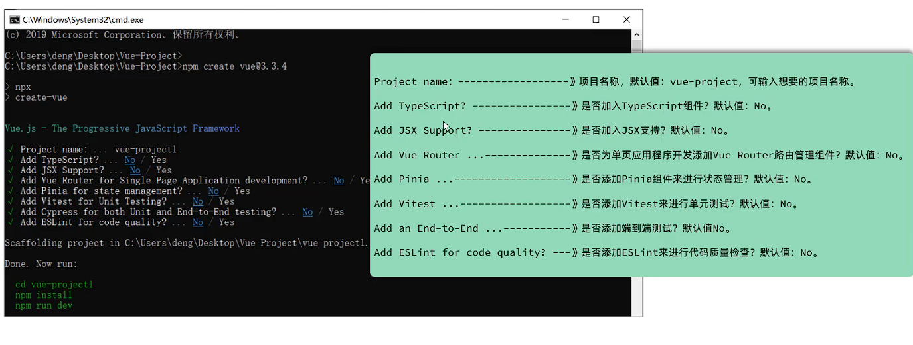
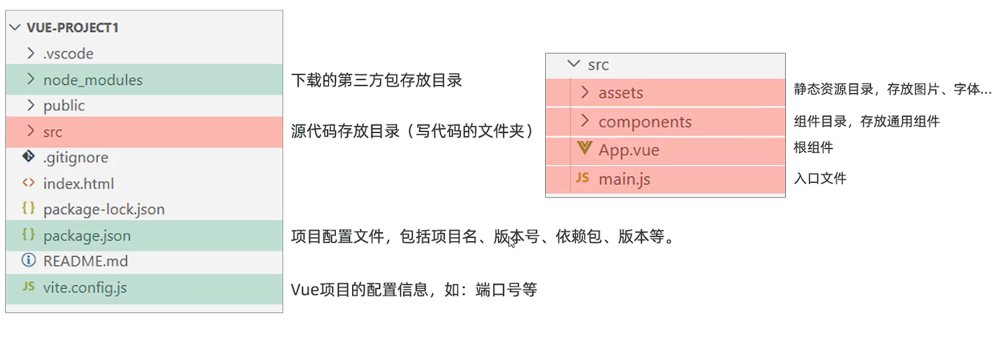

## 一、Nodejs
* **Nodejs：** Node.js 是一个基于 Chrome V8 引擎的 JavaScript 运行环境。类似于Java中的JVM。
## 二、npm
* **npm：** Node Package Manager，是 Node.js 的软件包管理工具。类似于Maven。
## 三、创建Vue项目
* **创建项目：** 创建工程化vue项目，命令为：`vue create vue`
  
* **安装依赖：** `cd`进入目录，运行`npm install`命令，安装依赖。
## 四、项目结构
* **使用WebStorm打开项目：** 

## 五、运行项目
* **运行项目：** 运行`npm run dev`命令，启动项目。
* **浏览器中输入对应的地址，进入项目** 
* **.vue文件：** 该文件是Vue项目中的组件文件，在Vue项目中也称之为单文件组件(SFC, Single File Component)。Vue的单文件组件会将一个组件的逻辑(JS)、模板(HTML)、样式(CSS)放在同一个文件中(*.vue)。
