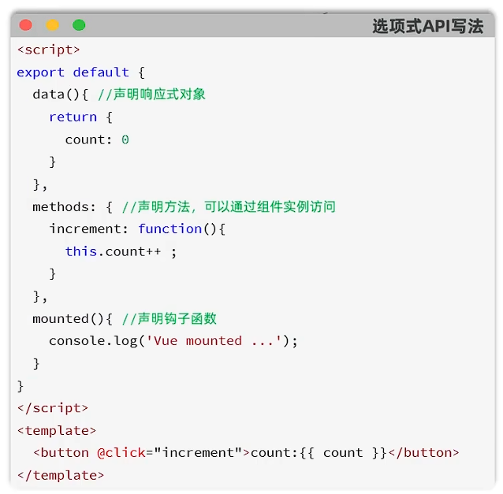
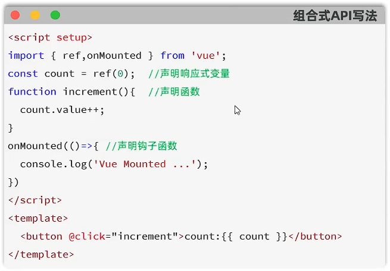

## 一、API风格
* Vue有两种API风格：选项式API和组合式API。
  * **选项式API：** 可以用包含多个选项的对象来描述组件的逻辑，如data、methods、mounted等。选项定义的属性会暴露在函数内部的this对象中，它会指向当前组件的实例。
  
  * **组合式API：** 组合式API是Vue3的新特性，基于函数组件的编写方式，通过使用函数来组织和复用组件的逻辑。它提供了一种更灵活，更可组合的方式来编写组件。
   
    * **`setup()`：** 是一个标识，告诉Vue需要进行一些处理，让我们可以更简洁的使用组合式API。
    * **`ref()`：** 接收一个内部值，返回一个响应式ref对象，此对象只有一个指向内部值的属性`value`。
    * **`onMounted()`：** 在组合式API中的钩子方法，注册一个回调函数，在组件挂载完成后执行。
    * **组合式API中，没有this对象，它指向的是undefined。**
