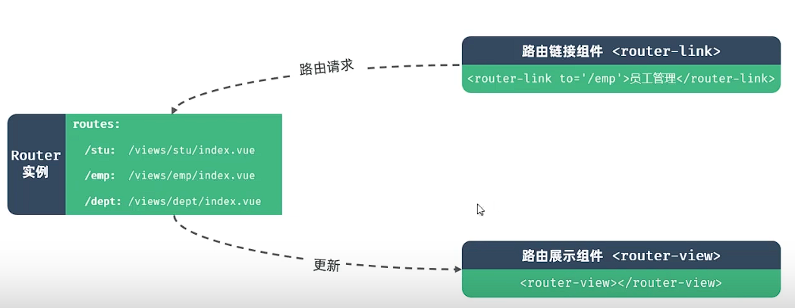
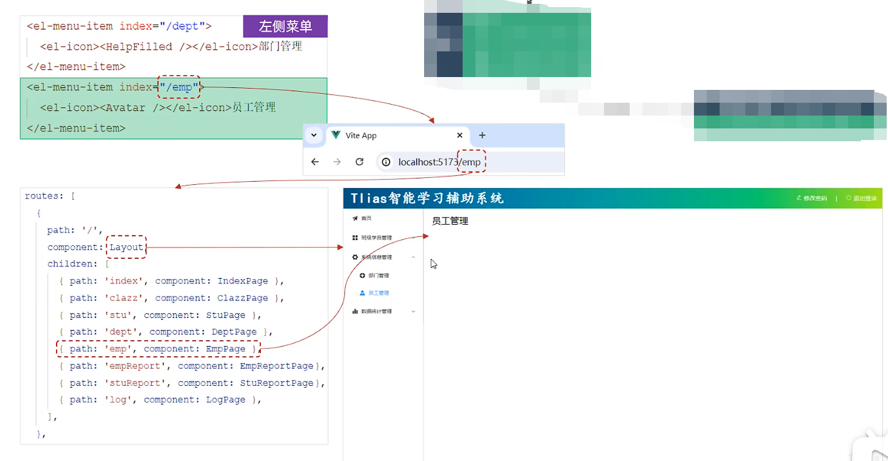

## 一、Vue-router
* **Vue-router：** Vue官方的路由插件，指路径和组件的对应关系，访问路径，渲染对应的组件 
* **组成：**
  * **Router实例：** 路由实例，基于createRouter函数创建，维护了应用的路由信息。
  * **`<router-link>`：** 路由链接组件，浏览器会将其解析成`<a>`标签。
  * **`<router-view>`：** 动态视图组件，用来渲染展示与路由路径对应的组件。
  
## 二、嵌套路由

