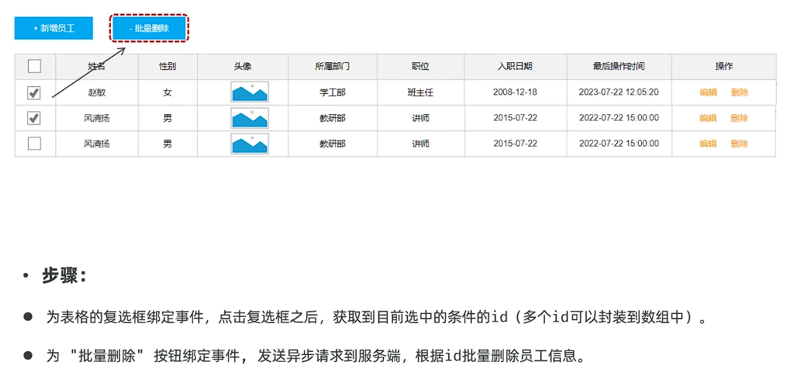

## 一、页面布局
* **搜索栏：**
  
  表单中数据较多，需要将其绑定在对象中，其中`data[]`数组中的开始结束时间需要赋值给begin和end属性。
  此时可以使用watch监听对象中的属性
  
  * **watch监听对象中的属性**
    * 作用：侦听一个或多个响应数据源，并在数据源变化时调用传入的回调函数
    * 用法：
      1.导入watch函数
      2.执行watch函数，传入要侦听的响应式数据源(ref对象)和回调函数。   
       
    * 3.侦听对象的全部属性：
     
    * 4.侦听对象中的某个属性：
     
* **新增员工弹窗：**
 
 
 
* **修改员工弹窗：**
  
* **删除单个员工：**
 
* **批量删除员工：**
 
## 二、页面交互
* **员工列表查询：**
  * 1.页面加载完毕后，查询员工信息列表。
  * 2.点击查询按钮，查询员工信息列表。
  * 3.当页码、每页记录数产生变化时，查询员工信息列表。 
* **关于表单校验的正则表达式：**
  * 以`/^1[3-9]\d{9}$/`为例： 
  * **写法：** `/....../`
  * **`^`：** 以...开头。
  * **`$`：** 以...结尾。
  * **[3-9]：** 匹配3到9之间的数字。
  * **\d：** 匹配数字, 等价于[0-9]。
  * **{9}：** 量词，匹配9个数字。 