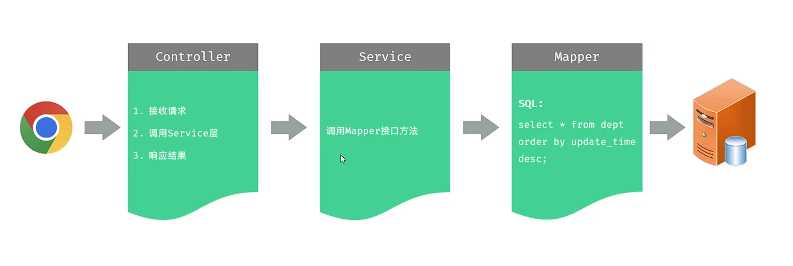
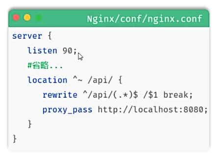

## 一、关于列表查询，每一层架构的职责：

##  二、Nginx反向代理
* 反向代理是一种网络架构，通过代理服务器为后端的服务器做代理，客户端的请求直接请求代理服务器，然后再转发给代理服务器。

* **上述反向代理字段的意义：**
  * location：用于定义匹配路径匹配的规则。
  * ^~ /api/: 表示精确匹配。即只匹配 /api/ 开头的路径。
  * rewrite：用于重写匹配到的路径。
  * proxy_pass：用于代理转发，它将匹配到的请求转发给位于后端的指令服务器。