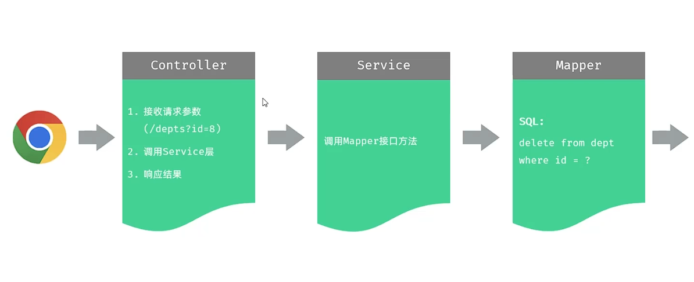

## 一、关于删除部门每层架构职责：

* **删除部门如何接收id参数：**
* 1、使用HttpServletRequest对象接收参数。
```java
@DeleteMapping("/depts")
public Result deleteDept(HttpServletRequest request) {
  String id = request.getParameter("id");
  int i = Integer.parseInt(id);
  System.out.println("接收到的id：" + i);
  return Result.success();
} 
```
* 2、使用Spring提供的@RequestParam注解将请求参数绑定给形参。
```java
@DeleteMapping("/depts")
public Result deleteDept(@RequestParam("id") Integer id) { //  id为形参,且使用了@RequestParam注解后必须要传递该参数，除非将required属性设置为false(默认为true)
  System.out.println("接收到的id：" + id);
  return Result.success();
 }
```
* 3、若请求参数与形参名称相同，则使用@RequestParam注解中的参数可以省略。
```java
@DeleteMapping("/depts")
public Result deleteDept(@RequestParam Integer id) {
  System.out.println("接收到的id：" + id);
  return Result.success();
}
```
* 4、在url中使用{id}直接添加path参数，使用@PathVariable注解。
```java
@GetMapping("/depts/{id}")
public Result getDeptById(@PathVariable Integer id) {
  System.out.println("接收到的id：" + id);
  return Result.success();
}
