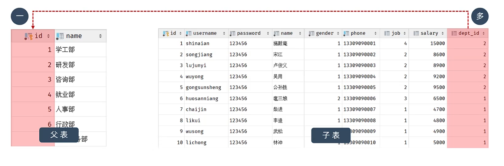
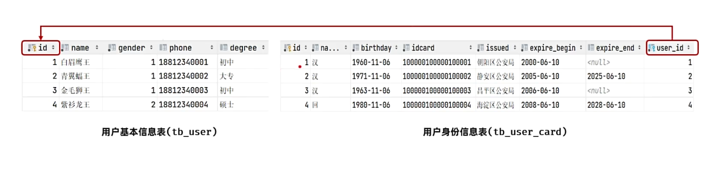
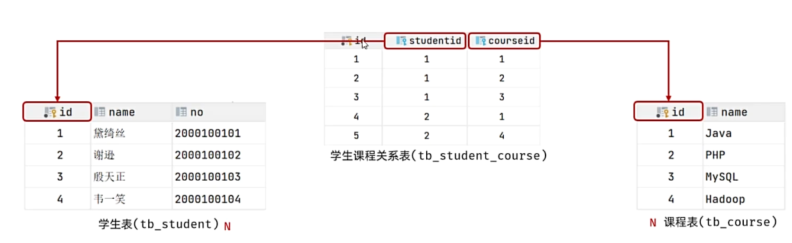
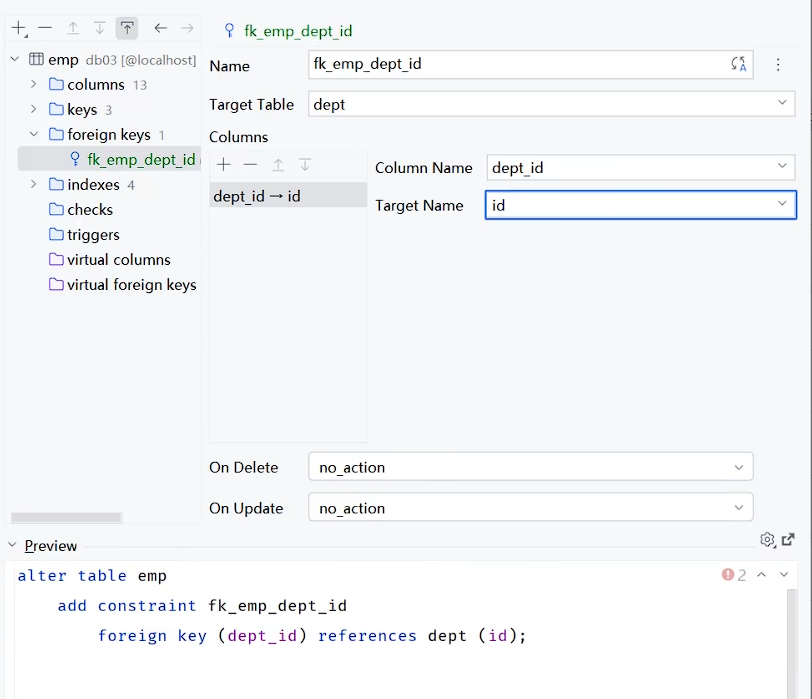

## 一、多表关系：
* **多对一(一对多)：**  一个部门对应多个员工
  * **实现：** 在"多"方使用`dept_id int unsigned NOT NULL COMMENT '关联的部门id' ` 语句来关联"一"方。
  
* **一对一：** 一个用户对应一个身份证关系
  * **实现：** 在任意"一"方使用`user_id int unsigned NOT NULL UNIQUE COMMENT '关联的用户id' ` 语句来关联另"一"方。 
   
* **多对多：** 一个学生对应多门课程，一个课程也可以给多个学生选择
  * **实现：** 建立第三张表，中间至少包含两个外键，分别关联两方主键。
   
## 二、多表问题：
* **现象：** 若两张表的数据未建立外键约束，那么就会出现部门的数据可以直接删除，然而依然有员工关联了该部门的情况，此时就出现了数据不完整、不一致的问题。
* **解决：** 使用外键约束：
  * **语法：**
    * **1.创建表时：** 在末尾添加`[constraint] [外键名称] FOREIGN KEY (外键字段名) REFERENCES 主表 (字段名)` ;
    * **2.修改表时：** 在修改表时，使用`ALTER TABLE 表名 ADD CONSTRAINT 外键名称 FOREIGN KEY (外键字段名) REFERENCES 主表 (字段名)`
    * **3.也可通过datagrip图形化界面添加外键约束：**
     
    * **注意：目前的开发中已经不再使用以上的使用物理外键的方式了，严重消耗性能。现在更多使用逻辑外键。**
## 三、多表查询
* **多表查询：** 从多张表查询数据。
* **笛卡尔积：** `select * from emp,dept;`执行该查询时，会将emp表中的数据与dept表中的数据进行组合，生成笛卡尔积。
* **连接查询：**
* **内连接：** 查询A、B交集的部分。
  * **内连接语法：** 
```sql
-- 1.隐式内连接：
select 字段列表 from 表A,表B where 连接条件;
-- 2.显式内连接：
select 字段列表 from 表A [inner] join 表B on 连接条件; 
-- 3.为表起别名，简化书写：当指定了表的别名后，就只能通过别名指定字段名了，原表名无法使用。
select 字段列表 from 表A [as] 别名A , 表B [as] 别名B where 连接条件;
```
  * **外连接：** 
    * **左外连接：** 查询左表的所有数据，包括两张表交集部分数据。
    * **右外连接：** 查询右表的所有数据，包括两张表交集部分数据。
```sql
-- 1.左外连接
select 字段列表 from 表A left [outer] join 表B on 连接条件;
-- 2.右外连接
select 字段列表 from 表A right [outer] join 表B on 连接条件;
-- 左外连接和右外连接可以相互替换，替换时更换表A和表B的位置即可
```
* **子连接：** 子查询的要点在于要先对需求做拆分，明确具体步骤，随后逐步编写sql语句。
  * **介绍：** SQL语句中嵌套select语句，称为嵌套查询，又叫子查询。
  * **语法：** `select 字段列表 from 表A where 字段名1 = (select 字段名1 from 表B ...);`
  * **说明：** 子查询的外部语句可以是增删改查的任意一个，最常见的是select。
  * **分类：**
    * 1.标量子查询：子查询的返回结果为单个值。
    * 2.列子查询：子查询的返回结果为一列。
    * 3.行子查询：子查询的返回结果为一行。
    * 4.表子查询：子查询的返回结果为多行多列。 
