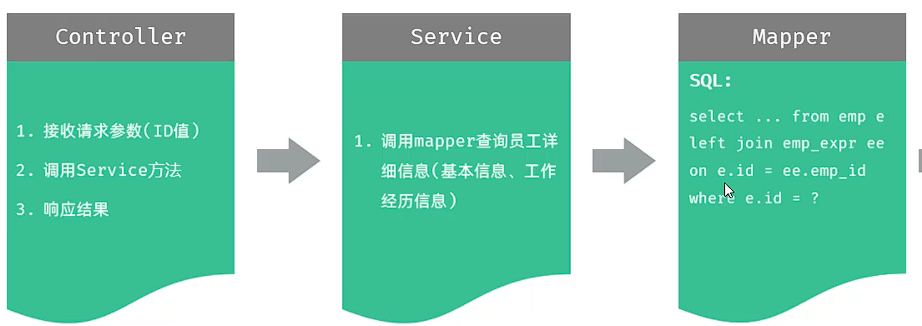
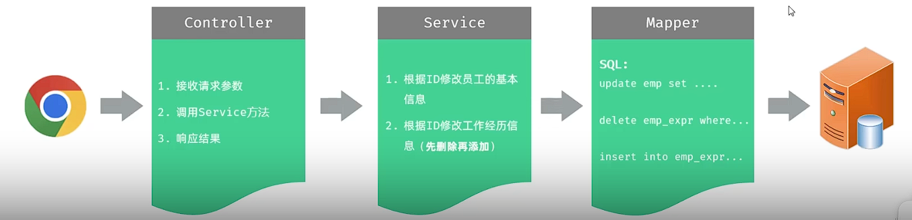

## 一、数据回显：

* **EmpList对象手动封装：**
 
  * **如果查询返回的字段名与实体属性名可以直接对应，则可以用ResultType封装。**
  * **如果查询返回的字段名与实体属性名对应不上，或者实体属性很复杂，则需要通过resultMap手动封装。**
## 二、修改员工

* **修改员工动态SQL：**
  * **`<set>`标签作用：**
    * 会自动生成`SET`关键字，自动删除更新字段后多余的逗号。
     
