## 一、登录功能
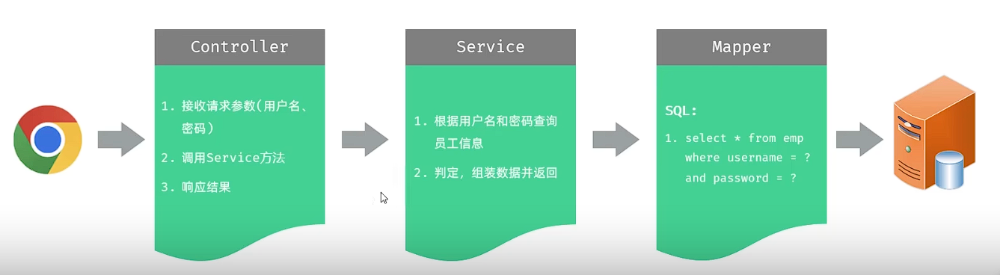
## 二、登录校验：
* **登录标记：** 登录成功后，后续的每一次请求，都会获取该标记
* **统一拦截器：** 过滤器Filter,拦截器Interceptor。
 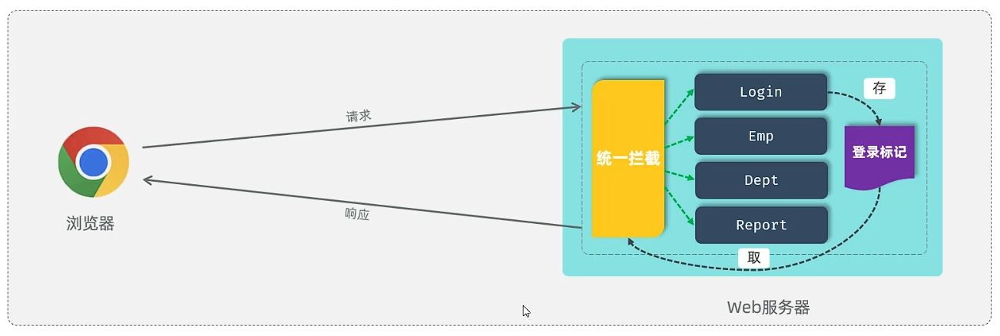
## 三、会话技术
* **会话技术：** 用户打开浏览器，访问web服务器的资源，会话建立，直到一方断开连接，会话结束。一次会话可以包含多次请求和响应。
* **会话跟踪：** 一种维护浏览器状态的方法，服务器需要识别多次请求是否来着于同一个浏览器，以便在同一次会话的多次请求间共享数据。
* **会话跟踪技术：**
  * **Cookie：** 浏览器端存储的数据
   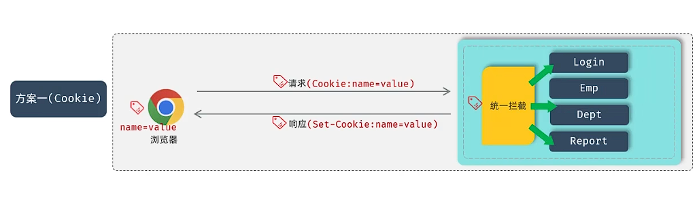
    * **优点：** http支持的技术。
    * **缺点：** 移动端app不支持；不安全，用户可以禁用自己的cookie；Cookie不能跨域访问。
    * **跨域：** 当协议、域名、端口号任意一个不同，则属于跨域。
  * **Session：** 服务器端存储的数据，服务器端通过Session来识别浏览器。
   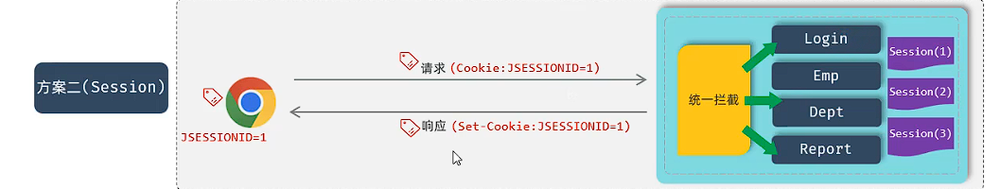
    * **优点：** 存储在服务器端，安全。
    * **缺点：** 服务器集群环境下无法直接使用Session；Cookie的缺点它全有。
  * **令牌：** 服务器端存储的数据，浏览器端通过令牌来识别浏览器。
   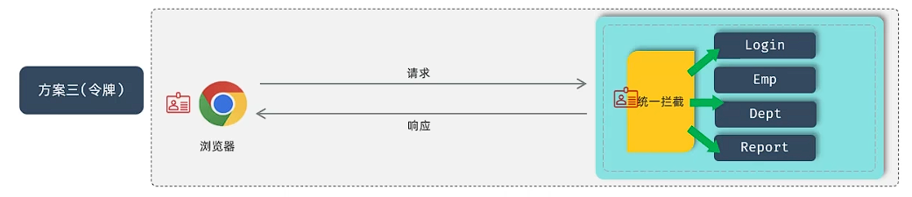
    * **优点：** 支持PC端、移动端；解决集群环境下的认证问题；减轻服务器端的存储压力。
    * **缺点：** 需要手动实现令牌验证。
## 四、JWT令牌
* **JWT令牌：** Json Web Token，定义了一种简洁的、自包含的格式，用于在通信双方以json数据格式安全的传输信息。
* **JWT令牌组成：**
  * **1.Header：** 头，记录令牌类型，签名算法等，例如：{"alg":"HS256","type":"JWT"}
  * **2.Payload：** 有效载荷，携带一些自定义的信息、默认信息，例如：{"id":"1","name":"John Doe"}。
  * **3.Signature：** 签名，防止token被篡改、确保安全性。将Header和Payload融入，并加入指定密钥进行加密，通过签名算法计算得来。
  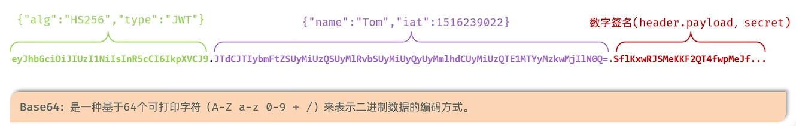
* **Java实现JWT：**
  * **1.引入JWT依赖。**
  * **2.使用官方工具类JWTs生成或解析Jwt令牌。** 
  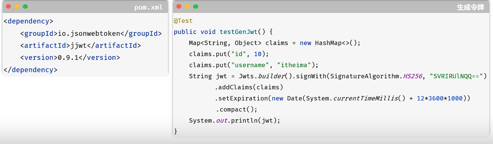
  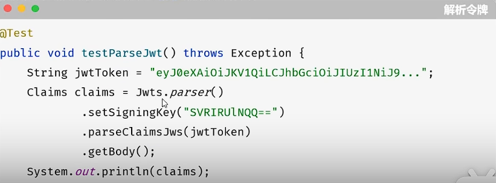
  * **Jwt任意元素被修改，都会被JWT验证失败。**
  * **Jwt校验时使用的签名密钥，必须和生成Jwt令牌时使用的密钥一致。**
## 五、登录成功后生成令牌
* **1.定义Jwt令牌的操作工具类。**
* **2.在登录成功后，生成Jwt令牌，返回。**
## 六、过滤器Filter
* 过滤器可以把对资源的请求拦截下来，从而实现特殊的功能。
* 过滤器可以完成一些通用动作，比如登录认证、统一编码处理、敏感字处理等。
* **filter使用：**
  * 定义filter，定义一个类，实现Filter接口，实现所有方法。
  * 配置filter，Filter类上加@WebFilter注解，配置拦截路径。引导类上加@ServletComponentScan注解，开启servlet组件支持。
   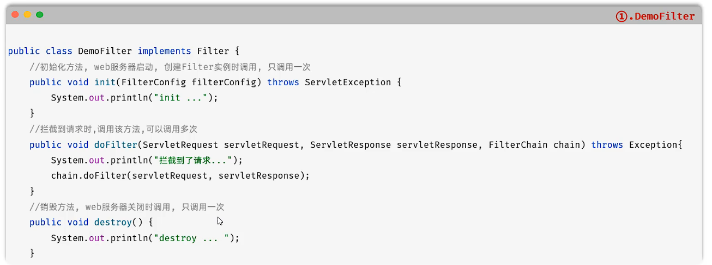
* **校验流程：**
 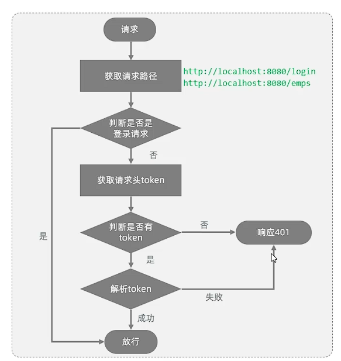
* **Filter可以根据不同的需求拦截不同的路径：** 
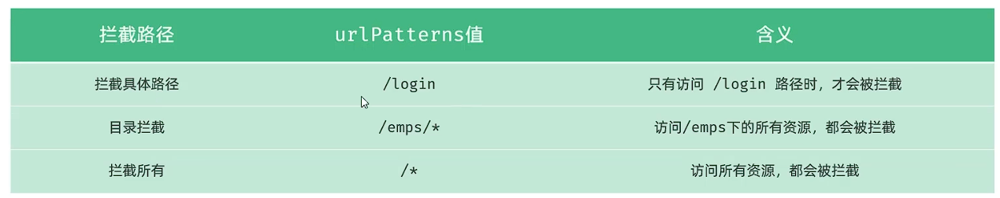
* **Web应用中若配置了多个Filter，那么这些Filter就形成了一个Filter链：**
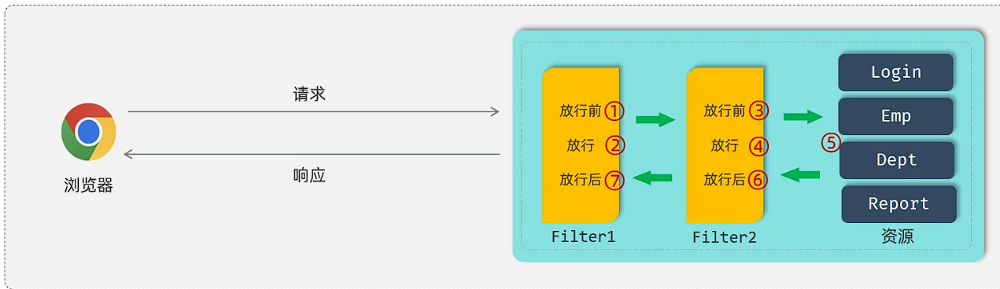
## 七、拦截器Interceptor
* **拦截器Interceptor：** 是一种动态的拦截方法调用机制，StringBoot提供，主要用来动态拦截控制器方法执行。
* **作用：** 拦截请求，在指定的方法调用前后，根据业务需要执行预先设定的代码。
* **使用：**
  * 1.创建拦截器类，实现HandlerInterceptor接口，实现方法。
  * 2.注册拦截器。
  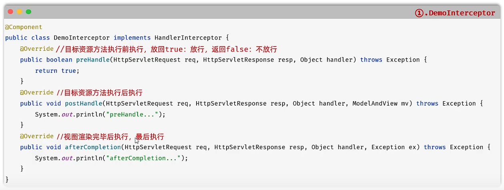
  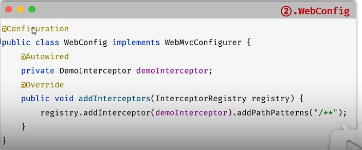
  * 3.配置拦截路径：Interceptor拦截器可以根据需求不同，在对应的注册拦截器类中配置不同的拦截路径。
  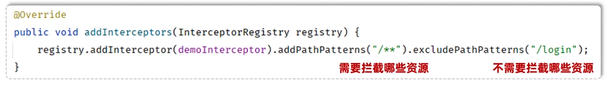
  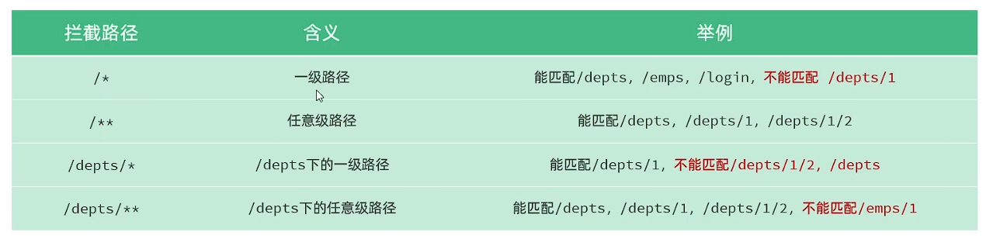
* **当Filter和Interceptor都存在时，优先级：Filter > Interceptor** 
  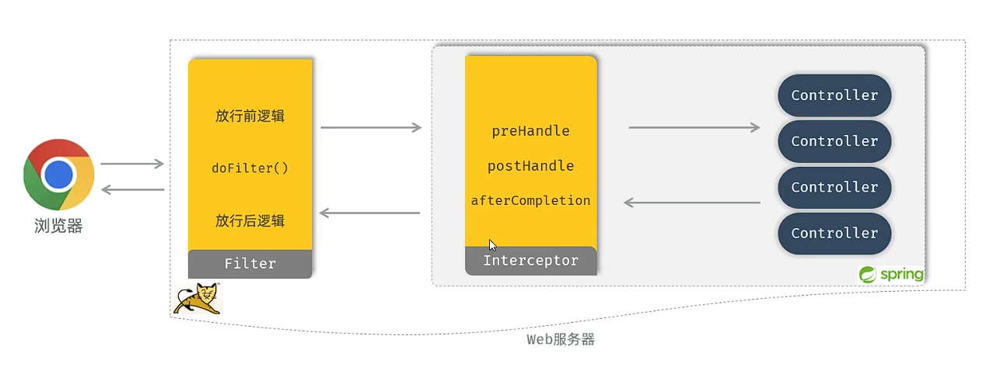
## 八、Filter和Interceptor对比
* **接口范围不同：** 过滤器需要实现Filter接口，而拦截器需要实现HandlerInterceptor接口。
* **拦截范围不同：** 过滤器Filter可以拦截任意的请求，而拦截器Interceptor只能拦截Spring环境中的资源。
