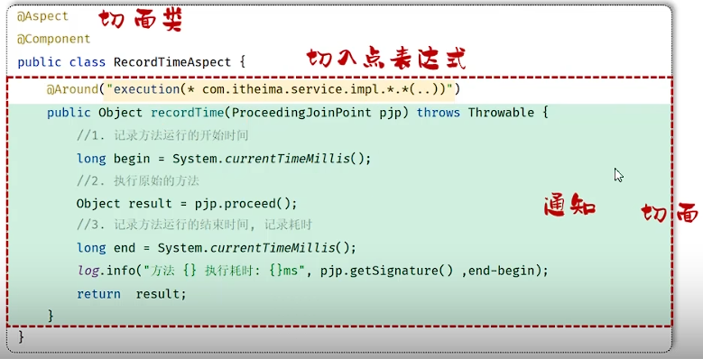

## 一、AOP
* **AOP：** Aspect Oriented Programming，面向切面编程，面向特定方法编程。
* **场景：** 统计每一个业务方法的执行耗时。
  
* **优势：**
  * 1.减少重复代码。
  * 2.代码无侵入。
  * 3.提高开发效率。
  * 4.维护方便。
* **实现步骤：**
  * 1.导入相关依赖
   
  * 2.编写AOP程序：针对于特定的方法根据业务需要进行编程。
  
## 二、AOP概念
* **连接点：** JoinPoint, 可以被AOP控制的方法。
* **通知：** Advice, 指重复的逻辑，也就是共性功能，最终体现为一个方法。
* **切入点：** PointCut, 匹配连接点的条件，通知仅会在切入点方法执行时被应用。
  * **切入点一定是连接点，连接点不一定是切入点。** 
* **切面：** Aspect, 描述通知和切入点的对应关系(通知+切入点)。
* **目标对象：** Target, 通知所应用的对象。

* **AOP执行流程：** 动态代理技术：
  
## 三、通知类型
* 根据执行时机不同，通知类型分为以下常见五类：
  * 1.@Around： 环绕通知，此注解标注的通知方法在目标的前后都被执行。
    * 对于@Around通知，需要自己调用ProceedingJoinPoint的proceed()方法，让原始方法执行，其他通知不需要。 
    * @Around的方法的返回值，必须是Object，来接收原始方法的返回值。
  * 2.@Before： 前置通知，此注解标注的通知方法在目标方法前被执行。
  * 3.@After： 后置通知，此注解标注的通知方法在目标方法后被执行，无论是否有异常都会执行。
  * 4.@AfterReturning： 返回通知，此注解标注的通知方法在目标方法正常返回后被执行，有异常不执行。
  * 5.@AfterThrowing： 异常后通知，此注解标注的通知方法在目标方法抛出异常后被执行。
* **若需要重复定义切入点表达式，可以使用@PointCut注解，需要时引用定义的切入点表达式。**
 
## 四、通知顺序
* **通知执行顺序：** 若有多个切面的切入点都匹配到目标方法，目标方法执行时，多个方法都会被执行。
  * 不同的切面类中，默认按照切面类的类名字母排序：
    * 目标方法前的通知方法，字母排名靠前的先执行；
    * 目标方法后的通知方法，字母排名靠前的后执行。
  * 使用@Order注解，在注解中写数字决定执行顺序：
    * 目标方法前的通知方法，数字越小，越先执行；
    * 目标方法后的通知方法，数字越小，越后执行。
## 五、切入点表达式
* **切入点表达式：** 描述切入点方法的一种表达式。
* **作用：** 决定项目中哪些方法需要加入通知。
* **常见形式：**
  * **execution：** 根据方法签名来匹配
   
    * **execution：** 主要根据方法的返回值、包名、类名、方法名、方法参数等信息来匹配，语法为：
     `execution(访问修饰符 ? 返回值 包名.类名.?方法名(参数列表) throws 异常? )`
    * 其中带?的部分表示可以省略的部分：
      1.访问修饰符：如public、protected等，可省略；
      2.包名.类名：可省略，但不建议省略；
      3.throws 异常：可省略(指方法上声明抛出的异常，并非实际抛出的异常)
    * 可以使用通配符描述切入点：
      1.`*`: 单个独立的任意符号，可以通配任意返回值、包名、类名、方法名、任意类型参数，也可以通配包、类、方法名的一部分。 
      `execution(* com.*.service.*.update*(*))`
      2.`..`: 多个连续的任意符号，可以通配任意层级包名，或任意类型、任意个数的参数。
      `execution(* com.example..service.*(..))`
      3.若需求复杂，可以使用`&&` `||` `!` 来进行组合。
  * **@annotation：** 根据注解匹配，@annotation(注解类型)  
  
## 六、连接点
* 在Spring中用JoinPoint抽象了连接点，用它可以获得方法执行时的相关信息，如类名、方法名、方法参数等。
  * 对于@Around通知，获取连接点信息只能通过ProceedingJoinPoint。
   
  * 对于其他四种通知，获取连接点信息只能通过JoinPoint，它是ProceedingJoinPoint的父类型。
  
## 七、案例：
* **需求：** 将操作人、操作时间、执行方法全类名、执行方法名、方法运行时参数、返回值、方法执行时长记录入数据库表。
* **采用哪种通知类型：** @Around环绕通知
* **切入点表达式：** 
  
* **如何获取操作人的id：** 
  * 浏览器的jwt令牌中，存储了用户id。
  * 获取jwt令牌，并解析，即可获取当前员工登录信息。
  * **ThreadLocal：**
    * ThreadLocal并不是一个线程，而是Thread的局部变量。
    * ThreadLocal为每个线程提供单独的存储空间，具有隔离线程的效果，不同线程之间不相互干扰。
     
    * **常用方法：**
      1.`public void set(T value)`：设置当前线程的线程局部变量的值。
      2.`public T get()`：返回当前线程的线程局部变量的值。
      3.`public void remove()`：删除当前线程的线程局部变量。
  * **使用ThreadLocal获取当前登录员工信息：**
    1.定义ThreadLocal操作的工具类，用于操作当前登录员工id。
    2.在TokenFilter中，将解析完的员工id存入ThreadLocal中(用完需要删除)。
    3.在AOP通知方法中，从ThreadLocal中获取当前登录员工id。
 
 
 
