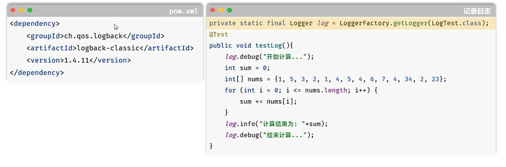
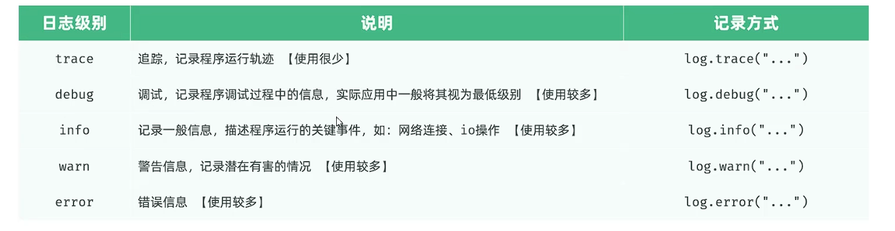

## 一、日志技术
* **Logback入门：**
  * **准备：** 引入logback依赖(springboot中已经传递该依赖)、配置文件logback.xml。
  * **记录：** 定义日志记录对象Logger，记录日志。
  * **若引入lombok，则可将日志记录对象Logger换成@Slf4j注解。**
  
* **日志级别：** 日志级别是指日志信息的类型，日志都分级别，常见的级别如下(由低到高)：
  
 