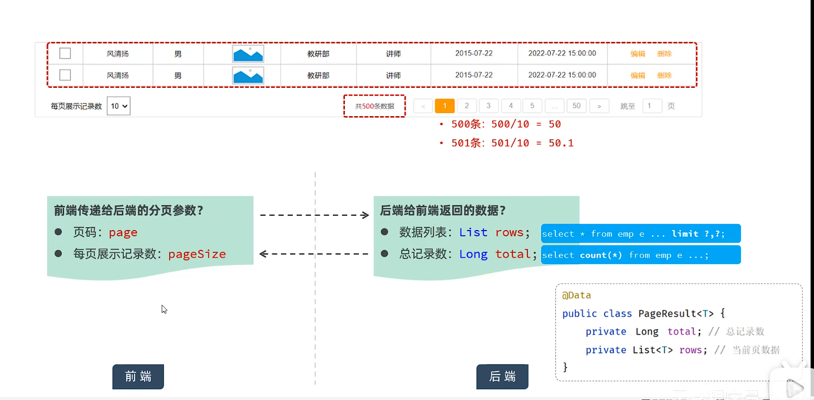
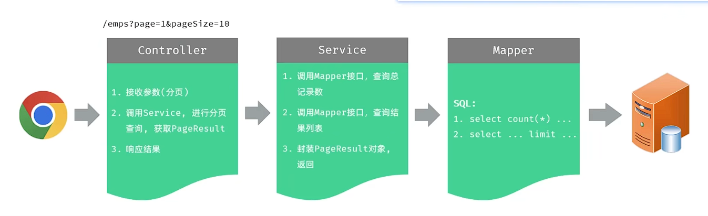
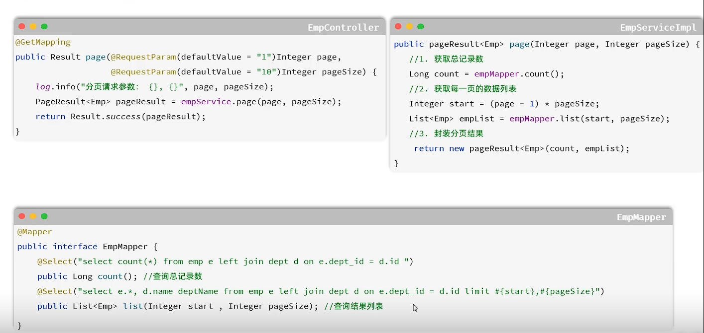
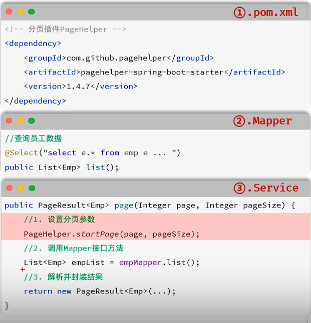
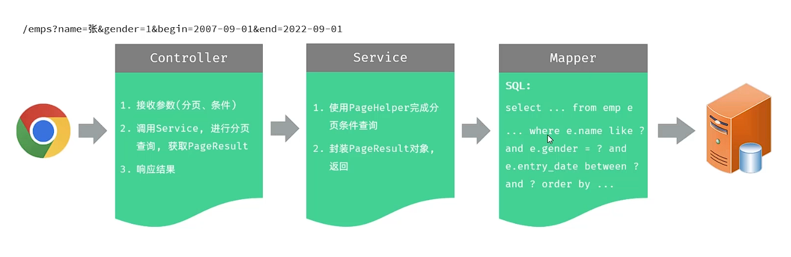
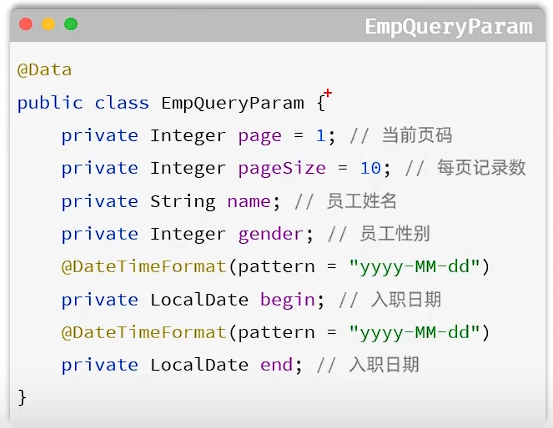
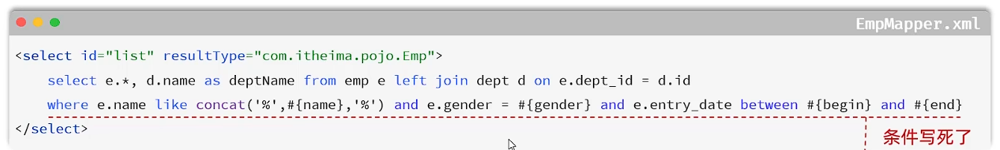

## 一、分页查询：
* **原理：**

* **代码分工：**

* **具体实现：**

* **其他实现方法：pageHelper插件：** mybatis插件，用来简化分页操作，提高开发效率。
  * **使用步骤：**
    * 1.在pom.xml中引入依赖。
    * 2.在Mapper接口中定义查询方法(不考虑分页)。
    * 3.在Service中实现分页查询。
 
  * **注意事项：** 
    * 1.在Mapper的SQL语句中，一定不能加";"结尾
    * 2.pageHelper插件仅对紧跟在其后的第一个查询语句进行分页处理。
## 二、条件分页查询：

* **代码优化：**
  * **请求参数：** 上图可知，controller需要接收六个参数，若参数过多，则可以使用一个对象来封装参数。
   
  * **动态SQL：** 在条件查询中，参数应当随着需求而变化，因此不能使用固定的SQL语句。
   
    * **`<if>`标签：** 判断条件是否成立，若为true，拼接SQL。
    * **`<where>`标签：** 根据查询条件，来生成WHERE关键字，并自动去除多余的and和or。
 