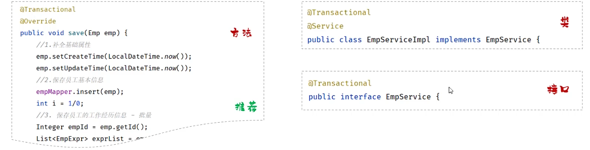
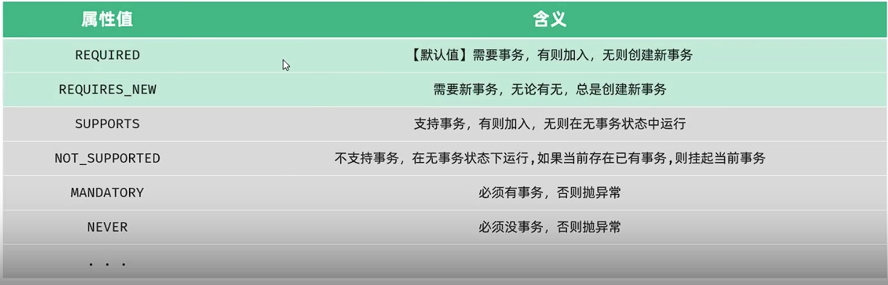
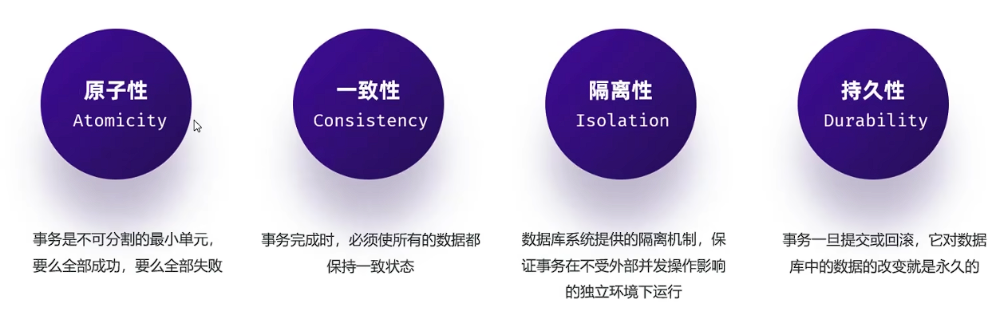

## 一、新增员工

## 二、关于批量插入员工工作经历
* **实现：** 在对应员工经历Mapper.xml中使用`<foreach>`标签实现批量插入。
 
  * **关于`<foreach>`标签：**
    * 1.collection：指定集合的名称。  
    * 2.item：指定集合中遍历出的元素/项。
    * 3.separator：指定每次遍历使用的分隔符。
    * 4.open：遍历开始前拼接的片段。
    * 5.close：遍历结束后拼接的片段。  
## 三、事务操作：
* **事务：** 事务是一组操作的集合，它是不可分割的工作单位。事务会把所有操作作为整体向系统提交或撤销操作请求，这些操作要么同时成功，要么同时失败。
* **事务控制的散步操作:** 1. 开启事务(begin) 2. 提交事务(commit) 3. 回滚事务(rollback) 4. 获取事务状态
* **事务控制：**
  * 注解：@Transactional
  * 作用：将方法交给spring进行事务管理，方法执行前开启事务，成功执行则提交事务，失败则回滚事务。
  * 位置：业务逻辑层的方法上、类上、接口上。(一般会把注解加在有很多增删改查的方法上)
   
  * 默认回滚RuntimeException的异常，其他异常不回滚，需要使用rollbackFor指定需要回滚的异常
* **事务传播行为：** 指的是当一个事务方法被另一个事务方法调用时，这个事务方法应如何进行，使用propagation属性来指定。
 
* **事务的四个特性：** 
