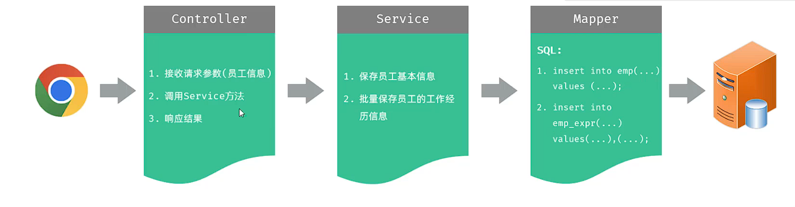
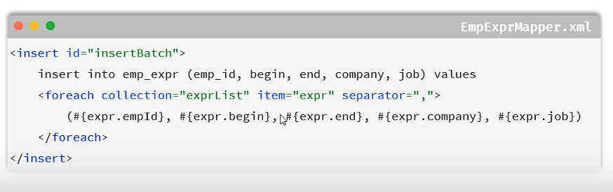

## 一、新增员工

## 二、关于批量插入员工工作经历
* **实现：** 在对应员工经历Mapper.xml中使用`<foreach>`标签实现批量插入。
 
  * **关于`<foreach>`标签：**
    * 1.collection：指定集合的名称。  
    * 2.item：指定集合中遍历出的元素/项。
    * 3.separator：指定每次遍历使用的分隔符。
    * 4.open：遍历开始前拼接的片段。
    * 5.close：遍历结束后拼接的片段。  
