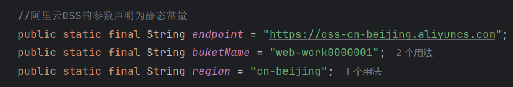
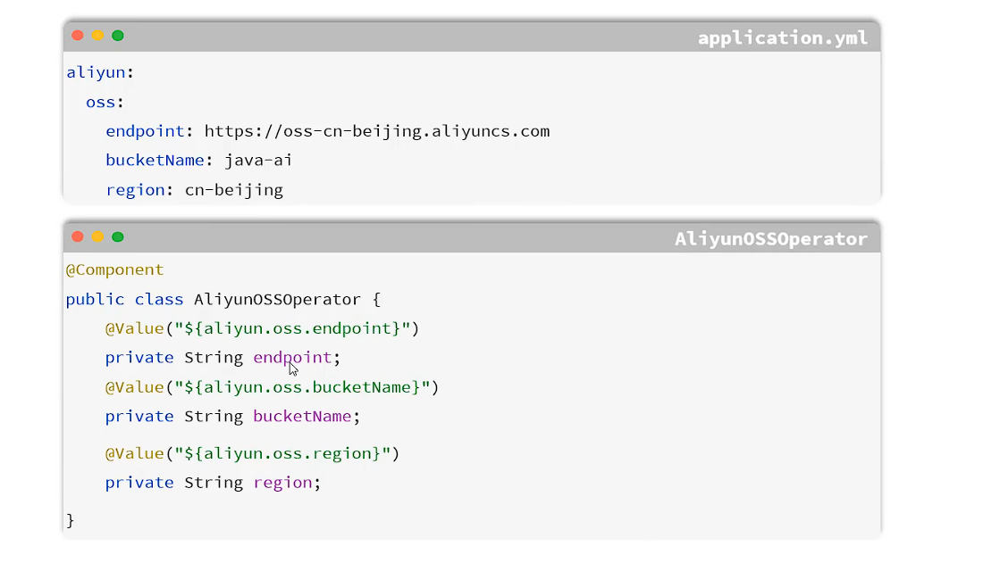

## 一、文件上传

## 二、本地存储

* SpringBoot中文件上传时默认大小为1MB，若不配置文件上传大小，超过这个值就会报错。
## 三、阿里云OSS存储
* **阿里云OSS存储：** 阿里云OSS存储是一个基于对象的存储服务，可以使用OSS存储来存储和访问任意类型的数据，如文本、音频、视频、图片等。
* **我的个人阿里云OSS AccessKey：**
**AccessKey ID：** LTAI5t6kT4dqexvqVs6toAwp
**AccessKey Secret：** a29ySJvqi2FcSwSDjnSkRhFE841SVu
* **阿里云OSS存储步骤：**
  * 1.引入阿里云的文件上传工具类。
  * 2.上传接口开发 
* **优化：** 将常量写在程序里不便于维护，可在application.yml中配置阿里云OSS的相关参数，然后通过@Value注解获取参数值。
  
 
  * 当配置项过多，@Value注解也会不方便管理，此时可将OSS配置封装进实体类中，使用@ConfigurationProperties注解。
  