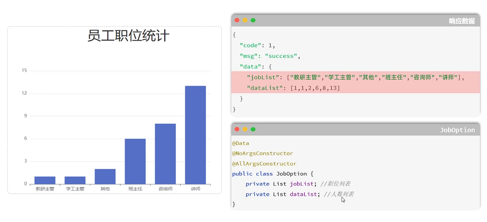
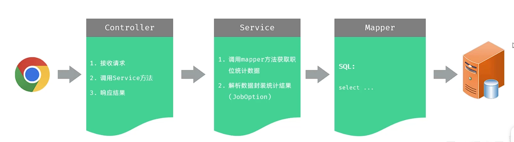

## 一、职位统计

* **SQL语句：** case
```sql
select (
  case when job=1 then '班主任'
  when job=2 then '讲师'
  when job=3 then '学工主管'
  when job=4 then '教研主管'
  when job=5 then '咨询师'
  else '其他' end) as jobName,
  count(*) as num
from emp group by job order by num;
```

## 二、性别统计
* **SQL语句：** 因为性别就两个值，所以可用if来作判断
```sql
select if(sex=1,'男','女') gender ,count(*) num
```

