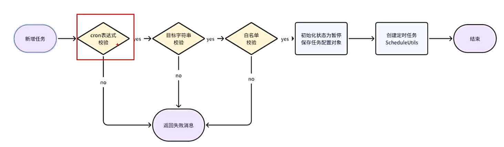

### 一、代码生成器
1. **查询数据库**
   (1)导入数据库
   (2)查询数据库列表
   (3)`information_schema.tables`
   (4)查询当前数据库下的表
      排除`qrtz_`和`gen_`开头的表
      排除在`gen_table`中存在的表

2. **导入表结构**
 
3. **生成代码**
 
4. **修改配置文件**
   代码生成器的配置文件在`ruoyi-generator/src/main/resources/generator.yml`
   ```yml
   # 代码生成
   gen:
     # 作者
     author: ruoyi
     # 生成包路径
     packageName: com.ruoyi.generator
     # 去除表的前缀: 默认false
     autoRemovePre: true
     # 表前缀
     tablePrefix: sys_, tb_
    ```
5. **Velocity模板**
   官网: `https://velocity.apache.org`
   该模板是一个Java模板引擎，使用特定语法在模板中嵌入Java对象数据，实现界面与代码的分离。
   **使用:**
   先准备好模板文件`resources/index.html.vm`
   ```html
   <html>
   <body>
   <h1>${name}</h1>
   </body>
   </html>
   ```
   ```java
   public class VelocityTest {
    public static void main(String[] args) {
      // 1.初始化模板引擎
      VelocityInitializer.initVelocity();
      // 2.准备模板数据模型
      VelocityContext velocityContext = new VelocityContext();
      velocityContext.put("name", "Hello World");
      // 3.读取模板
      Template template = Velocity.getTemplate("index.html.vm", "UTF-8");
      // 4.渲染模板
      FileWriter writer = new FileWriter("D:\\index.html"); 
      template.merge(velocityContext, writer);
      writer.close(); // 关闭流
    }
   }
   ```
   **Velocity模板语法:**
   (1)声明变量: 
   定义变量: `#set($name = "value")`
   输出变量: `$name` 或 `${name}` 前者适用于直接输出变量，后者适用于字符串拼接。
   (2)循环语法:
   ```
   #set($list = [1,2,3,4,5])
   #foreach($item in $list)
     序号[$foreach.count] 值[$item] <br/> ## count从1开始，index从0开始
   #end
   ```
   (3)条件语法:
   ```
   ## 定义变量
   #set($score = 80)
   ## 判断条件
   #if($score >= 80)
      优秀
   #elseif($score >= 60)
      中等
   #else
      差
   #end
   ```
### 二、RBAC权限控制
1. **Spring Security**
   提供了全面的安全认证和授权支持，与RBAC模型结合使用时，Spring Security可以实现灵活的角色权限控制。
2. **登录流程**
   
3. **角色控制权限**
   
4. **动态菜单路由**
   **前端部分**
   用户登录成功后，由`@/router/index.js`跳转到首页并加载layout布局组件
   在`@/layout/index.vue`中，加载`sidbar`侧栏组件
   在`@/layout/components/Sidebar/index.vue`中，遍历动态菜单路由在页面显示
   **后端部分**
   
5. **权限注解**
   `@PreAuthorize("@ss.hasPermi('manage:user:list')")`
   `@ss`表示PermissionService服务类
   `hasPermi`表示权限校验方法, 判断是否拥有该权限
   `manage:user:list`表示权限标识
   **关于@PreAuthorize注解方法**
   (1)`hasPermi`: 判断当前用户是否拥有指定权限
   (2)`lackPermi`: 判断当前用户是否缺少指定权限, 与`hasPermi`相反
   (3)`hasAnyPermi`: 判断当前用户是否拥有任意指定权限, 不同权限间用逗号分隔
   (4)`hasRole`: 判断当前用户是否拥有指定角色
   (5)`lackRole`: 判断当前用户是否缺少指定角色, 与`hasRole`相反
   (6)`hasAnyRole`: 判断当前用户是否拥有任意指定角色, 角色间用逗号分隔
   **若希望部分接口不用验证权限就能公开访问，可以使用`@Anonymous`注解**
### 三、任务
1. **异步任务管理器**
   主要用于处理一些不需要及时返回结果的后台任务，从而提高应用程序的性能
   
2. **操作日志**
   在需要记录操作日志的地方添加`@Log`注解
   `@Log(title = "用户管理", businessType = BusinessType.INSERT)`
   **关于log的参数**
   (1)`title`: 操作日志标题
   (2)`businessType`: 操作日志类型
   (3)`operatorType`: 操作人类别
   (4)`isSaveRequestData`: 是否保存请求的参数
   (5)`isSaveResponseData`: 是否保存响应的参数
   (6)`excludeParamNames`: 排除指定的请求参数
   
3. **定时任务**
   **`Quartz`核心API**
   (1)`Job`: 要执行的人物类，必须实现`Quartz`提供的`Job`接口
   (2)`JobDetail`: 任务的详细信息，包括Job实例，通过`JobBuilder`创建
   (3)`JobBuilder`: 声明一个任务实例，可以定义关于该任务的详情，任务名、组名等
   (4)`Trigger`: 触发器，用于触发并执行Job实例的机制
   (5)`SimpleTrigger`: 简单触发器，用于执行简单的重复任务，比如每隔5秒执行一次任务
   (6)`CronTrigger`: Cron触发器，用于定义复杂的执行时间
   (7)`TriggerBuilder`: 创建触发器实例的构建器
   (8)`Scheduler`: 调度器，Quartz的核心组件，负责启动、停止、暂停、恢复任务
4. **定时任务执行**
 
5. **新增定时任务**
 
6. **集群模式**
   单机模式下，默认所有的jobDetail和trigger都存储在内存中
   **实现集群模式**
   (1)导入`quartz.sql`数据库文件
   (2)将`quartz/src/main/java/com/ruoyi/quartz/config/ScheduleConfig.java`中的注释删除
   (3)节点复制
7. **数据权限**
   默认情况下，系统管理员具有所有的数据权限(userId为1)
   自定义注解、AOP切面技术、SQL拼接
   
